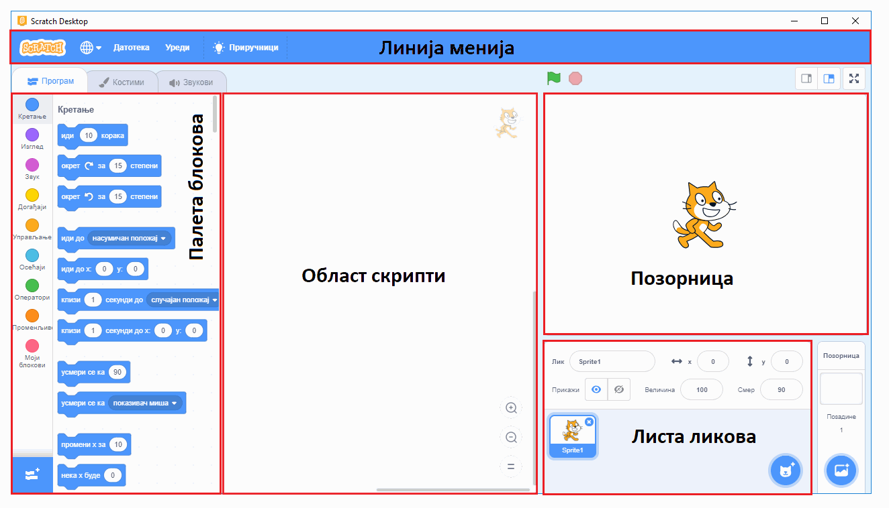

~~~~~~~~~~~~~~~~~~~~~~~~~~~~~
1. Рачунарство - **Увод**
~~~~~~~~~~~~~~~~~~~~~~~~~~~~~

Добродошао/Добродошла!

Налазиш се у Петљиној онлајн учионици где смо за тебе припремили часове програмирања за пети разред у програму Скреч (*Scratch*), који је намањен за визуелно програмирање.

Пред тобом су лекције које прате све оно што је предвиђено да се ради и на редовним часовима Информатике и рачунарства
у школи. Лекције су прилагођене твом узрасту. Организовали смо их да имају теоријски део који чине текст, видеи, питалице и након тога
долази мини квиз који ће ти помоћи да процениш колико си градива усвојио/усвојила из лекције коју си прошао/прошла.

Након већих целина, припремили смо за тебе тестове којима пратимо твој напредак.

Пре него што пређемо на први час, погледај како изгледа окружење програмског језика Скреч, у коме ћеш вероватно проводити највише времена на часовима који следе.

Ово окружење се састоји од великог броја делова и компоненти, од којих су само неки одмах видљиви. На слици су именовани неки од  најважнијих делова, а са овим и другим деловима ћемо се детаљније упознати у наредним лекцијама.
 
Користећи ово окружење моћи ћеш да направиш своју прву анимирану причу, мини игрицу, занимљиву презентацију. Скреч је визуелан језик,
то значи да ћеш све ово правити превлачењем одговарајућих блокова, а не писањем наредби. Ако си нестрпљив/нестрпљива да видиш како изгледа једна анимација, направљена у програмском језику Скреч, кликни на слику:

.. raw:: html

   

   <iframe src="https://scratch.mit.edu/projects/173903305/embed" allowtransparency="true" width="485" height="402" frameborder="0" scrolling="no"  allowfullscreen>
   </iframe>
   

А ако желиш да бациш поглед и на програм који ово ради, кликни |scratch_primer_projekat_link|.

.. |scratch_primer_projekat_link| raw:: html

   <a href="https://scratch.mit.edu/projects/173903305/editor/" target="_blank">ovde</a>

Наредне лекције ће ти помоћи да направиш своје прве програмерске кораке у једном визуелном програмском језику, а текстуално програмирање те чека већ у 6. разреду. 

Желимо ти успешан рад!

