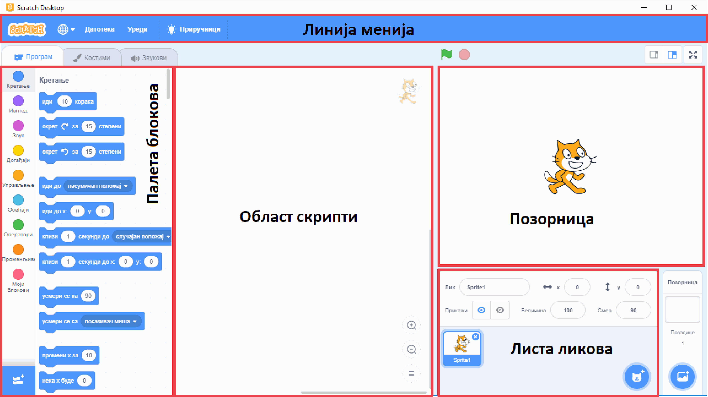

~~~~~~~~~~~~~~~~~~~~~~~~~~~~~
**Увод**
~~~~~~~~~~~~~~~~~~~~~~~~~~~~~

Добродошао/Добродошла!

Налазиш се у Петљиној онлајн учионици где смо за тебе припремили часове програмирања за пети разред у програму Скреч (*Scratch*), који је намањен за визуелно програмирање.

Пред тобом су лекције које прате све оно што је предвиђено да се ради и на редовним часовима Информатике и рачунарства
у школи. Лекције су прилагођене твом узрасту. Организовали смо их да имају теоријски део који чине текст, видеи, питалице и након тога
долази мини квиз који ће ти помоћи да процениш колико си градива усвојио/усвојила из лекције коју си прошао/прошла.

Након већих целина, припремили смо за тебе тестове којима пратимо твој напредак.

Пре него што пређемо на први час, хајде да се укратко упознамо са окружењем програмског језика Скреч.

Ово окружење се састоји од великог броја делова и компоненти, од којих су само неки одмах видљиви. За сада ћемо поменути само најважније делове, а са овим и другим деловима ћемо се детаљније упознати у наредним лекцијама.
 
- Палета (колекција) блокова садржи наредбе програмског језика Скреч, разврстане по групама и представљене графички. Због графичког представљања, наредбе у Скречу често називамо блоковима.
- Област скрипти је део у коме се наредбе-блокови слажу и формирају скрипте. Блокове превлачимо мишем из палете блокова у област скрипти, где ређањем блокова на одређени начин правимо скрипте.
- Позорница је део на коме се догађа све што испрограмираш у Скречу. На позорницу се могу постављати разни ликови, који ће се кретати по позорници, говорити и утицати једни на друге.
- Листа ликова садржи сличице ликова додатих у пројекат. Испод сваког лика је исписано његово име.
- Линија менија омогућава започињање новог пројекта, чување пројекта, учитавање раније сачуваног пројекта, подешавање окружења и слично.

Користећи ово окружење моћи ћеш да направиш своју прву анимирану причу, мини игрицу, занимљиву презентацију. Скреч је визуелан језик,
то значи да ћеш све ово правити превлачењем одговарајућих блокова, а не писањем наредби. Ако си нестрпљив/нестрпљива да видиш како изгледа једна анимација, направљена у програмском језику Скреч, кликни на слику:

.. raw:: html

   

   <iframe src="https://scratch.mit.edu/projects/173903305/embed" allowtransparency="true" width="485" height="402" frameborder="0" scrolling="no"  allowfullscreen>
   </iframe>
   

А ако желиш да бациш поглед и на програм који ово ради, кликни |scratch_primer_projekat_link|.

.. |scratch_primer_projekat_link| raw:: html

   <a href="https://scratch.mit.edu/projects/173903305/editor/" target="_blank">ovde</a>

Наредне лекције ће ти помоћи да направиш своје прве програмерске кораке у једном визуелном програмском језику, а текстуално програмирање те чека већ у 6. разреду. 

Желимо ти успешан рад!

