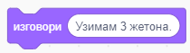
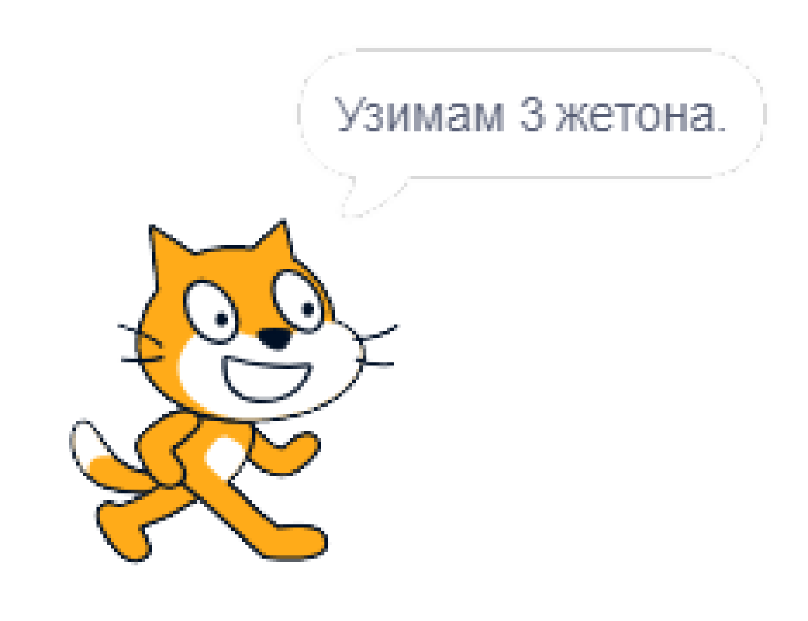

~~~~~~~~~~~~~~~~~~~~~~~~~~~~~~~~~~
1.1. Алгоритамски начин размишљања
~~~~~~~~~~~~~~~~~~~~~~~~~~~~~~~~~~

.. topic:: У оквиру овог часа упознаћеш се са следећим појмовима: 
            
            - рачунар

            - алгоритам

            - алгоритамски начин размишљања

            - програм 

            - блоковско програмирање - Scratch

Живимо окружени рачунарима. Рачунари се налазе у нашим мобилним уређајима, сатовима, телевизорима, кухињским апаратима, аутомобилима, лифтовима. Олакшавају нам послове, а учење чине занимљивијим. Захваљујући рачунарима, слободно размењујемо информације и брзо им приступамо. 

Мада се чини да су рачунари паметни, то је само привид - рачунари, још увек, не могу самостално да мисле! Наиме, **рачунари** су машине које следе упутства (наредбе) и тако обављају различите задатке. Наредбе рачунарима пишу људи, мали и велики програмери. **Програм** je низ наредби које рачунар извршава. Да би рачунар могао да ти помогне да брже и лакше обављаш неки посао, потребно је да га за то "обучиш" - програмираш, слично као што  људи  треба да се обуче да раде сложене послове. 

На пример, кувари користе рецепте у којима је поступак прављења јела задат као низ једноставних корака. Те једноставне кораке, наредбе, кувар уме да уради, а њиховим извршавањем по редоследу наведеном у рецепту може да направи и најсложенија јела која никад раније није правио.

Играч који игра неку игру против другог играча може да победи ако зна правила игре и ако има добар план како да победи - победничку стратегију.

Оно што је заједничко за програм, рецепт и победничку стратегију је да су то алгоритми записани језиком који разуме њихов извршилац - рачунар, кувар, играч. **Алгоритам** је низ корака који воде до решења неког проблема. Све ове активности - рад рачунара, кување по рецепту, играње игрице коришћењем победничке стратегије, остварују се извршавањем низа елементарних корака по редоследу који је задат алгоритмом. 

|

Нема свака игра победничку стратегију, али ова коју ти нудимо има. То је верзија игре НИМ са једном гомилом жетона. Два играча А и В наизменично повлаче потезе. У сваком потезу играч може да узме 1, 2 или 3 жетона. Први почиње играч А уписивањем броја жетона које узима. Побеђује онај играч који последњи узме жетон. Можеш да играш против рачунара (single player) или против другог играча. Покушај!

.. nimgame:: nim1
   :takeaway: 3
   :count: 15
..
   takeaway je broj koji učenici mogu da uzmu
   count je broj koliko elemenata postoji na početku 
   igra se tako što učenik unese broj u boxić pored dugmeta take, pritisne dugme i onda igra računar. može da se igra i u dva igrača ako se odčekira dugme single player u gornjem desnom uglu. Rešićemo malo grafički dizajn u narednom periodu. 

Да ли си успео/успела да победиш рачунар који игра по стратегији која му је уграђена програмом? Колико жетона треба да узмеш првом потезу да би победио/победила?

|

Хајде да заједно анализирамо како доћи до победе. Кренућемо од краја игре.

Побеђује играч који противнику остави 4 жетона. Колико год узео противник, на табли остаје онолико жетона колико други играч може да узме једним потезом. Дакле, у овој игри побеђује онај играч који свом противнику на табли остави неки умножак од 4 жетона - 4, 8 или 12. Ако играч А у првом потезу узме 1 жетон, играч В обезбеђује себи победу узимањем два жетона. Ако играч А у првом потезу узме 2 жетона, играч В обезбеђује себи победу узимањем једног жетона. Међутим, ако играч А у првом потезу узме 3 жетона, обезбедио је победу за себе.

У следећој табели приказана је победничка стратегија за играча А.

================================================ =============================================
               **Играч А**                                      **Играч Б**                   
================================================ =============================================
 1. Узима 3 жетона.                                                                           
                                   Остаје 12.     1. Узима х жетона (1-3). Остаје 12-х (9-11).
 2a. Ако је противник узео 1, узима 3 жетона.                                                 
 2b. Ако је противник узео 2, узима 2 жетона.                                                 
 2c. Ако је противник узео 3, узима 1 жетон.                                                  
                                    Остаје 8.     2. Узима х жетона (1-3). Остаје 8-х (5-7).  
 3a. Ако је противник узео 1, узима 3 жетона.                                                 
 3b. Ако је противник узео 2, узима 2 жетона.                                                 
 3c. Ако је противник узео 3, узима 1 жетон.                                                  
                                   Остаје 4.      3. Узима х жетона (1-3). Oстаје 4-х (1-3).  
 4. Узима све преостале жетоне и побеђује.        4. Нема жетона. Губи.                       
================================================ =============================================

Примећујеш да је, у победничком алгоритму, природа корака различита. 

•	Неки кораци се извршавају по редоследу како су наведени (Корак 1: Узима 3 жетона);
•	Неки кораци се извршавају само под одређеним условом (Кораци 2 и 3: Ако је противник узео 1, узима 3 жетона, ...);
•	Неки кораци се понављају (кораци 2 и 3 су идентични, дакле корак 2 се понавља 2 пута), 

Ток алгоритма је делом линијски (корак по корак), делом условљен (Потез играча А зависи од потеза противника) и делом цикличан 
(неки кораци се понављају).

Колико жетона треба да узме играч А у првом потезу да би обезбедио победу, ако је на талону 16 жетона, а у једном потезу може да се узме 1-3 жетона?

А ако је на табли 15 жетона, али у једном потезу може да се узме 1-4 жетона?

.. reveal:: zadatak_sakrivanje_nim
    :showtitle: Погледај одговор
    :hidetitle: Сакриј одговор

	У првом случају играч А нема победничку стратегију, јер се на почетку налази 16 = 4х4 жетона, што играчу В обезбеђује победу. Једина шанса да победи играч А је да играч В не зна победничку стратегију и вуче потезе насумице. 
	
	У другом случају побеђује онај играч који својим потезом остави противнику 5, 10 или 15 жетона. Дакле, играч Б има победничку стратегију. Да је на табли 16 жетона и да у једном потезу може да се узме 1-4 жетона, играч А би могао да победи, ако у првом потезу узме 1 жетон.
	
Да би победнички алгоритам разумео и рачунар, потребно је да му га објасниш користећи неки од **програмских језика**.

Програмски језици су углавном текстуални. То значи да програмер пише наредбе у специфичном облику енглеског језика. На пример, ако користиш Пајтон (енгл. Python), наредба да рачунар на екрану испише „Узимам 3 жетона.“ изгледа овако: ``print (‘Uzimam 3 žetona.’)``.

Почетницима текстуални програмски језици често делују сложено. Зато су осмишљени визуелни програмски језици, као што је Скреч. Они ти омогућавају да програмираш без куцања наредби, спајањем графичких блокова. За сада ти, можда, и ово делује компликовано, али видећеш да није.

Да бисмо те уверили у једноставност визуелног програмирања, показаћемо ти како се у програмском језику Скреч постиже исписивање реченице „Узимам 3 жетона.“ Довољно је уписати текст у овај блок.

Када рачунар изрвши ову наредбу, на екрану ће се појавити:

Симпатично, зар не?

Мада вероватно немаш програмерско искуство у Скречу, верујемо да ћеш моћи да одговориш на следећа питања.

.. mchoice:: L1P2
   :answer_a: Кораке 1 и 2
   :answer_b: Кораке 1 и 3
   :answer_c: Кораке 2 и 3
   :answer_d: Кораке 1, 2 и 3
   :feedback_a: Шта се дешава у трећем кораку алгоритма? Размисли.
   :feedback_b: Шта се дешава у другом кораку алгоритма? Размисли.
   :feedback_c: Шта се дешава у првом кораку алгоритма? Размисли.
   :feedback_d: Браво! За тебе је програмирање заиста једноставно! 
   :correct: d

   На које кораке алгоритма Играча Б може да се односи следећи низ наредби? 

   .. image:: ../../_images/S3_01_algoritmi/L1_Blokovi2.png
      :width: 200   
      :align: center

.. mchoice:: L1P3s
   :answer_a: Корак 1
   :answer_b: Корак 2
   :answer_c: Корак 3
   :answer_d: Корак 4
   :feedback_a: 
   :feedback_b: 
   :feedback_c: 
   :feedback_d: 
   :correct: b,c

   Ова наредба делује сложеније. На који корак алгоритма Играча A се она односи? (Изабери све тачне одговоре)

   .. image:: ../../_images/S3_01_algoritmi/L1_Blokovi3.png
       :align: center
       :width: 200
      
Програмирање треба да посматраш као нову врсту писања. Када овладаш техникама и логиком програмирања, 
моћи ћеш да "пишеш" нове врсте "текста" - интерактивне приче, игре, анимације и симулације.

Рачунар је предвидљива машина. Радиће баш оно што му кажеш. Твој програм извршаваће се на потпуно исти 
начин на различитим рачунарима. 

Покушај да даш неко упутство другарицама и друговима. Видећеш да ће свако од њих, иако су добили прецизна упутства,
задатак урадити на свој начин. На људе утичу њихове емоције, предзнање, искуство, концентрација и још много чинилаца. Људи могу да увежбају да раде по прецизном упутству, али и даље ће грешити чешће него рачунари (на пример због умора).

Лепота програмирања лежи у могућности да смишљаш разне занимљиве ствари и састављањем програма оствариш своје идеје. Рачунар, сам по себи, не рађа креативност, али може да ти помогне да развијеш и испољиш своју креативност и покажеш је коме год желиш, па чак и целом свету!

.. |S3Python| image:: ../_images/S3_01_algoritmi/S3Python.png

Шта смо научили
---------------

У овој лекцији увели смо појам алгоритма. На примеру игре Ним показали смо како одговарајућим редоследом потеза можеш да дођеш до победе. Тај низ корака, који називамо победничка стратегија, је пример алгоритма. Да би рачунар могао да изврши алгоритам, потребно је да га испрограмираш, односно да кораке алгоритма запишеш језиком који рачунар разуме - програмским језиком. Језик програмирања који ћеш учити кроз лекције овог курса је Скреч. 

Додатак
-------

Више детаља о структури алгоритама, начину њиховог графичког представљања и начину њиховог записивања у Скречу, можеш да видиш у тексту
`Основни елементи програмске логике у Скречу <https://petlja.org/biblioteka/r/lekcije/scratch3-praktikum/scratch3-grananje>`_
из нашег практикума.

.. infonote::

    **Провери своје знање пролазећи кроз наредна питања и вежбе.**

