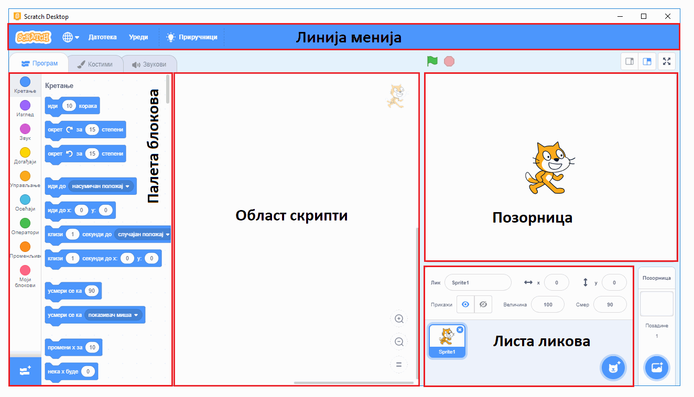

~~~~~~~~~~~~~~~~~~~~~~~~~~~~~~~~~~~~~~~~~~~~~~~~~~~~~~
1.3. Подешавања и почетак рада
~~~~~~~~~~~~~~~~~~~~~~~~~~~~~~~~~~~~~~~~~~~~~~~~~~~~~~

.. topic:: У оквиру ове активности сазнаћеш:
            
            - Како да на Скречу подесиш језик на српски
            - Зашто треба да имаш налог на Скречу и како да га направиш
            - Како да започнеш Скреч пројекат

Најједноставнији начин да користиш Скреч јесте директно на веб сајту `scratch.mit.edu <https://scratch.mit.edu>`_.

Користи два одвојена прозора или два таба свог веб прегледача (браузера), тако да у једном имаш отворен овај курс, а у другом сајт `scratch.mit.edu <https://scratch.mit.edu>`_. 

Када одеш на сајт `scratch.mit.edu <https://scratch.mit.edu>`_, прво што треба да урадиш је да подесиш језик на српски.

.. infonote::

    **Подешавање језика:**
    
    Скролуј до краја старне и уочи дугме за избор језика. На следећој слици оно је у црвеном оквиру:

    .. image:: ../../_images/S3_01_prvi_program/izbor_jezika.png
       :align: center
       :width: 700

    Ако на том месту није изабран српски језик, изабери га. Скреч ће запамтити твој избор, тако да када следећи пут уђеш у Скреч ово нећеш морати да радиш.

Затим треба да креираш свој кориснички налог, уколико га још немаш. 

.. infonote::

    **Прављење налога:**

    Изабери опцију *Придружи се Скречу*, која се налази у горњем десном углу веб стране:

    .. image:: ../../_images/S3_01_prvi_program/pridruzi_se.png
       :align: center
       :width: 700

    Као име за пријаву немој да користиш своје право име, најбоље је да измислиш неко име само за ову прилику. 
    
    Налог на Скречу такође правиш само једном, на пример, када први пут дођеш на сајт.

Сада, када имаш кориснички налог (било од раније или управо креиран), треба да се пријавиш.

.. infonote::

    **Пријављивање:**

    Изабери опцију *Пријави се* у врху стране и унеси своје корисничко име и лозинку.

    .. image:: ../../_images/S3_01_prvi_program/prijavi_se.png
       :align: center
       :width: 700
       
    |
    
    Пријављивање ти омогућава 
    
    - да чуваш своје пројекте онлајн и да им приступаш са било ког рачунара
    - да објављујеш своје пројекте који ти се допадају и тако их делиш их са другима, ако то желиш
    - да коминуцираш са другим корисницима платформе Скреч, да тражиш помоћ у вези са пројектима и помажеш другима

Сада је све спремно за рад и можеш да започнеш нови пројекат.

.. infonote::

    **Почетак рада:**

    У врху са леве стране нађи опцију *Стварај*:

    .. image:: ../../_images/S3_01_prvi_program/stvaraj.png
       :align: center
       :width: 700

    Када кликнеш на опцију *Стварај* отвориће ти се радно окружење програмског језика Скреч. 
    

Пре него што почнемо, погледај поново слику окружења Скреч и запамти како се зову његови најважнији делови, јер ће ти то помоћи да пратиш описе активности које следе.

- Палета (колекција) блокова садржи блокове од којих се састављају програми програмског језика Скреч, разврстане по групама и представљене графички. Већина блокова у Скречу представља наредбе, али има и блокова који представљају делове неких наредби.
- Област скрипти је део у коме се наредбе-блокови слажу и формирају скрипте. Блокове превлачимо мишем из палете блокова у област скрипти, где ређањем блокова на одређени начин правимо скрипте.
- Позорница је део на коме се догађа све што испрограмираш у Скречу. На позорницу се могу постављати разни ликови, који ће се кретати по позорници, говорити и утицати једни на друге.
- Листа ликова садржи сличице ликова додатих у пројекат. Испод сваког лика је исписано његово име.
- Линија менија омогућава започињање новог пројекта, чување пројекта, учитавање раније сачуваног пројекта, подешавање окружења и слично.

.. topic:: Погледај видео:

   Овај видео ти може помоћи да започнеш рад и боље се упознаш са окружењем Скреча

    .. ytpopup:: CUyF3fDeRKc
        :width: 735
        :height: 415
        :align: center 