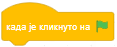

~~~~~~~~~~~~~~~~~~~~~~~~~~~~~~~~~~~~~~~~~~~~~~~~~~~~~~
1.4. Први програм
~~~~~~~~~~~~~~~~~~~~~~~~~~~~~~~~~~~~~~~~~~~~~~~~~~~~~~

.. topic:: У оквиру ове активности сазнаћеш:
            
            - Како да одабереш ликове и позадину за свој пројекат
            - Како да твоји ликови говоре као у стрипу
            - Како да направиш, извршаваш, дорађујеш и сачуваш свој програм

.. |novi_lik|          image:: ../../_images/S3_opste/novi_lik.png
.. |nova_pozadina|     image:: ../../_images/S3_opste/nova_pozadina.png

Хајде да направимо наш први програм!

Након што кликнеш на дугме "Стварај", требало би да се налазиш на почетку новог пројекта.

|

Ако си у неком започетом пројекту (који не желиш да сачуваш, или је већ сачуван), нови пројекат можеш да започнеш кликом на мени "Датотека" и избором ставке "Ново".

|
   
На почетку пројекта треба да изаберемо лик, или ликове који ће учествовати у пројекту. Погледај доњи десни део екрана:

.. image:: ../../_images/S3_01_prvi_program/likovi_pozadine.png
   :align: center
   :width: 400

У новом пројекту већ се налази један лик (означен словом А) и позорница са једном празном позадином (означена словом Б). У сваком пројекту постоји само једна позорница, не можемо је уклонити из пројекта, нити додати нову позорницу. Међутим, та једна позорница може да има разне изгледе, који се зову позадине. Да додаш позадину, кликни на дугме |nova_pozadina| у доњем десном углу. Отвара се галерија позадина. Кликни на позадину коју желиш и она ће покрити позорницу.

Слично можеш да додаш и нови лик. Кликни на дугме |novi_lik| у листи ликова и отвориће се галерија ликова. Изабери лик који желиш, тако што ћеш да кликнеш на њега. Сада имамо два лика у пројекту, при чему је нови лик тренутно активан.

|
   
Подаци које видимо непосредно изнад ликова (име, положај, величина и оријентација) се увек односе на активан лик. Такође, у области скрипти се увек виде само скрипте активног лика. Тренутно нема никаквих скрипти јер их још нисмо направили, али сада ћемо то учинити.

|
   
.. comment .. sidebar:: Групе блокова

Уз леву ивицу екрана виде се речи "Кретање", "Изглед", "Звук", "Догађаји" итд. испод кругова у разним бојама, баш као са леве стране овог текста. Клик на сваку од тих речи у Скречу отвара по једну групу међусобно сродних блокова. Отвори групу "Догађаји" (жута група) и превуци блок |zelena_zastavica| у област скрипти.

.. infonote::

    Свака скрипта која започиње блоком |zelena_zastavica| извршиће се када кликнеш на зелену заставицу изнад горњег левог угла позорнице.

Отвори сада групу блокова "Изглед" (љубичаста група), довуци блок |izgovori_sec| у област скрипти и постави га непосредно испод блока  |zelena_zastavica|. Кликни на зелену заставицу изнад позорнице и твој први програм ће се извршити! 

Упиши неки текст у нови блок уместо речи "Здраво" и покрени програм поново кликом на зелену заставицу. Надовежи још неколико блокова |izgovori_sec| на крај скрипте и упиши реченице које желиш. Можеш и да мењаш трајање појединих реченица.

Наша скрипта изгледа овако, а ти направи своју.

Мачак нам је у овом пројекту сувишан. Ако већ ниси, можеш да га уклониш из пројекта овако:

Кликни на мачка у листи ликова, тако да он постане активан. Примети да се скрипта више не види, јер је за мачка нисмо ни састављали.
Кликни затим на кантицу поред мачка, чиме ћеш га уклонити из пројекта. Сада је лик девојчице поново активан и види се скрипта коју смо саставили за њу.

Пројекат може да не садржи ни један лик. У то се можеш уверити ако уклониш и лик девојчице из пројекта. Истина, тада се у пројекту ништа не би дешавало, али би то ипак био пројекат. Пројекат без ликова може да има и неко понашање, а за то је потребно саставити једну или више скрипти за позорницу. Можемо, на пример, да испрограмирамо позорницу да на сваких неколико секунди промени позадину, то јест да се понаша као "слајд-шоу" за прегледање слика.

Лик који је уклоњен из пројекта можеш да вратиш кликом у менију на реч "Уреди", а затим на ставку "Поврати лик".

Ако желиш, можеш да сачуваш овај пројекат: у линији менија дај име пројекту (црвено „1” на слици испод), затим кликни на мени „Датотека” (корак 2) и одабери где желиш да сачуваш пројекат (корак 3).

Када изабереш ставку "Сачувај одмах", пројекат ће бити сачуван на сајту Скреча. Оваквом пројекту можеш следећи пут да приступиш са било ког рачунара, само је потребно да се пријавиш под истим корисничким именом.

Када изабереш ставку "Сачувај на свом рачунару", пројекат ће бити сачуван на рачунару за којим се налазиш, највероватније у фасцикли *Преузимања* (фолдеру *Downloads*). Том пројекту нећеш моћи да приступиш са другог рачунара.

.. topic:: Погледај видео:

   Погледај овај видео како би утврдио/утврдила све што о чему смо говорили у овој  и како би почео/почела са израдом једне једноставне игрице. 

    .. ytpopup:: HsW9zXNWJT8
        :width: 735
        :height: 415
        :align: center 

Додатак
-------

Ако желиш, погледај `поглавље Окружење програмског језика Скреч <https://petlja.org/biblioteka/r/lekcije/scratch3-praktikum/scratch3-interfejs>`_ у Петљином практикуму. Тамо можеш да нађеш још нека објашњења о окружењу Скреч, питања за проверу знања, вежбе, упутства, предлоге и слично.

Петљин `студио Интерфејс <https://scratch.mit.edu/studios/25117360/>`_ на сајту Скреча садржи урађене пројекте за задатке сличне оним којима смо се овде бавили.

