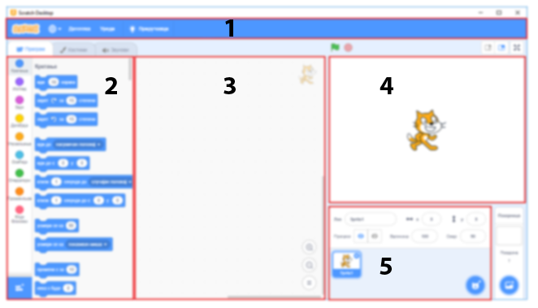

2.3. Квиз - Почетак рада
~~~~~~~~~~~~~~~~~~~~~~~~~~~
Питање 1
~~~~~~~~

.. mchoice:: peti_22_1
   :answer_a: Да
   :answer_b: Не
   :correct: b
   :feedback_a: Нетачно!
   :feedback_b: Тачно!
   
   Да ли може да се направи пројекат који нема позорницу?

Питање 2
~~~~~~~~
   
.. mchoice:: peti_22_2
   :answer_a: Да
   :answer_b: Не
   :correct: b
   :feedback_a: Тачно!
   :feedback_b: Нетачно!
   
   Да ли може да се направи пројекат који нема ликове?   
   
Питање 3
~~~~~~~~

Поједини делови Скреч интерфејса на следећој слици означени су бројевима од 1 до 5. 

      
.. dragndrop:: peti_22_3
    :feedback: Покушај поново.
    :match_1: позорница|||4
    :match_2: палета наредби|||2
    :match_3: област скрипти|||3
    :match_4: листа ликова|||5
    :match_5: линија менија|||1
    
    Превлачењем упари називе делова окружења са њиховим позицијама на слици.

Питање 4
~~~~~~~~

.. mchoice:: peti_22_4
   :multiple_answers:
   :answer_a: линија менија
   :answer_b: листа ликова
   :answer_c: област скрипти
   :answer_d: палета наредби
   :correct: b
   :feedback_a: 
   :feedback_b: 
   :feedback_c: 
   :feedback_d: 

   Назив за место где у приказане сличице свих ликова који учествују у пројекту је: 

Питање 5
~~~~~~~~
 
.. mchoice:: peti_22_5
   :multiple_answers:
   :answer_a: презентације
   :answer_b: скрипте
   :answer_c: графичке датотеке
   :answer_d: звучне датотеке
   :correct: b, c, d
   :feedback_a: 
   :feedback_b: 
   :feedback_c: 
   :feedback_d: 

   Позорници и ликовима могу да буду придружене: (Изабери све тачне одговоре) 
 