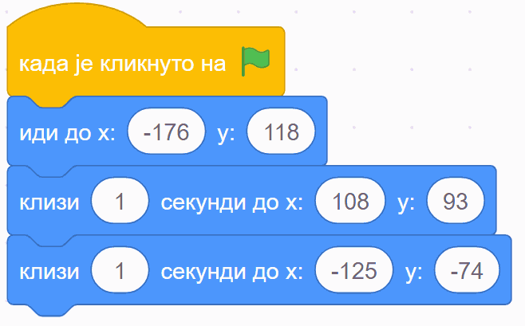
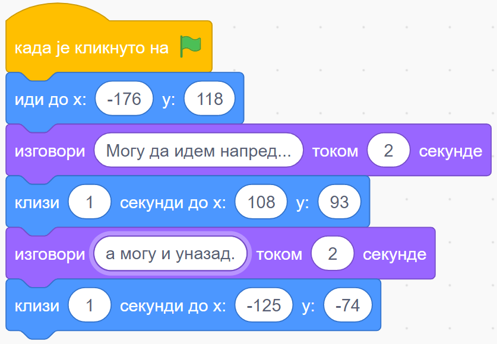
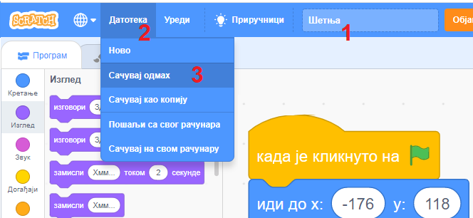

~~~~~~~~~~~~~~~~~~~~~~~~~~~~~~~~~~~~~~~~~~~~~~~~~~~~~~
2.1. Положај и кретање лика
~~~~~~~~~~~~~~~~~~~~~~~~~~~~~~~~~~~~~~~~~~~~~~~~~~~~~~

.. topic:: У оквиру овог часа сазнаћеш:
            
            - Како се помоћу бројева (координата) задаје положај на позорници
            - Како да из програма постављаш и помераш ликове по позорници

.. |zelena_zastavica|  image:: ../../_images/S3_opste/zelena_zastavica.png
.. |idi_xy|            image:: ../../_images/S3_opste/idi_xy.png
.. |klizi_xy|          image:: ../../_images/S3_opste/klizi_xy.png
.. |izgovori_sec|      image:: ../../_images/S3_opste/izgovori_sec.png

Координате
----------

.. sidebar:: Координате тачака и ликова

    .. image:: ../../_images/S3_02_polozaj/koordinate.png
       :align: center
       :width: 600

Поменули смо да је позорница место на коме се догађа све што испрограмираш у Скречу. Позорница је широка 480 корака и висока 360 корака. Положај ликова на позорници се задаје помоћу два броја, које зовемо **координате** и обично их означавамо са *X* и *Y*.

- Координата *X* говори где се лик налази по ширини позорнице, тј. колико је лик лево или десно у односу на средину позорнице по ширини. Када се лик помера на лево, његова *X* координата се смањује, а када се помера на десно, његова *X* координата се повећава.
- Координата *Y* говори где се лик налази по висини позорнице, тј. колико је лик горе или доле у односу на средину позорнице по висини. Када се лик помера на доле, његова *Y* координата се смањује, а када се помера на горе, његова *Y* координата се повећава.

Из галерије позадина изабери позадину ``Xy-grid``, јер ће ти она помоћи да научиш да задајеш и очитаваш положаје.

Taмно плава, усправна линија у средини позорнице се зове *Y* оса, а наранџаста, водоравна линија је *X* оса. Ове две линије се једним именом зову **координатне осе** и оне нам помажу да прочитамо координате тачака позорнице. Центар позорнице се налази у пресеку ове две линије и координате центра позорнице су (*X*:0, *Y*:0), или кратко (0, 0). Тачка на десном крају *X* осе (наранџасте линије) има координате (*X*:240, *Y*:0), односно (240, 0). На слици су исписане и координате левог краја *X* осе, као и горњег и доњег краја *Y* осе.

На истој слици смо нацртали и означили великим стрелицама по једну црвену, црну и зелену тачку. Помоћу оса можемо да прочитамо да су координате црвене тачке (*X*:200, *Y*:100), односно (200, 100), координате црне тачке су (*X*:-100, *Y*: 50), односно (-100, 50), док су координате зелене тачке (*X*:100, *Y*:-100), односно (100, -100).

Тренутни положај лика може се прочитати у информацијама о активном лику испод позорнице. На слици "Координате тачака и ликова" положај лика се види у дну слике (означен црвеним оквиром).

У новом пројекту померај лика мишем по позорници и прати вредности координата. Упиши нове координате лика и види како се он померио. Понови поступак, али пре него што упишеш координате процени где ће се лик појавити. Уради то неколико пута, док се не навикнеш на употребу координата.

|

Провери своје разумевање координата и одговори на следеће питање.

.. mchoice:: koordinate_gde_je_lik
   :answer_a: У горњем левом делу позорнице.
   :answer_b: У доњем левом делу позорнице.
   :answer_c: У горњем десном делу позорнице.
   :answer_d: У доњем десном делу позорнице.
   :feedback_a: Y координата је негативна. Да ли су тачке са негативном Y координатом у горњем или доњем делу слике?
   :feedback_b: Браво! Одлично разумеш како координате (вредности X и Y) одређују положај лика на позорници! 
   :feedback_c: Погледај поново слику "Координате тачака и ликова". Где се налазе тачке чије су обе координате негативне?
   :feedback_d: X координата је негативна. Да ли су тачке са негативном X координатом у левом или десном делу слике?
   :correct: b

   Пажљиво погледај информације о положају лика на позорници. Где се лик налази?

   .. image:: ../../_images/S3_02_polozaj/gde_je_lik.png
       :align: center
       :width: 500

Пример 1 - Мачак шета
'''''''''''''''''''''

Хајде сада да испробамо кретање лика у једном једноставном пројекту.

1. Кликом на жути круг уз леву ивицу екрана, отвори групу блокова "Догађаји", а затим довуци у област скрипти блок |zelena_zastavica|. Сваки низ наредби (скрипта) који започиње овим блоком, извршиће се када кликнеш на зелену заставицу изнад горњег левог угла позорнице.

2. Кликом на плави круг пређи на групу блокова "Кретање".

3. Постави мачка на место на позорници, са којег желиш да крене у шетњу. Довуци блок |idi_xy| у област скрипти и надовежи га испод почетног блока. Примети да координате у блоку одговарају тренутном положају мачка.

4. Постави мачка на место на позорници, до којег желиш да стигне. Довуци блок |klizi_xy| у област скрипти и надовежи га испод претходних блокова.

5. Постави мачка на место на коме треба да заврши шетњу. Довуци још једном блок |klizi_xy| у област скрипти и надовежи га испод претходних блокова. Ако желиш, подеси време током којег ће мачак клизити од једног положаја до другог.

Твоја скрипта би требало да сада изгледа овако некако (бројеви не морају да буду исти):

Кликни на зелену заставицу и пошаљи мачка у шетњу.

Пример 2 - Мачак шета и прича
'''''''''''''''''''''''''''''

Мачку који шета додаћемо облачиће са текстовима које он "изговара", као у стрипу.

1. Кликни на љубичасти круг и отвори групу блокова "Изглед".

2. Пронађи блок |izgovori_sec| и убаци га испод блока |idi_xy|. Упиши неки текст у нови блок.

3. Довуци још један блок |izgovori_sec| и убаци га између два блока |klizi_xy|. Упиши неки текст и у овај блок.

Скрипта сада изгледа слично овој (бројеви и текстови не морају да буду исти):

|

Испробај и ову верзију пројекта. Додај по жељи неке друге реченице које мачак изговара, или промени трајање неких реченица или кретања.

Ако желиш, можеш да сачуваш и овај пројекат: корак 1 - именуј пројекат; корак 2 - кликни на мени "Датотека"; корак 3 - одабери где желиш да сачуваш пројекат.

