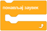
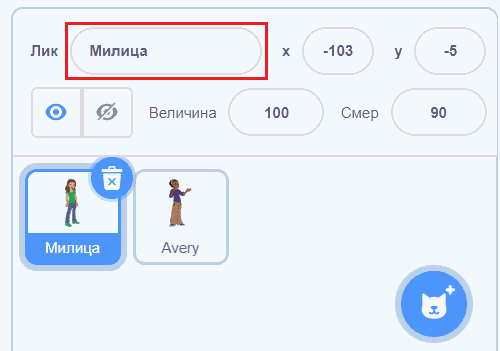
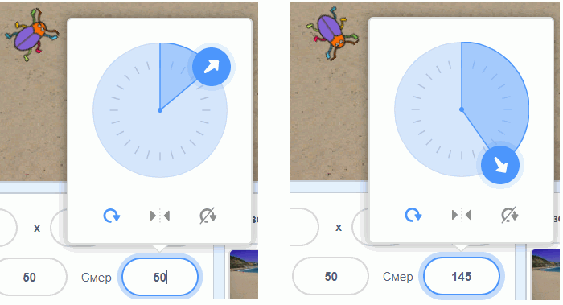
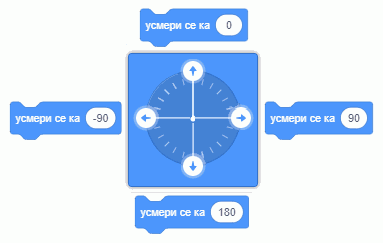
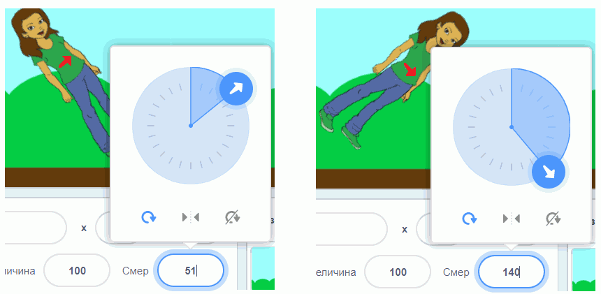
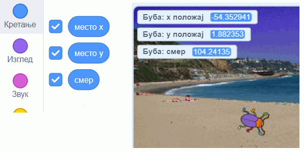
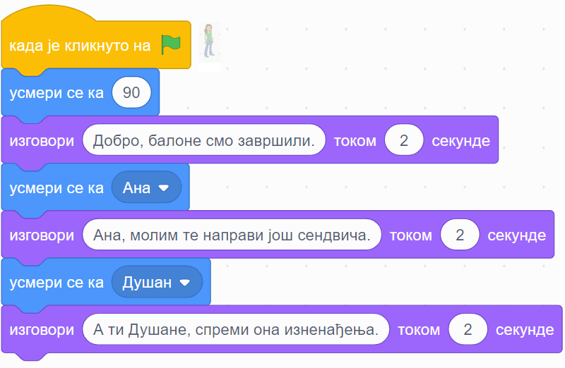
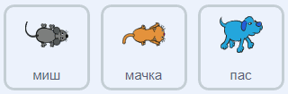
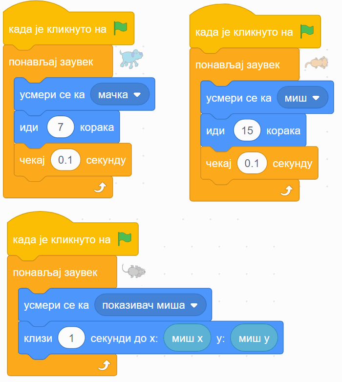

~~~~~~~~~~~~~~~~~~~~~~~~~~~~~~~~~~~~~~~~~~~~~~~~~~~~~~
Усмеравање лика
~~~~~~~~~~~~~~~~~~~~~~~~~~~~~~~~~~~~~~~~~~~~~~~~~~~~~~

.. topic:: У оквиру ове активности сазнаћеш:
            
            - Како се задаје смер
            - Како да из програма усмераваш ликове

.. |zelena_zastavica|  image:: ../../_images/S3_opste/zelena_zastavica.png

.. |idi_xy|            image:: ../../_images/S3_opste/idi_xy.png

.. |klizi_xy|          image:: ../../_images/S3_opste/klizi_xy.png

.. |mesto_x|           image:: ../../_images/S3_opste/mesto_x.png
.. |mesto_y|           image:: ../../_images/S3_opste/mesto_y.png

.. |usmeri_objektu|    image:: ../../_images/S3_opste/usmeri_objektu.png

.. |nacin_okretanja|   image:: ../../_images/S3_opste/nacin_okretanja.png
.. |smer|              image:: ../../_images/S3_opste/smer.png

.. |izgovori_sec|      image:: ../../_images/S3_opste/izgovori_sec.png

Група блокова "Кретање" садржи велики број блокова. Неке од њих смо већ користили и видели како функционишу. Сада ћемо укратко описати и остале блокове из ове групе. Ако ти за неки блок не буде јасно како он ради, слободно га испробај у било ком тренутку. При испробавању може да буде корисно да имаш два или више ликова на позорници. Ако желиш, можеш да ликовима промениш имена - само изабери лик кликом на њега у листи ликова и упиши ново име у одговарајуће поље у врху листе ликова (на следећој слици то поље је у црвеном оквиру).

|

- Блокови |idi_do| и |klizi_do| померају лик до одређеног места (до неког другог лика, до тренутне позиције миша, или до случајне позиције). Померање може да буде тренутно, или током задатог времена.

- Блокови |idi_xy|, |klizi_xy|, |promeni_x|, |neka_x|, |promeni_y|, |neka_y| сви доводе лик до задатог положаја на позорници. При томе се или наводе координате циљног положаја, или се задаје како се мења *x* или *y* координата.

|

- Блок |idi_koraka| помера лик задати број корака у смеру у коме је лик окренут. Смер лика можемо да задамо у листи ликова. Кликни у поље "смер" и када се појави круг са стрелицом, помери стрелицу да показује у смеру у ком желиш да окренеш лик. Примети како се лик окреће у смеру стрелице.

|

- Лик се може усмерити и из програма. Блокови |okret_udesno|, |okret_ulevo|, |usmeri_ka|, |usmeri_objektu| служе да окрену лик у жељеном смеру. Прва два блока мењају смер лика за задати број степени улево или удесно, трећи блок задаје смер у степенима, а четврти окреће лик ка одређеном месту (другом лику или положају миша). Када користимо блок |usmeri_ka|, при задавању смера се поново појављује круг са смеровима, који нам помаже да задамо жељени смер. Без обзира на то, ради читања програма је добро знати како се смерови задају бројем. Ту нам може помоћи следећа слика:

|

За неке ликове није природно да се окрећу у свим смеровима:

У таквом случају користимо три дугмета |interaktivno_nacin_okretanja|, која се налазе испод круга за задавање смера, да бисмо задали начин окретања лика. Испробај свако од ова три дугмета: кликни на дугме, окрећи стрелицу на кругу и прати на који начин се лик окреће. Ако задржиш миша изнад дугмета, добићеш кратку поруку о функцији тог дугмета. Примети да и поред тога што лик не мора да се **окрене** (усмери) ка смеру кретања, задати **смер кретања** за њега и даље важи. Ово можеш да потврдиш користећи блок |idi_koraka|.

Начин окретања лика можемо да мењамо и у програму, а за то се користи блок |nacin_okretanja|. Још један блок који утиче на окретање лика је |ako_si|. Њиме задајемо да лик који дође до ивице позорнице, треба да се окрене, што ће нам бити потребно касније.

~~~~

Остали су нам још блокови |mesto_x|, |mesto_y| и |smer|, који су другачији од осталих. Пре свега, они нису наредбе него само показују вредности кордината и смера активног лика. Уочи да у палети блокова испред ових блокова стоје мала четвртаста поља. Кликни у та поља и у њима ће се појавити квачице, а вредности координата и смера се појављаују на позорници:

Пошто блокови |mesto_x|, |mesto_y| и |smer| јављају неке вредности, зовемо их блокови-репортери (остали блокови су блокови-наредбе).

Примери
-------

Хајде да ово сада испробамо на примерима!

Пример 1 - Припрема журке
'''''''''''''''''''''''''

Наши ликови и позадина у овом пројекту су као на следећој слици, а ти изабери исте или сличне.

.. image:: ../../_images/S3_02_polozaj/vezba_zurka_likovi.jpg
   :align: center
   :width: 400

Ликове смо редом слева на десно назвали Ана, Даница и Душан. Пошто Ана и Душан само стоје, скрипте за њих нису потребне. Скрипта за Даницу је дата на слици испод.

Приметите како се Даница окреће ка саговорнику док му се обраћа. Овај програм ради како смо и желели чак и без подешавања начина окретања, мада за Даницу начин окретања треба да буде "лево-десно" а не "у свим смеровима".

Пример 2 - Јурњава
''''''''''''''''''

Изабери ове ликове из галерије (ми смо им променили имена у *пас*, *мачка* и *миш*), а позадину изабери по жељи (ми смо користили позадину *Golden-rock*).

|

На следећој слици су редом скрипте за пса, мачку и миша. При врху сваке скрипте је лик на којег се скрипта односи.

|

Блок |zauvek| ћеш пронаћи у групи блокова "Управљање", а његова улога ти је можда већ јасна - блокови унутар овог блока се понављају заувек, то јест док не прекинемо извршавање програма притиском на знак "стоп" поред зелене заставице. Блокови |mis_x| и |mis_y| се налазе у групи "Осећаји". Ови блокови су блокови-репортери, који јављају координате показивача миша (уређаја, а не лика). 

Примети да групу блокова којој неки блок припада увек можеш да одредиш по боји блока.

У овом пројекту, миш-лик  се креће ка стрелици миша-уређаја, мачка јури миша, а пас мачку. Подесите начине окретања са сваки лик појединачно помоћу дугмади |interaktivno_nacin_okretanja|, онако како вам је најлогичније. Покрените програм и померајте стрелицу миша, да би се животиње јуриле.

Додатак
-------

Ако желиш, погледај `поглавље Кажи где да идем <https://petlja.org/biblioteka/r/lekcije/scratch3-praktikum/scratch3-koordinate>`_ у Петљином практикуму. Тамо можеш да нађеш још нека објашњења, примере, вежбања, питања и пројекте.

Петљин `студио Координате <https://scratch.mit.edu/studios/25117373/>`_ на сајту Скреча садржи урађене пројекте за задатке сличне оним којима смо се овде бавили.
