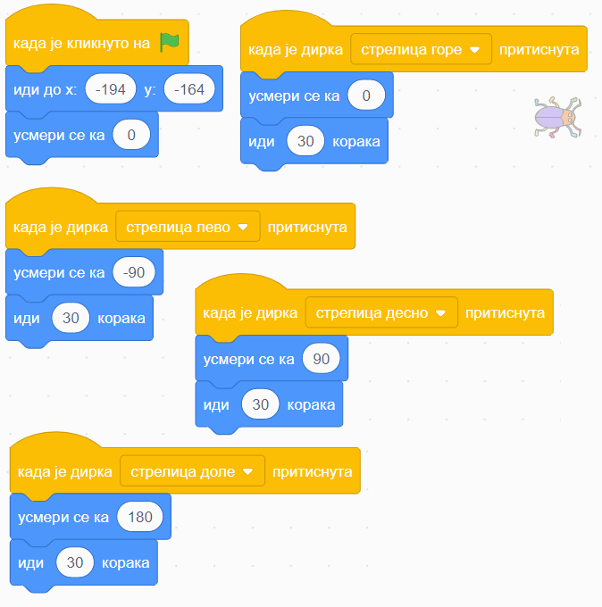

~~~~~~~~~~~~~~~~~~~~~~~~~~~~~~~~~~~~~~~~~~~~~~~~~~~~~~
Низање корака
~~~~~~~~~~~~~~~~~~~~~~~~~~~~~~~~~~~~~~~~~~~~~~~~~~~~~~

.. topic:: У оквиру ове активности вежбаћеш:
            
            - Прављење скрипти у којима се кораци само нижу један за другим
            - Усклађивање скрипти различитих ликова по времену помоћу чекања

.. |zelena_zastavica|  image:: ../../_images/S3_opste/zelena_zastavica.png
.. |idi_xy|            image:: ../../_images/S3_opste/idi_xy.png
.. |klizi_xy|          image:: ../../_images/S3_opste/klizi_xy.png
.. |cekaj|             image:: ../../_images/S3_opste/cekaj.png
.. |dirka|             image:: ../../_images/S3_opste/dirka.png
.. |prikazi|           image:: ../../_images/S3_opste/prikazi.png
.. |sakrij|            image:: ../../_images/S3_opste/sakrij.png

.. |usmeri_objektu|    image:: ../../_images/S3_opste/usmeri_objektu.png
.. |nacin_okretanja|   image:: ../../_images/S3_opste/nacin_okretanja.png
.. |izgovori_sec|      image:: ../../_images/S3_opste/izgovori_sec.png

У многим скриптама блокови се само стављају један испод другог, а не и један у други. При томе сваки блок представља један корак у алгоритму, а алгоритам се извршава тако што се кораци просто нижу један за другим (нема прескакања, нити враћања на већ извршене блокове). Зато се ова лекција зове **низање корака**, а алгоритми које ћемо да програмирамо се зову **алгоритми линијске структуре**.

Примери
-------

Пример 1 - лавиринт
'''''''''''''''''''

Направићемо лавиринт, у коме корисник програма може помоћу стрелица на тастатури да води бубу до излаза.

Лавиринт ћеш најлакше направити ако из галерије позадина изабереш позадину "Xy-grid-30px", коју ћеш затим прилагодити. Ова позадина садржи квадратну мрежу (енгл. *grid*), у којој је сваки квадрат величине 30 корака.

.. image:: ../../_images/S3_03_nizanje_koraka/lavirint_pozadina.jpg
    :align: center
    :width: 400

Када изабереш ову позадину, кликни на њу у листи (корак 1 на слици), а затим кликни на картицу "Позадине" (корак 2 на слици).

.. image:: ../../_images/S3_03_nizanje_koraka/lavirint_pravljenje.jpg
    :align: center
    :width: 600

|

Унутар картице "Позадине" имамо могућност да уређујемо и преправљамо позадину, слично као у програму "Бојанка" (*Paint*). Изабери кантицу (корак 3 на претходној слици) и обој нека поља по жељи, тако да добијеш лавиринт.

На сличан начин можеш да преправљаш и изглед ликова, треба само да кликнеш на лик у листи ликова, тако да он постане активан, а затим на картицу. Када мењамо изглед лика, картица се не зове "Позадине" него "Костими", јер позорница има позадине, а лик костиме.

|

Прелазимо на ликове. Једини лик у пројекту је буба. Додај је у пројекат, промени јој име (1), подеси јој величину тако да може да стане у једно поље лавиринта (2) и постави је на почетно место (3).

|

Остаје још да испрограмирамо бубу. Када програм почне, желимо да се буба врати на почетну позицију и окрене у одговарајућем смеру (у нашем лавирину то је на горе). Осим тога, на притисак сваке од стрелица на тастатури (горе, доле, лево, десно), буба треба да се окрене у одговрарајућем смеру и помери се 30 корака, јер је толика величина поља. то значи да ћемо за бубу имати 5 малих скрипти - једну за почетак програма и четири за стрелице (по једну за сваку стрелицу). 

Ево како скрипте изгледају у нашем примеру лавиринта:

Блок |dirka| се, као и |zelena_zastavica|, налази у групи "Догађаји", што препознајемо и по боји блока.

.. infonote::

    **Запамти**: сваки лик може да има неограничен број скрипти. У примеру "Лавиринт" оне се стартују на различите начине, али лик може да има и више скрипти које се стартују на исти начин, на пример две скрипте које се обе стартују кликом на зелену заставицу.

Направи приказане скрипте и испробај програм. Колико брзо можеш да изведеш бубу из лавиринта без варања (стајања на љубичаста поља)?

Пример 2 - одскакање лопте
''''''''''''''''''''''''''

У овом пројекту ћемо приказати лопту која полази из неке тачке високо на позорници, затим неколико пута пада и одскаче. Из галерије ликова искористићемо лик |lopta|, а као позорницу ћемо одабрати кошаркашко игралиште.

Скрипту, наравно, започињемо блоком |zelena_zastavica|. Први корак је да поставимо лопту на почетно место, а за то ћемо употребити блок |idi_xy|. У наставку нам је довољно само још неколико блокова |klizi_xy|, који ће померати лопту доле-горе. Битно је да ових блокова буде непаран број, на пример 7, јер лопта треба да заврши доле.

Знамо да је лопта која одскаче нешто бржа доле а спорија горе. Да би наша анимација мало више личила на стварност, можемо да убацимо по један блок |cekaj| сваки пут када је лопта горе. Према томе, скрипта има овај облик:

Теби остаје да упишеш вредности координата и трајање клизања и чекања. Пре него што то урадиш, подсети се како се мењају координате при кретању по позорници:

.. mchoice:: odskakanje_dole
   :answer_a: Y се повећава а X се не мења.
   :answer_b: Y се смањује а X се не мења.
   :answer_c: X се повећава а Y се не мења.
   :answer_d: X се смањује а Y се не мења.
   :feedback_a: Лопта која пада иде ка дну позорнице. Да ли су Y координате при дну позорнице мање или веће? Размисли и покушај да исправиш одговор.
   :feedback_b: Тако је!
   :feedback_c: Која координата се мења ако се лик креће на доле? Размисли и покушај да исправиш одговор.
   :feedback_d: Која координата се мења ако се лик креће на доле? Размисли и покушај да исправиш одговор.
   :correct: b

   Како се мењају координате лопте која пада?

.. mchoice:: odskakanje_gore
   :answer_a: Y се повећава а X се не мења.
   :answer_b: Y се смањује а X се не мења.
   :answer_c: X се повећава а Y се не мења.
   :answer_d: X се смањује а Y се не мења.
   :feedback_a: Тако је!
   :feedback_b: Лопта иде у вис, тј. ка врху позорнице. Да ли су Y координате при врху позорнице мање или веће? Размисли и покушај да исправиш одговор.
   :feedback_c: Која координата се мења ако се лик креће на горе? Размисли и покушај да исправиш одговор.
   :feedback_d: Која координата се мења ако се лик креће на горе? Размисли и покушај да исправиш одговор.
   :correct: a

   Како се мењају координате лопте након што се она одбије од земље?

Сада, када знаш коју координату да мењаш а коју не, треба мало да експериментишеш. Слободно покушавај више пута и постепено поправљај бројеве (савет: користи тастер *Tab*). Овде не постоји једно тачно решење - свако решење које личи на одбијање праве лопте од пода је добро. Зато не жури да погледаш наше решење.

.. reveal:: zadatak_sakrivanje_lopta_odskace
    :showtitle: Упореди своје решење са нашим
    :hidetitle: Сакриј решење

    **Могуће решење**
 
    .. image:: ../../_images/S3_03_nizanje_koraka/lopta_odskace_skripta.png
        :align: center
        :width: 360

Пример 3 - ужина
''''''''''''''''

У пројекту се појављују ови ликови:

Девојчица Авери је огладнела и размишља шта да поједе. Ово је њена скрипта:

Ликови хране треба да се виде док Авери размишља о њима, а остало време да буду сакривени. Сваки од три лика хране треба да извршава ову скрипту, али са различитим бројевима:

Блокови |prikazi| и |sakrij| се налазе у групи "Изглед" (што се види и по боји ових блокова). Можеш да олакшаш себи посао тако што саставиш скрипту (са било којим бројевима) за један лик, а затим је превучеш до остала два лика у листи ликова. Препознаћеш да је листа копирана у други лик по томе што се лик у слити мало затресе. После копирања треба за сваки лик уписати одговарајуће бројеве у скрипту.

Изабери положаје ликова хране и одреди колико сваки од ових ликова треба да чека пре него што се појави, а колико дуго треба да чека док је приказан. Сва времена се могу израчунати, али ако не успеш да упишеш права времена у првом покушају, размисли и поправи их, по потреби и више пута (труди се да не нагађаш). Када завршиш, можеш да погледаш и наше решење.

.. reveal:: zadatak_sakrivanje_uzina
    :showtitle: Упореди своје решење са нашим
    :hidetitle: Сакриј решење

    **Могуће решење**
 
    Поред сваке скрипте је лик одговарајуће хране.
    
    .. image:: ../../_images/S3_03_nizanje_koraka/uzina_skripte_vocke.png
        :align: center
        :width: 600

Пројекти за самосталан рад
--------------------------

Разговор
''''''''

Направи пројекат у коме неколико ликова разговара (тема разговора и дијалози нека буду твој избор).

Поред блока |zelena_zastavica|, користи и блокове |izgovori_sec| и |cekaj|, а ако желиш можеш да употребиш и блокове |usmeri_objektu| и |nacin_okretanja|.

Скрипте појединих ликова треба да буду синхронизоване, слично као у пројекту *Ужина* - док један лик говори, остали чекају исто толико времена.

Моји пријатељи
''''''''''''''

Направи пројекат у коме један, главни лик представља остале. Сваки од осталих ликова се појављује само док главни лик говори о њему. Поред блокова поменутих у пројекту *Разговор*, требаће ти и блокови |prikazi| и |sakrij|.
                                                                    

Додатак
-------

Ако желиш, погледај `поглавље Низање корака <https://petlja.org/biblioteka/r/lekcije/scratch3-praktikum/scratch3-nizanje-koraka>`_ у Петљином практикуму. Тамо можеш да нађеш још нека објашњења и занимљиве пројекте.

Петљин `студио Низање корака <https://scratch.mit.edu/studios/24051841/>`_ на сајту Скреча садржи урађене пројекте за задатке сличне оним којима смо се овде бавили.
