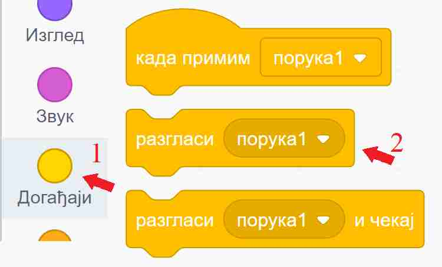
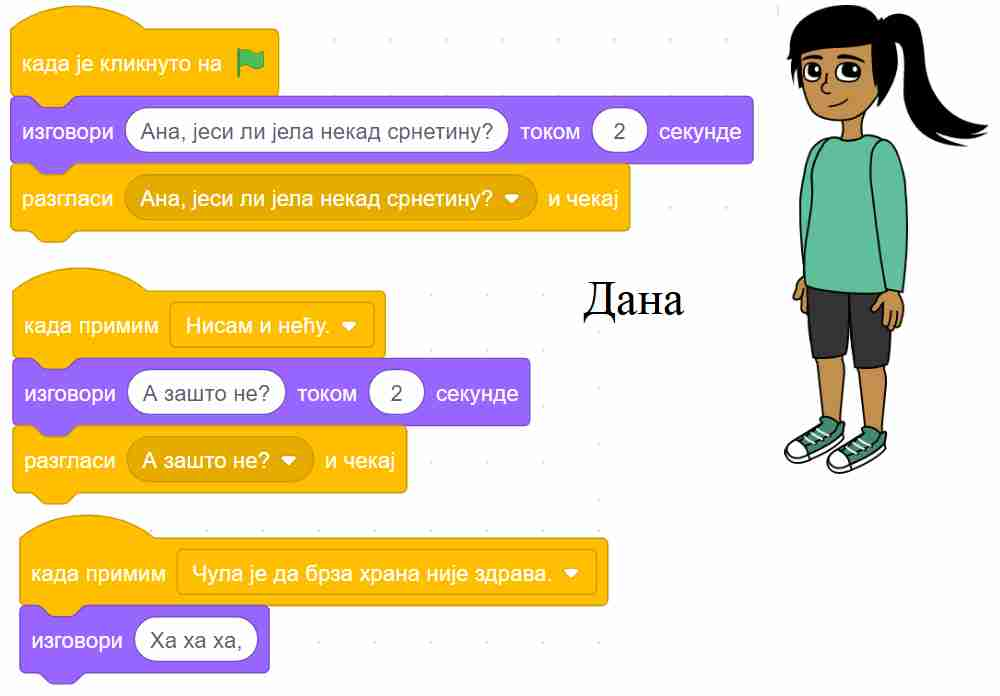
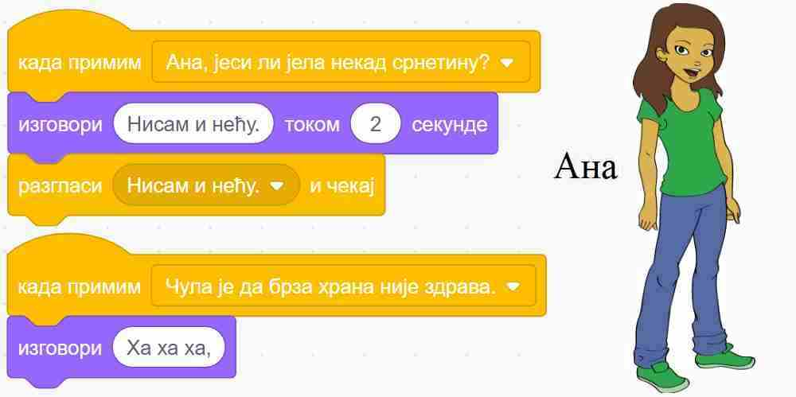
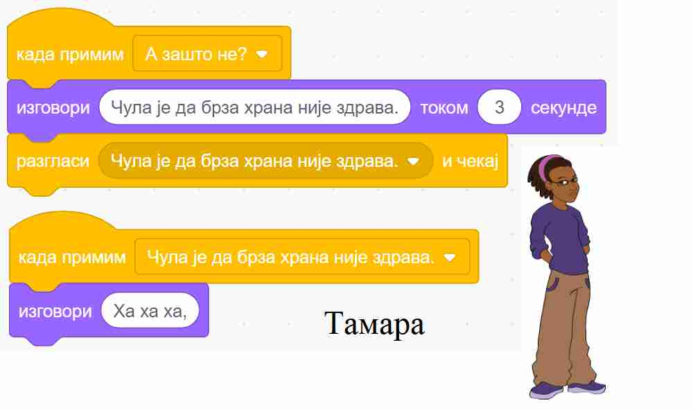
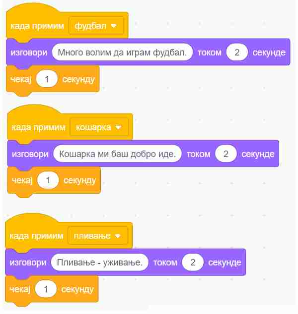

~~~~~~~~~~~~~~~~~~~~~~~~
5.1. Усклађивање скрипти
~~~~~~~~~~~~~~~~~~~~~~~~

.. topic:: У оквиру овог часа научићеш:

    - како да синхронизујеш ликове помоћу наредби "чекај ... секунду"
    - шта су објаве (разглашавања) и како оне функционишу
    - како да да синхронизујеш ликове коришћењем објава

До сада већ сигурно умеш да синхронизујеш ликове помоћу наредби "чекај ... секунду" из групе блокова за управљање. Међутим овај начин синхронизовања ликова није нарочито флексибилан. Претпоставимо да хоћемо да продужимо трајање једне од реченица. Програм се, наравно, може преправити, али када продужимо трајање говора говорника у наредби "изговори", треба још у скриптама осталих ликова пронаћи и продужити одговарајуће чекање. Слично је и када хоћемо да убацимо нову реченицу. Све ово постаје још компликованије када има више ликова и када је њихов разговор дужи. Уместо да уживамо у дорађивању програма и прављењу богатије и садржајније анимације, ми се све теже одлучјујемо да још понешто додамо, да не бисмо покварили и раздесили програм.

Други врло моћан начин да ускладиш, односно синхронизујеш понашање ликова и позадине у програму је коришћење објава. Основна идеја разглашавања је врло једноставна - један од ликова (или позорница) направи објаву и разгласи је, као када телевизијска станица емитује програм. Сви ликови (укључујући и објављивача) могу, а не морају да приме објаву, као што преко телевизора можемо, а не морамо да пратимо програм. Како се користе објаве објаснићемо кроз примере.

Примери
-------

Први пример, пројекат у коме три другарице разговарају, креираћемо на два начина: 

помоћу наредби "чекај ... секунду" и коришћењем објава.

У другом примеру ћемо користити објаве за синхронизацију понашања лика и позадине.

Пример 1 - Срнетина
'''''''''''''''''''

Нека три девојчице, Дана, Ана и Тамара, воде следећи разговор:

- Дана: Ана, јеси ли јела некад срнетину?
- Ана: Нисам и нећу.
- Дана: А зашто не?
- Тамара: Чула је да брза храна није здрава.
- Све три: Ха ха ха

Кликни на слику да видиш како тај разговор изгледа кад се испрограмира.

.. raw:: html

   

   <iframe src="https://scratch.mit.edu/projects/416420869/embed" allowtransparency="true" width="485" height="402" frameborder="0" scrolling="no"  allowfullscreen>
   </iframe>
   

Усклађивање ликова у овом програму може да се уради коришћењем чекања по следећем упутству. 

.. reveal:: zadatak_sakrivanje_razgovor_cekanje
    :showtitle: Погледај упутство
    :hidetitle: Сакриј упутство

    Разговор можемо да прикажемо у табели, додељујући успут трајање свакој реченици:

    .. csv-table::
       :header: "Трајање", "Дана", "Ана", "Тамара"
       :widths: 15, 35, 15, 35
       :align: left

       "2 секунде", "**Ана, јеси ли јела некад срнетину?**", *чека*, *чека*
       "2 секунде", *чека*, **Нисам и нећу.**, *чека*
       "2 секунде", **А зашто не?**, *чека*, *чека*
       "3 секунде", *чека*, *чека*, **Чула је да брза храна није здрава.**
       "заувек", **Ха ха ха**, **Ха ха ха**, **Ха ха ха**
   
    Сада се скрипта за сваку девојчицу лако саставља на основу њене колоне у табели. Да би скрипте биле једноставније, трајања узастопних чекања смо сабрали и представили једном наредбом чекања.

    .. image:: ../../_images/S3_05_sinhronizacija/SrnetinaCekanje_Dana.jpg
        :width: 500px
        :align: center

    .. image:: ../../_images/S3_05_sinhronizacija/SrnetinaCekanje_Ana.jpg
        :width: 500px
        :align: center

    .. image:: ../../_images/S3_05_sinhronizacija/SrnetinaCekanje_Tamara.jpg
        :width: 500px
        :align: center

|

Исти овај разговор могао је да се направи помоћу разглашавања. 

Ево како се праве објаве: у групи блокова "догађаји" изаберемо блок |razglasi| и поставимо га у скрипту. У поље блока уместо "порука1" упишемо текст који желимо. То ће бити име наше објаве.

|

Блок |kad_primim| можемо да користимо и да бисмо синхронизовали скрипте једног лика између себе, али обично га користимо да бисмо ускладили понашање више ликова. У блоку |kad_primim| треба да изаберемо неку од до сада дефинисаних објава, а затим испод тог блока додамо наредбе које треба извршити када изабрана објава буде разглашена.

За овај пример то је све што нам треба. Погледајмо скрипте за сваку од девојчица и у верзији када се користе објаве.

|

|

|

У овом случају, преправљање трајања појединих стања би било знатно једноставније - довољно је изменити програм на само једном месту.

План комуникације
-----------------

Када се ликови у програму синхронизују помоћу објава, важно је да план комуникације буде једноставан. У противном, програм може да постане тежак за праћење. Један једноставан план комуникације је да само један лик "зна" када шта треба да се догоди, а остали не морају да знају "целу причу" него само примају објаве и реагују на њих. На тај начин везе између ликова остају једноставне, па нам је лако да пратимо комуникацију. Зато се овакав начин размене врло често користи.

Пример 2 - Спортови
'''''''''''''''''''

У следећем, једноставном примеру, позорница мења позадине и сваку промену објављује, а лик прима поруке и реагује на њих коментаром.

.. raw:: html

   

   <iframe src="https://scratch.mit.edu/projects/416418651/embed" allowtransparency="true" width="485" height="402" frameborder="0" scrolling="no"  allowfullscreen>
   </iframe>
   

Покушај да направиш овакав програм.

Скрипта позорнице изгледа овако:

.. image:: ../../_images/S3_05_sinhronizacija/Sportovi_Pozornica.jpg
    :width: 250px
    :align: center

|

Видимо да није неопходно да у скрипти позорнице кажемо колико треба да се чека да би се завршила реакција дечака. Довољно је да уместо блока |razglasi| употребимо блок |razglasi_cekaj|. Ово је последњи од три блока који су у вези са разглашавањем (два смо користили и у претходном примеру). Када користимо овај блок, рачунар неће наставити са извршавањем скрипте позорнице док се све реакције на објаву не заврше. Овде постоји само једна реакција, али и да их је више, све би биле сачекане. У случају да скрипте реакције такође нешто разглашавају и чекају, полазна скрипта би, наравно, сачекала заједно са њима. Захваљујући овако организованом сачекивању, све тече по реду и следећа позадина се појављује тек када се заврши скрипта реакције дечака.

Погледајмо и скрипту дечака:

Примећујемо да ни "дечак не мора да зна" када ће се која позадина појавити. Што се њега тиче, позорница је могла да поставља позадине било којим редом, па и да их понавља, а скрипте којима дечак реагује на објаве не би морале због тога уопште да се мењају.

У овом примеру скрипте позорнице и дечака нису независне, оне сарађују путем објава. Међутим, ове скрипте нису ни превише повезане: позорница не зна ништа о томе како дечак реагује на објаве (могао је и да се шета по слици или ради нешто друго), ни колико те реакције трају; са друге стране, дечак не зна када ће која објава да се догоди, а то му није ни потребно да би реаговао. Овом лабавом повезаношћу позорнице и дечака добијамо програм који је лакше преправљати, уколико пожелимо да га мењамо.

|

Шта смо научили
---------------

У овој лекцији показали смо две технике за усклађивање понашања објеката (ликова и позорнице) пројекта: синхронизацију помоћу чекања и синхронизацију коришћењем објава. За реализацију разглашавања у Скречу се користе три блока из групе "Догађаји": |kad_primim|, |razglasi| и |razglasi_cekaj|. Разглашавање се користи за позивање скрипти које треба да се активирају када су испуњене одређени услови. Скрипте, чији је први блок "кад примим ...", ће се позивати након што задата порука буде разглашена. 

Додатак
-------

Погледај и примере 
`Породица <https://petlja.org/biblioteka/r/lekcije/scratch3-praktikum/scratch3-kornjaca-grafika#id6>`_
и `Дан и ноћ <https://petlja.org/biblioteka/r/lekcije/scratch3-praktikum/scratch3-grananje#id4>`_
из нашег практикума, где ћеш видети још неке начине да се реагује на објаве. На пример, видимо да се ликовима може покренути и више скрипти као реакција на једну објаву, да реакција може да садржи и наредбу понављања итд. У наредним лекцијама ће бити још примера у којима се понашање ликова усклађује разглашавањем.

Петљин `студио Разглашавање <https://scratch.mit.edu/studios/27294857>`_ на сајту Скреча садржи урађене пројекте за задатке сличне оним којима смо се овде бавили.

.. infonote::

    **Провери своје знање пролазећи кроз наредна питања и вежбе.**

