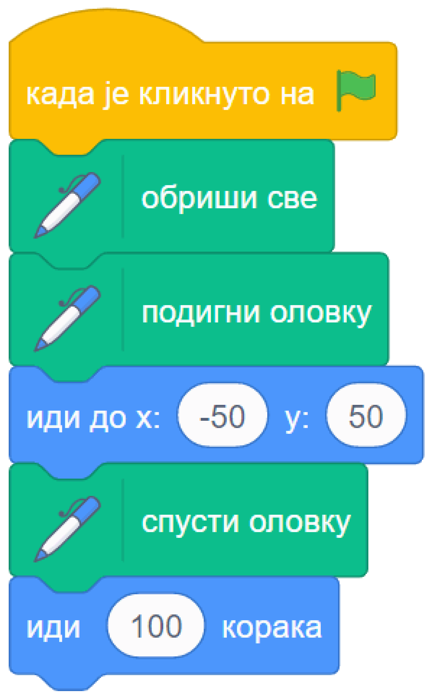
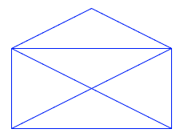

~~~~~~~~~~~
6.1. Цртање 
~~~~~~~~~~~

.. topic:: У оквиру овог часа научићеш: 
            
            - како лик може да црта док се креће
            - зашто спуштамо и подижемо оловку
            - како мењамо боју и дебљину оловке
            - како кретањем напред и окретањем направити цртеж

.. |sakrij|            image:: ../../_images/S3_opste/sakrij.png

.. |klizi_xy|          image:: ../../_images/S3_opste/klizi_xy.png

У претходној лекцији смо научили како можемо управљати кретањем лика помоћу дирки са тастатуре. Сада ћемо скриптама за кретање додати могућност да лик притом оставља траг. Сваки лик у Скречу може да оставља траг приликом кретања, то јест да црта. Блокови помоћу којих задајемо ликовима кад и како да цртају, налазе се у једном од стандардних проширења Скреча - у проширењу "Оловка". Ево како можеш да додаш ово проширење у своје окружење:

1. Кликни на дугме |dodaj_prosirenje| у доњем левом углу екрана (испод ознака свих група блокова). 
2. Изабери проширење "Оловка".
3. Примети да се појавила нова група блокова - "Оловка". Кликни на ту групу да видиш какве блокове она садржи.

.. image:: ../../_images/S3_06_kornjaca/prosirenje_olovka.png
    :align: center
    :width: 700

Можемо да замислимо да је додавањем овог проширења сваки лик добио по једну оловку, којој може да подешава боју и дебљину. Блоком |spusti| кажемо лику да спусти своју оловку, то јест активирамо остављање трага, а блоком |podigni| га деактивирамо. Блок |obrisi| уклања трагове свих ликова. Немој да мешаш овај блок са блоком |sakrij|, који сакрива сам лик, а не његове трагове.

Испробај одмах ова три блока. На пример, овако можеш да нацрташ једну праву линију:

Можеш и да надовежеш неколико блокова кретања, линија ће пратити лика све док је оловка спуштена. Ако желиш, испробај и блокове |neka_debljina| за задавање дебљине трага и |neka_boja| за задавање боје.

.. topic:: Погледај видео:

   У овом видеу провежбаћемо како да употребљавамо оловку у Скречу. 
   
    .. ytpopup:: ssLLO56xSwo
        :width: 735
        :height: 415
        :align: center 

Примери
-------

Пример 1 - Коверта
'''''''''''''''''' 

Умеш ли да нацрташ овакву коверту једним потезом?

Ако ти задатак није познат од раније, покушај сада да га решиш, користећи обичну оловку и папир. Да ти не кваримо забаву, ми смо наше решење за сада сакрили. Када смислиш решење (или ако одустанеш од решавања), погледај и наше решење, јер ћемо га користити за смишљање скрипте која црта исту овакву коверту.

.. reveal:: zadatak_sakrivanje_koverta_jednim_potezom
    :showtitle: Цртање коверте - Решење
    :hidetitle: Сакриј решење

    **Решење**: Ако означимо тачке као на слици, линија се може нацртати једним потезом ако тачке спајамо овим редоследом: :math:`A - E - D - C - B - A - C - E - B`.
 
    .. image:: ../../_images/S3_06_kornjaca/koverta_resenje.png
        :align: center
        :width: 200
    
Остави решење да буде видљиво, јер ће нам требати у наставку. Да бисмо коверту нацртали у Скречу, потребно је да изаберемо где ће се на позорници налазити која тачка. 

Нека коверта буде широка 200 корака и нека се налази на средини позорнице по ширини. Онда *X* координата за тачке *A* и *E* треба да буде -100, за тачку *D* 0, а за тачке *B* и *C* +100. Према томе, за сада смо одредили да је :math:`A(-100, \_), B(100, \_), C(100, \_), D(0, \_), E(-100, \_)`.

Изаберимо још да је коверта висока 150 корака (100 за затворену коверту и 50 за део који се пресавија). Полазећи од тога да је врх коверте у тачки (0, 50), добијамо да је *Y* координата за тачку *D* 50, за тачке *E* и *C* 0, а за тачке *A* и *B* -100. Сада имамо све координате: :math:`A(-100, -100), B(100, -100), C(100, 0), D(0, 50), E(-100, 0)`.

Сада само треба да убацимо ове координате у блокове кретања. Користићемо блок |klizi_xy| радије него |idi_xy|, да бисмо могли да пратимо цртање и лакше поправимо скрипту ако буде потребно.

Лик на почетку постављамо у тачку :math:`A`, а затим га пуштамо да клизи редом ка тачкама :math:`E, D, C, B, A, C, E, B`, као у решењу полазне мозгалице. Одговарајућа скрипта изгледа овако.

.. reveal:: zadatak_sakrivanje_koverta_skripta
    :showtitle: Погледај скрипту
    :hidetitle: Сакриј скрипту

    .. image:: ../../_images/S3_06_kornjaca/koverta_skripta.png
        :align: center
        :width: 400

Кликни на следећу слику да видиш како ради одговарајући програм.

.. raw:: html

   

   <iframe src="https://scratch.mit.edu/projects/416418381/embed" allowtransparency="true" width="485" height="402" frameborder="0" scrolling="no"  allowfullscreen>
   </iframe>
   

 

.. reveal:: drugi_primer
    :showtitle: Други пример
    :hidetitle: Сакриј пример

    **Пример 2 - Лађа**

    У овом примеру ћемо нацртати једну овакву лађу.

    .. image:: ../../_images/S3_06_kornjaca/ladja_izgled.png
          :align: center
          :width: 400

    Слика се састоји од три дела: трупа, јарбола и заставице. Да нам скрипта не би била предугачка и тешка за праћење, поделићемо је у целине. У првој целини бришемо претходна цртања, искључујемо цртање (подижемо оловку) и постављамо мачка на палубу. У свакој од следеће три целине цртамо по један део лађе (труп, јарбол и заставицу), а у последњој, петој целини поново постављамо мачка на палубу.

    Да ових пет скрипти не би цртале истовремено и мешале се једна другој у посао, неке од њих ће на почетку да чекају колико је потребно да претходне целине заврше са радом.

    Поједини бројеви из ових скрипти су изостављени. Твој задатак је да их одредиш и упишеш. Размишљај слично као када смо цртали коверту. Ако ти из првог покушаја цртеж не испадне како треба, размисли и пробај поново.

    .. image:: ../../_images/S3_06_kornjaca/ladja_skripte_bez_brojeva.png
        :align: center
        :width: 700

    Кликни на следећу слику да видиш како ради одговарајући програм.

    	.. raw:: html

    		

    		<iframe src="https://scratch.mit.edu/projects/416418534/embed" allowtransparency="true" width="485" height="402" frameborder="0" scrolling="no"  	allowfullscreen>
    		</iframe>
    		

.. comment
.. Пројекти за самосталан рад
  --------------------------

  Степенице
  '''''''''

  Направи пројекат у коме црташ степенице.

 .. image:: ../../_images/S3_06_kornjaca/stepenice_izgled.png
      :align: center
      :width: 300

 |

 Пошто сам лик није битан за реализацију, можеш и да га учиниш невидљивим користећи блок |sakrij|.

 Слова С, К, Р, Е, Ч
 '''''''''''''''''''

 Направи пројекат у коме лик црта нека, или сва слова речи СКРЕЧ. Уочи да три од ових слова не могу да се нацртају једним потезом, што значи да ће за поједина слова бити потребно више пута подизати и спуштати оловку.

  .. image:: ../../_images/S3_06_kornjaca/slova_skrec_izgled.png
      :align: center
      :width: 300

..	
.. comment
.. И у овом пројекту лик можеш да сакријеш користећи блок |sakrij|, а ако желиш да користиш оловку као лик, `овде <https://petlja.org/biblioteka/r/lekcije/scratch3-praktikum/scratch3-kornjaca-grafika#id2>`_ можеш да научиш како да подесиш лик оловке 
 тако да он црта својим врхом, а не средином. 

Шта смо научили
---------------

У овој лекцији показали смо како у своје окружење можеш да додаш стандарно проширење за цртање - групу блокова "Оловка". У Скречу сваки лик има виртуелну оловку којом може да црта приликом свог кретања по позорници. Виртуелна оловка има облик округле четкице за коју се могу задати дебљина, боја и сенка. Кроз примере пројеката и вежбе показали смо како повезивањем блокова из групе "Кретање" и групе "Оловка" можемо да креирамо различите цртеже. 

Додатак
-------

Ако желиш, погледај `поглавље Хајде да цртамо <https://petlja.org/biblioteka/r/lekcije/scratch3-praktikum/scratch3-kornjaca-grafika>`_ у Петљином практикуму. Тамо можеш да нађеш још нека објашњења, корисне савете и идеје. На пример, објашњење како да лик оловке црта својим врхом (које смо помињали у задатку *Слова С, К, Р, Е, Ч*) се налази у овом поглављу, а можеш сазнати и како ради блок |pecat| из групе блокова "Оловка" и друге занимљиве ствари.

Петљин `студио Корњача графика <https://scratch.mit.edu/studios/24055098/>`_ на сајту Скреча садржи урађене пројекте за задатке сличне оним којима смо се овде бавили.

.. comment

    Припреме

    - задавање боје
    - центрирање лика (оловке)

.. infonote::

    **Провери своје знање пролазећи кроз наредна питања и вежбе.**

