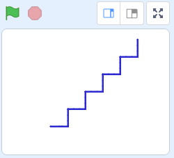
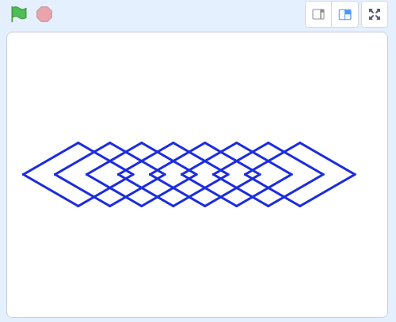
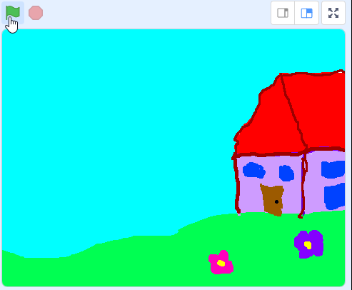
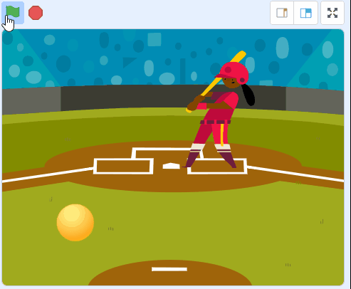

~~~~~~~~~~~~~~~~~~~~~~~~~~~
Наредбе понављања - вежбање
~~~~~~~~~~~~~~~~~~~~~~~~~~~

.. topic:: У оквиру овог часа треба да вежбаш разне употребе блокова понављања: 
            
            - цртање правилних геометријских фигура
            - цртање кретањем напред и окретањем
            - мењање костима лика да би се добио утисак летења или ходања
            - мењање величине лика да би се добио утисак перспективе (дубине цртежа)

.. |ponavljaj|         image:: ../../_images/S3_opste/ponavljaj.png

Изабери неке од предложених задатака и направи пројекте у којима решаваш те задатке. Слободно се враћај на вежбе са претходног часа да се подсетиш на неке детаље, ако ти је то потребно.

Задаци
------

Правоугаоник
''''''''''''

Направи пројекат у коме ћеш нацртати правоугаоник. Дужине страница изабери.

Користи блок |ponavljaj|, у коме ће се цртање две странице правоугаоника поновити два пута.

Степенице
'''''''''

Нацртај поново степенице, али овај пут користи неки од блокова понављања. 

Осмоугао
''''''''

Направи пројекат у коме ћеш нацртати осмоугао странице дужине 70 корака.

Низ ромбова
'''''''''''

Направи пројекат у коме ћеш нацртати низ од 8 једнаких ромбова, странице дужине 80 корака, а углова 60 и 120 степени (ромбови су исти као ромб из задатка са претходног часа).

Кретање и мењање величине лика
''''''''''''''''''''''''''''''

Направи пројекат у коме се лик који изабереш креће и мења своју величину. 

Ликова може да буде и више. Ако немаш инспирације, ми ти нудимо ове две идеје:

