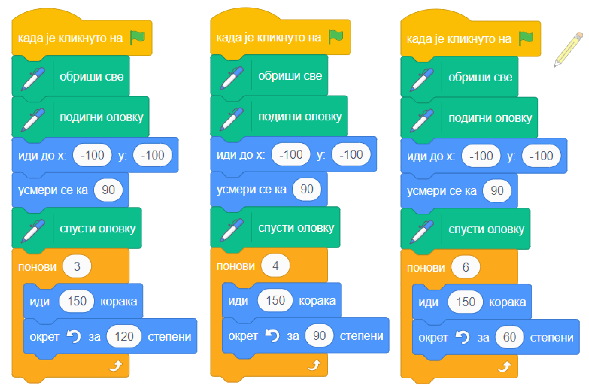

~~~~~~~~~~~~~~~~~~~~~~
7.1. Наредбе понављања
~~~~~~~~~~~~~~~~~~~~~~

.. topic:: У оквиру овог часа упознаћеш се са: 
            
            - могућностима понављања делова програма
            - блоковима којима се реализује понављање

.. |novi_lik|          image:: ../../_images/S3_opste/novi_lik.png
.. |nova_pozadina|     image:: ../../_images/S3_opste/nova_pozadina.png
.. |sledeci_kostim|    image:: ../../_images/S3_opste/sledeci_kostim.png
.. |idi_koraka|        image:: ../../_images/S3_opste/idi_koraka.png
.. |idi_xy|            image:: ../../_images/S3_opste/idi_xy.png
.. |cekaj|             image:: ../../_images/S3_opste/cekaj.png
.. |ponavljaj|         image:: ../../_images/S3_opste/ponavljaj.png
.. |ponavljaj_do|      image:: ../../_images/S3_opste/ponavljaj_do.png

У претходним7 лекцијамa већ смо користили наредбе понављања. Тако су у пројекту *Јурњава* све три скрипте придружене ликовима имале **цикличну** структуру са бесконачним понављањем. У групи "Управљање" блокови који служе за понављање других наредби изгледају овако:

.. image:: ../../_images/S3_07_petlje/blokovi_ponavljanja.png
    :align: center
    :width: 650

Наредбе које ставимо у уста оваквог блока, поновиће се одређени број пута. Ако бисмо током рада програма показивали прстом на сваку наредбу редом док се она извршава, правили бисмо кружне покрете. Зато се блокови за понављање наредби зову и петље, или циклуси. Наредбе у устима петље чине тело петље.

У наставку ћеш, кроз примере, научити како тачно ови блокови функционишу и добити разне идеје када и како да их употребиш.

Примери
-------
У првом примеру анимацију ходања остварујемо помоћу блока који реализује понављање задати број пута (први блок на слици горе).

У другом и трећем примеру показујемо како понављањем корака можемо да скратимо програме за цртање геометријских фигура.

Четврти пример илуструје како се користи блок који омогућава понављање док не буде задовољен неки услов (трећи блок на слици горе).

Пети (скривени) пример за непрекидну анимацију саобраћаја користи блок који омогућава бесконачно понављање (други блок на слици горе).

Пример 1 - Ходање
'''''''''''''''''

У Скречу постоје ликови са више костима, који представљају лик у разним тренуцима током хода. На пример, Ако изабереш лик *Avery Walk*, приметићеш да Авери има четири костима:

.. image:: ../../_images/S3_07_petlje/hodajuci_lik.png
    :align: center
    :width: 780

|

Слична ситуација је и са овим, и многим другим ликовима:

.. image:: ../../_images/S3_07_petlje/hodajuci_likovi.png
    :align: center
    :width: 780

|

Када надовежемо блокове  |idi_koraka|, |sledeci_kostim| и |cekaj|, изгледа као да је лик направио корак (или део корака). Понављањем ова три блока добија се утисак ходања или летења. Међутим, ако лик треба да направи тридесетак корака, било би непрегледно да стављамо ова три блока у скрипту по једном за сваки корак.

У оваквој ситуацији можемо да употребимо блок |ponavljaj| из групе "Управљање". Када користимо овај блок, задајемо колико пута ће наредбе у устима овог блока да се понове. Испробај, на пример, следећу једноставну скрипту и увери се да са врло мало труда добијамо прилично реалистичан утисак ходања:

.. image:: ../../_images/S3_07_petlje/hodanje_skripta.png
    :width: 300
.. image:: ../../_images/S3_07_petlje/hodanje.gif
    :width: 450

.. infonote::

    Покушај да у овај програм додаш лептира који маше крилима. Симулацију махања крилима направи на исти начин као што је мењањем костима направљена симулација ходања девојчице Авери.

Пример 2 - Цртање ромба
'''''''''''''''''''''''

Блокове понављања можемо да употребимо и при цртању. У овом примеру ћемо нацртати ромб са следеће слике.
 

Када не бисмо користили блокове понављања, редослед наредби које цртају би могао да буде:

.. image:: ../../_images/S3_07_petlje/romb_resenje1.png
    :align: left

- усмери се ка 120, иди 80 корака
- усмери се ка 60, иди 80 корака
- усмери се ка -60, иди 80 корака
- усмери се ка -120, иди 80 корака

|

Ако желимо да искористимо понављање, треба да размишљамо о углу за који оловка скреће, а не о смеру ка коме се се оловка окреће. Ако користимо окрете уместо усмеравања, наредбе ће бити

.. image:: ../../_images/S3_07_petlje/romb_resenje2.png
    :align: left

- усмери се ка 120
- иди 80 корака, скрени налево за 60 степени
- иди 80 корака, скрени налево за 120 степени
- иди 80 корака, скрени налево за 60 степени
- иди 80 корака

|

Овде можемо да допишемо на крај наредбу *скрени налево за 120 степени*, која неће ништа променити на цртежу (само ће на крају оловка да буде другачије окренута). Сада већ имамо групу наредби која се понавља два пута:

- иди 80 корака, скрени налево за 60 степени
- иди 80 корака, скрени налево за 120 степени

Цела скрипта, која на почетку брише претходна цртања са позорнице и бира боју и дебљину оловке, може да изгледа, на пример, овако:

.. reveal:: zadatak_crtanje_romba_skripta
    :showtitle: Погледај скрипту
    :hidetitle: Сакриј скрипту

    .. image:: ../../_images/S3_07_petlje/romb_skripta.png
        :align: center
        :width: 400

Пример 3 - Цртање још неких фигура
''''''''''''''''''''''''''''''''''

Покушај да одгонетнеш шта цртају следеће скрипте:

.. reveal:: zadatak_sta_crtaju_odskace
    :showtitle: Провери одговор
    :hidetitle: Сакриј одговор

    **Одговор:**
 
    .. image:: ../../_images/S3_07_petlje/sta_crtaju_izgled.png
        :align: center
        :width: 780

Пример 4 - Ауто који одлази
'''''''''''''''''''''''''''

У овом примеру ћемо нацртати ауто како се удаљава, крећући се по путу. Због удаљавања, лик аута током кретања постаје све мањи, а када стигне до хоризонта, ауто нестаје са позорнице.

.. raw:: html

   

   <iframe src="https://scratch.mit.edu/projects/416415294/embed" allowtransparency="true" width="485" height="402" frameborder="0" scrolling="no"  allowfullscreen>
   </iframe>
   

Ако желиш да направиш овакву анимацију прати следеће упутство.

.. reveal:: zadatak_sakrivanje_razgovor_auto_odlazi
    :showtitle: Погледај упутство
    :hidetitle: Сакриј упутство

    Слике аута и позадине можеш да нацрташ како желиш у неком програму за цртање као што је *Бојанка* (*Paint*). Када направиш слику аута, можеш да је додаш у Скреч тако што поставиш (без клика) миша на дугме |novi_lik|, сачекаш да се отвори приручни мени и изабереш ставку на врху, означену на следећој слици. 

    .. image:: ../../_images/S3_07_petlje/dodaj_sliku.png
        :align: center
        :width: 50

    На исти начин можеш да додаш и слику позадине, само треба да користиш дугме |nova_pozadina|.

    |

    Да бисмо што једноставније усмерили ауто, додаћемо још један лик (било који), назваћемо га "правац" и поставићемо га на место до ког ауто треба да стигне. Лик "правац" не треба да буде видљив, па можемо одмах да га сакријемо кликом на дугме које показује црвена стрелица. Овај лик неће ништа радити и за њега нећемо писати скрипте.

    .. image:: ../../_images/S3_07_petlje/auto_odlazi_likovi.png
        :align: center
        :width: 400

    На тај начин, довољно је да ауту кажемо да се усмери ка лику "правац" и не морамо ништа да рачунамо. Лик аута треба да понавља следеће кораке:

    - усмери се ка лику "правац"
    - помери се одређени број корака (ми смо изабрали 10)
    - мало се смањи (ми смо изабрали смањење за 5% од пуне величине)
    - сачекај мало, да анимација не би била пребрза (ми смо изабрали 0.1 секунду)

    Од три блока за понављање наредби, бирамо |ponavljaj_do|. Када користимо овај, блок, задајемо шта треба да важи да би понављање престало. Пошто се у нашем примеру *Y* координата аута повећава, понављање можемо да прекинемо када она постане већа од неког погодно изабраног броја (нешто ниже од висине хоризонта). Блок |vece| се налази у групи "Оператори" и о њему ћемо још причати.

    Пошто ће ауто након извршавања скрипте бити мањи, померен и скривен, да би следеће извршавање радило како треба, на почетак додајемо блокове који ауто поново чине видљивим и враћају га на почетну позицију и на пуну величину.

    Ево како изгледа скрипта за ауто:

    .. image:: ../../_images/S3_07_petlje/auto_odlazi_skripte.png
        :align: center
        :width: 360

Пример 5 - Саобраћај
'''''''''''''''''''''''
    
Овај пример је надоградња претходног. Приказаћемо како аутомобили иду путем у оба смера.

.. raw:: html

   

   <iframe src="https://scratch.mit.edu/projects/416415440/embed" allowtransparency="true" width="485" height="402" frameborder="0" scrolling="no"  allowfullscreen>
   </iframe>
   

Користићемо четири лика у пројекту. Лик "ауто" се удаљава ка лику "правац", а лик "ауто 2" се приближава ка лику "правац 2". Лик "правац" је исти као у претходном примеру, а лик "правац 2" се само поставља на ближи крај пута и у супротну траку.

За сваки од два аута ће нам требати по неколико костима, да бисмо дочарали пролазак различитих аутомобила. Постојећи костим можеш да умножиш десним кликом на њега. Након умножавања, преправи изглед лика (костим) по жељи. Ми смо само променили боју аута, али можеш и да нацрташ сасвим другачији ауто или неко друго возило (камион, аутобус и слично).

.. image:: ../../_images/S3_07_petlje/saobracaj_kostimi.png
    :align: center
    :width: 300

Ликови аута имају међусобно веома сличне скрипте. Лик аута из претходног примера иде од нас, полази у пуној величини, смањује се и завршава са удаљавањем када *Y* координата постане довољно велика. Обрнуто томе, нови лик аута иде ка нама, полази као мали и повећава се, а са приближавањем завршава када *Y* координата постане довољно мала.
Када било који ауто стигне до краја свог пута, сакрива се, мало сачека и мења костим, што ће створити утисак наиласка новог аута. Све ове завршне радње, заједно са целим блоком |ponavljaj_do| смештамо у блок |zauvek|. Овај блок ће понављати све наредбе које се налазе у њему док год се програм извршава. Програм можеш да зауставиш кликом на знак *СТОП* изнад позорнице.
Ево и скрипти оба аута:

.. image:: ../../_images/S3_07_petlje/saobracaj_skripte.png
    :align: center
    :width: 800

.. topic:: Погледај видео:

   Пошто си провежбао/провежбала како да употребиш наредбе понављања, погледај сада видео у коме ћемо применити наредбе понављања како бисмо унапредили нашу игрицу. 
   
    .. ytpopup:: VRyGoHsn63s
        :width: 735
        :height: 415
        :align: center 

Шта смо научили
---------------

У овој лекцији бавили смо се наредбама понављања. Кроз примере пројеката илустровали смо како се користи сваки од три типа циклуса: бесконачни, бројачки - код кога се унапред зна број понављања тела циклуса и циклус са предусловом - код кога број понављања зависи од испуњености неког услова. У петом примеру показали смо да се два и више циклуса могу комбиновати тако  да се улажу један у други (концентрична композиција). Слично, циклуси би се могли комбиновати и тако да се извршавају један за другим (редна композиција).

Додатак
-------

Ако желиш, погледај `поглавље Понављање корака <https://petlja.org/biblioteka/r/lekcije/scratch3-praktikum/scratch3-ponavljanje>`_ у Петљином практикуму. Тамо можеш да нађеш још нека објашњења, вежбе и занимљиве пројекте.

Петљин `студио Понављање <https://scratch.mit.edu/studios/24292278/>`_ на сајту Скреча садржи урађене пројекте за задатке сличне оним којима смо се овде бавили.

.. infonote::

    **Провери своје знање пролазећи кроз наредна питања и вежбе.**

