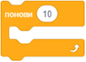

~~~~~~~~~~~~~~~~~~~~~~~~~~~~~~~~
7.3. Наредбе понављања - вежбање
~~~~~~~~~~~~~~~~~~~~~~~~~~~~~~~~

.. topic:: У оквиру овог часа треба да вежбаш разне употребе блокова понављања: 
            
            - цртање правилних геометријских фигура
            - цртање кретањем напред и окретањем
            - мењање костима лика да би се добио утисак летења или ходања
            - мењање величине лика да би се добио утисак перспективе (дубине цртежа)

Изабери неке од предложених задатака и направи пројекте у којима решаваш те задатке. Слободно се враћај на вежбе са претходног часа да се подсетиш на неке детаље, ако ти је то потребно.

Задаци
------

Правоугаоник
''''''''''''
 
Направи пројекат којим ћеш нацртати правоугаоник сличан ономе који црта наш програм (кликни на слику да га видиш).

.. raw:: html

   

   <iframe src="https://scratch.mit.edu/projects/713827556/embed" allowtransparency="true" width="485" height="402" frameborder="0" scrolling="no"  allowfullscreen>
   </iframe>
   

Дужине страница изабери.

Користи блок |ponavljaj|, у коме ће се цртање две странице правоугаоника поновити два пута.

Степенице
'''''''''
 
Направи пројекат којим ћеш нацртати степенице сличне онима које црта наш програм (кликни на слику да их видиш).

.. raw:: html

   

   <iframe src="https://scratch.mit.edu/projects/713827704/embed" allowtransparency="true" width="485" height="402" frameborder="0" scrolling="no"  allowfullscreen>
   </iframe>
   

Користи неки од блокова понављања. 

Осмоугао
''''''''
 
Направи пројекат у коме ћеш нацртати осмоугао странице дужине 70 корака. Кликом на слику можеш да видиш како то ради наш програм.

.. raw:: html

   

   <iframe src="https://scratch.mit.edu/projects/713827316/embed" allowtransparency="true" width="485" height="402" frameborder="0" scrolling="no"  allowfullscreen>
   </iframe>
   

Низ ромбова
'''''''''''
 
Направи пројекат у коме ћеш нацртати низ од 8 једнаких ромбова, странице дужине 80 корака, а углова 60 и 120 степени (ромбови су исти као ромб из задатка са претходног часа). Кликом на слику можеш да видиш какав треба да буде резултат одговарајућег програма.

.. raw:: html

   

   <iframe src="https://scratch.mit.edu/projects/416414973/embed" allowtransparency="true" width="485" height="402" frameborder="0" scrolling="no"  allowfullscreen>
   </iframe>
   

Кретање и мењање величине лика
''''''''''''''''''''''''''''''
 
Направи пројекат у коме се лик који изабереш креће и мења своју величину. 

Ликова може да буде и више. Ако немаш инспирације, ми ти нудимо ове две идеје:

|

.. image:: ../../_images/S3_07_petlje_vezbanje/IdemKuci.gif
    :width: 450
 

.. image:: ../../_images/S3_07_petlje_vezbanje/Bejzbol.gif
    :width: 450
