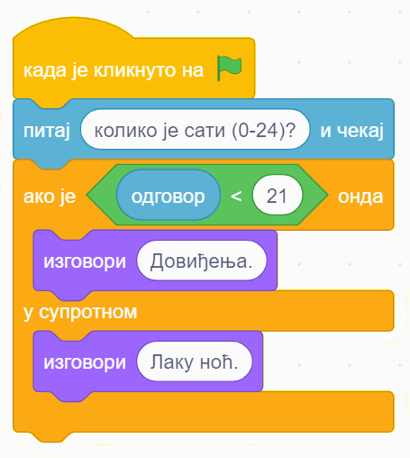
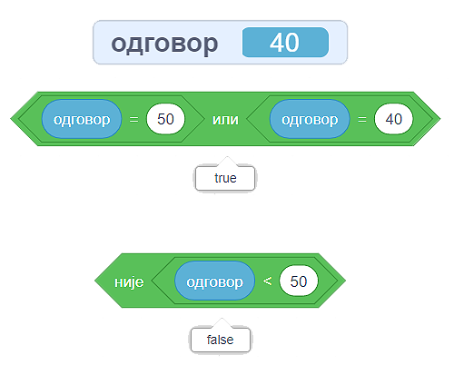

~~~~~~~~~~~~~~~~~~~~~~~~~~~~~~~~~
8.1. Условно извршавање (гранање)
~~~~~~~~~~~~~~~~~~~~~~~~~~~~~~~~~

.. topic:: У оквиру овог часа: 
            
            - упознаћеш наредбе условног извршавања
            - упознаћеш логичке операторе *и*, *или*, *није*
            - вежбаћеш употребу оператора поређења 
            - вежбаћеш употребу блокова групе *Осећаји*

.. |ako_onda|          image:: ../../_images/S3_opste/ako_onda.png
.. |ako_onda_inace|    image:: ../../_images/S3_opste/ako_onda_inace.png
.. |pitaj_cekaj|       image:: ../../_images/S3_opste/pitaj_cekaj.png
.. |odgovor|           image:: ../../_images/S3_opste/odgovor.png 

Најважнији појам у овој лекцији су наредбе условног извршавања, односно управљачки блокови који омогућавају условно извршавање. Ти блокови изглeдају овако:

Да бисмо употребили овакве блокове потребан нам је услов, а он се формира као код блока "понављај до ...".

Када користимо блок |ako_onda| са једним устима, наредбе у устима ће се извршити једном ако је услов испуњен, а иначе неће ни једном. Код блока |ako_onda_inace| који има двоја уста, у случају да је услов испуњен извршавају се наредбе у горњим устима, а ако није испуњен извршавају се наредбе у доњим устима.

Примери
-------

Пример 1 - Поздрав
''''''''''''''''''

Помоћу ове скрипте мачак ће те питати колико је сати да би знао како да те поздрави у наставку програма. Ако унесеш број мањи од 21, мачак ће рећи "Довиђења.", а у супротном ће рећи "Лаку ноћ."

Блок |pitaj_cekaj| се налази у групи блокова "Осећаји". Извршавањем овог блока лик поставља питање кориснику, а одговор који корисник откуца се смешта у |odgovor|.

Наилазак на управљачки блок |ako_onda_inace| током извршавања програма је као наилазак на скретницу, јер извршавање може да се настави једним или другим путем.

У програмирању се ова два могућа пута извршавања зову гране, па се зато и управљачки блок за условно извршавање зове **гранање** или **наредба гранања**. Група наредби у горњим устима блока се назива **да грана** јер се извршава када је одговор на питање из услова **да**, док, слично томе, наредбе у доњим устима чине **не грану**. 

Оператори поређења
------------------

У претходном примеру смо користили и оператор за поређење добијеног одговора и броја 21. У групи блокова *Оператори* постоје ова три оператора за поређење:

Као што вероватно претпостављаш, услов формиран овим операторима је испуњен ако између леве и десне стране важи однос описан знаком у средини, као у математици.

Резултат оваквих оператора је увек **тачно** или **нетачно**. Двокликом на оператор у окружењу Скреч добијамо исписан његов резултат, као у примерима *A* и *B* на следећој слици.

У примеру А видимо да је резултат испитивања испуњености услова вредност **false**, што значи **нетачно**. И заиста, нетачно је да су бројеви 20 и 50 једнаки. У примеру B испитивали смо да ли је број који је унео корисник мањи од броја 50 и добили вредност **true**, што значи **тачно**. Заиста, корисник је унео број 32, а тај број је мањи од броја 50.

Логички оператори
-----------------

Можда примећујеш да би у претходном примеру мачак у 1 сат по поноћи одговорио *Довиђења* а не *Лаку ноћ*. Мачак за сада одговара са *Лаку ноћ* само у 21, 22 и 23 сата, а било би боље да тако одговара на пример и у 0, 1, 2, 3 и 4 сата.

Да бисмо научили мачка да примереније одговори, треба нам начин да му кажемо да са *Довиђења* одговара само од 5 до 20 сати, а са *Лаку ноћ* у осталим случајевима. Услов

::

    одговор је између 5 и 20

се овако може изразити комбиновањем оператора поређења које смо упознали:

::

    (одговор је већи од 4) и (одговор је мањи од 21)

За комбиновање једноставнијих услова у сложеније, користе се ови оператори из групе блокова *Оператори*:

.. |Or| image:: ../../_images/S3_08_grananje/OperatorIli.png
    :width: 150px

- Резултат оператора |And| је **true** ако су тачна оба једноставнија услова;
- Резултат оператора |Or| је **true** ако је тачан бар један од једноставнијих услова;
- Резултат оператора |Not| је **true** ако није испуњен једноставнији услов (вредност једноставнијег услова је **false**, тј. нетачно).

У окружењеу Скреч резултате логичких оператора такође можемо да добијемо двокликом на оператор. Да бисмо потврдили да разумемо како функционишу логички оператори, погледајмо следећу слику:

Логички оператор **ИЛИ** даје вредност **true** зато што је испуњен бар један од два услова (број који је корисник унео није једнак 50, али јесте једнак 40). 

Логички оператор **НИЈЕ** даје вредност **false** зато што је под-услов испуњен (40 јесте мање од 50), па је цела изјава "није тачно да је 40 мање од 50" нетачна. 

Сада смо спремни да дорадимо претходни пример.

Пример 2 - Поздрав после поноћи
'''''''''''''''''''''''''''''''

Помоћу ове скрипте мачак уме да каже *Довиђења* у току дана (од 5 до 20 сати), а *Лаку ноћ* у току ноћи (од 21 до 4 сата).

Исти резултат можемо да добијемо и мало другачије:

Осећаји
-------

Блокови из групе *Осећаји* садрже разне вредности, које можемо да употребимо за формирање услова тако што те вредности поредимо са другим вредностима. На пример, ови блокови

.. image:: ../../_images/S3_08_grananje/misx.png
    :width: 100px   

садрже вредности координата тренутног положаја миша. Захваљујући овим блоковима, ликови у нашим програмима могу различито да реагују на различите положаје миша.

Пример 3 - Где је миш
'''''''''''''''''''''

У овом примеру мачак прати положај миша и непрекидно изговара да ли се миш налази горе-лево, горе-десно, доле-лево, или доле-десно. 

Да бисмо могли да испитамо у којој четвртини позорнице се налази миш, користимо три наредбе гранања, од којих једна садржи друге две:

    
Задатак може да се реши и коришћењем 4 наредбе гранања (са једним устима), помоћу којих испитујемо једну по једну четвртину позорнице:

.. image:: ../../_images/S3_08_grananje/if_primer3b.png
    :width: 400px   
    :align: center

 
                                                                    

Додатак
-------

Ако желиш, погледај `поглавље Наредбе гранања <https://petlja.org/biblioteka/r/lekcije/scratch3-praktikum/scratch3-grananje>`_ у Петљином практикуму. Тамо можеш да нађеш још нека објашњења и занимљиве пројекте.

Петљин `студио Гранање <https://scratch.mit.edu/studios/24292223>`_ на сајту Скреча садржи урађене пројекте за задатке сличне оним којима смо се овде бавили.
