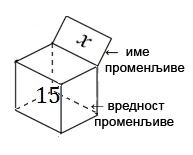
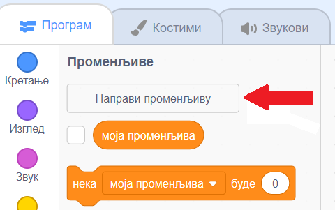
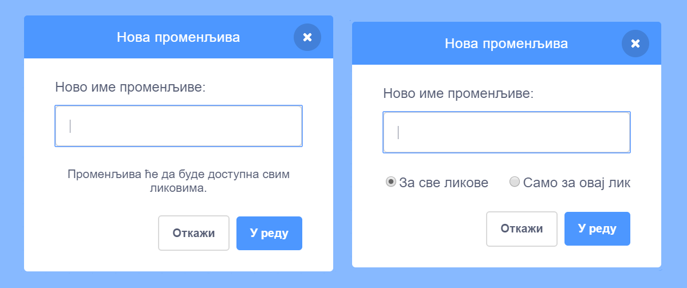
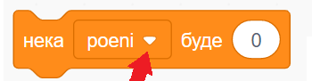
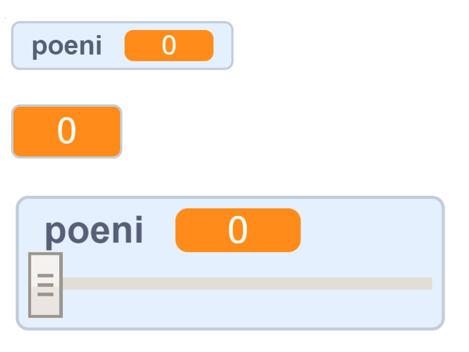
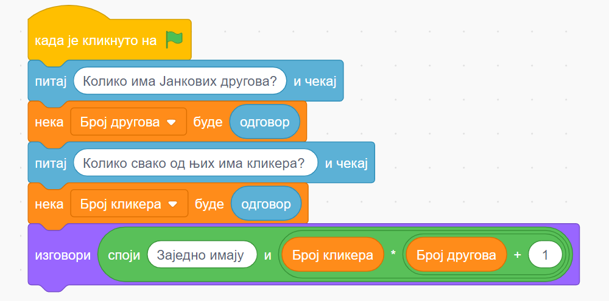

~~~~~~~~~~
Променљиве
~~~~~~~~~~

.. topic:: У оквиру овог часа научићеш: 
            
            - који типови података постоје у Скречу
            - како да креираш и користиш променљиве
            - како да пратиш вредности променљивих током рада програма
            - како да користиш променљиве у рачунању

Променљиве су веома корисне у програмима, јер доносе много нових могућности, као што ћеш видети у вежбањима и пројектима уз ову лекцију. На пример, ако правиш игрицу, она постаје занимљивија када можеш да видиш тренутни резултат, или колико је неком лику остало енергије. Зато је важно да научиш да употребљаваш променљиве.

**Шта је променљива?**

Променљива (варијабла) је део меморије рачунара, коме смо дали неко име. Променљиву можемо да замислимо као кутију са именом, у којој програм памти неки податак, који нам је потребан.

Кутијом на слици смо представили променљиву која се зове *Х*, а у њој се налази број 15. 

**Чему служе променљиве?**

Помоћу променљивих можемо да урадимо разне ствари. 

Можемо, на пример да бројимо колико пута се током рада програма нешто догодило (колико пута су се два лика додирнула, колико пута је лик дотакао ивице позорнице или неку одређену боју итд.). Исто тако, можемо да израчунамо координате неког важног места на позорници и запамтимо их у променљивама, да бисмо могли да доведемо нашег лика до тог места када буде потребно.

У промеменљиве можемо да стављамо и другачије врсте података, а не само бројеве. На пример, можемо да запамтимо текстуалне одговоре корисника на нека питања, па да касније поступамо у складу са тим одгворима. 

**Какве све врсте података (типови података) постоје?**

Ми смо и у досадашњим пројектима користили различите врсте података, само их нисмо смештали у променљиве. Подсетимо се:

- Текст "Здраво свете" и сви остали које смо уносили у блокове *Изговори* и *Замисли* су једна врста података. Овакве, текстуалне податке називамо стрингови.
- Бројеви које смо уносили као аргументе у наредбе кретања (иди, клизи, усмери се ка, промени за) су такође подаци, овај пут бројчани (нумерички).
- Услов понављања или услов гранања може да има две вредности – тачно и нетачно. Резултат израчунавања услова (вредност услова) је још једна врста податка - логички податак.

Све ове врсте података (текстуални, бројчани, логички) могу и да се сместе у променљиве.

**Како се праве променљиве?**

На врху групе блокова променљиве се налази дугме на коме пише "Направи променљиву". 

|

Када кликнемо на дугме "Направи променљиву" појавиће се прозор - дијалог сличан овим:

|

Изглед прозора зависи од тога да ли смо пре клика на дугме "Направи променљиву" уређивали скрипте позорнице или неког од ликова. Уколико смо уређивали скрипте позорнице, треба још само да упишемо како ће променљива да се зове. У случају да смо уређивали скрипте неког од ликова, осим имена променљиве можемо да изаберемо и да ли желимо да променљиву користимо само у скриптама тренутно активног лика, или ће та променљива бити доступна скриптама свих ликова.

Видимо да се променљиве у сваком случају праве веома једноставно. Када направимо променљиву, од тог тренутка на даље можемо да је користимо у скриптама актуелног лика или скриптама свих ликова (зависно од начина на који смо је направили).

**Како се користе променљиве**

Нека смо направили променљиву "поени". Погледајмо сада групу блокова "Променљиве".

.. image:: ../../_images/S3_09_promenljive/RadnjeSaPromenljivom.png
    :width: 400px
    :align: center

Ове 4 наредбе можемо да применимо на сваку променљиву коју направимо. У свакој од наредби поред имена променљиве се налази мала стрелица. 

Та стрелица сугерише да на име променљиве може да се кликне и да ће се кликом отворити нека листа. И заиста, отвара се листа која нам омогућава да изаберемо променљиву на коју желимо да применимо наредбу.

Ево шта све можемо да урадимо помоћу ових наредби:

- Наредба **нека ... буде** служи да поставимо вредност променљиве. Потребно је само да изаберемо променљиву, а затим да упишемо вредност коју јој додељујемо.
- Помоћу наредбе **промени ... за** повећавамо вредност изабране променљиве за вредност коју упишемо. На пример, ако упишемо :math:`3`, вредност променљиве ће се повећати за :math:`3`. Када желимо да смањимо вредност променљиве, треба да упишемо негативну вредност. На пример, ако упишемо :math:`-3`, вредност променљиве ће се смањити за :math:`3`.
- Помоћу наредби **прикажи променљиву** и **сакриј променљиву** постижемо да се вредност променљиве види или не види на позорници.

За променљиве које користимо у програму постоји једноставан и директан начин да задамо да ли да буду видљиве на позорници или не. Довољно је кликнути на знак ✓ (штрикла, квачица) поред имена прменљиве. 

Поменуте наредбе "прикажи променљиву" и "сакриј променљиву" нам омогућавају да исту ствар урадимо из програма.

Када се променљива први пут појави на позорници, она се налази у горњем левом углу. Мишем је лако можемо преместити на било које друго место на позорници. 

Када изаберемо да се вредност променљиве приказује, можемо да задамо и начин на који ће она бити приказана. Начин приказа се мења двокликом на променљиву на позорници. Ево како све променљива може да изгледа.
    

Ово су биле основне ствари које треба да знаш о променљивама пре него што почнеш да их користиш. 

**Пројекат**

Да би ти постало јасније шта све можеш да урадиш да променљивама, **проучи пројекат**
`Лов <https://petlja.org/biblioteka/r/lekcije/scratch3-praktikum/scratch3-promenljive#id2>`_ у нашем практикуму. 

Након што детљно разумеш пројекат *Лов*, покушај да направиш неки сличан пројекат по својој идеји.

Рачунање
--------

Осим постављања, мењања и гледања вредности променљивих, променљиве можемо да користимо и у рачунању. У групи "Оператори", на самом почетку се налазе аритметички оператори помоћу којих обављамо основне рачунске операције - сабирање, одузимање, множење и дељење.
    
.. image:: ../../_images/S3_09_promenljive/AritmetickiOperatori.png
    :width: 150px
    :align: center

У овалне отворе можемо да уписујемо бројеве, али и да убацујемо променљиве. То нам омогућава да решимо многе задатке као што је овај:

Пример - кликери
''''''''''''''''

Јанко је са друговима изашао да играју кликере. Да би игра била равноправна, сви су од куће понели исти број кликера.

|

Следећи програм пита колико има Јанкових другова и колико сваки од њих има кликера, а исписује колико кликера имају сви заједно. 

Размисли зашто се при рачунању укупног броја кликера број другова прво повећава за један, па тек онда множи бројем кликера.

Покушај и ти да самостално направиш неки сличан пројекат.

Додатак
-------

Ако желиш, погледај `поглавље Променљиве <https://petlja.org/biblioteka/r/lekcije/scratch3-praktikum/scratch3-promenljive>`_ у Петљином практикуму. Тамо можеш да нађеш још нека објашњења и занимљиве пројекте.

Петљин `студио Променљиве <https://scratch.mit.edu/studios/24292043>`_ на сајту Скреча садржи урађене пројекте за задатке сличне оним којима смо се овде бавили.

