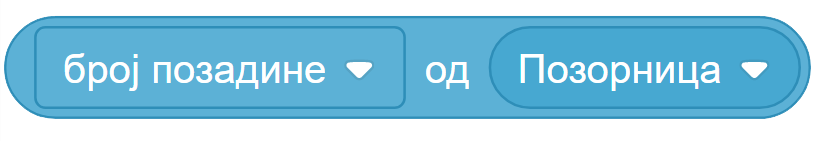

~~~~~~~~~~~~~~~~~~~~~~~~~~~~~~~~~
10.1. Осећаји
~~~~~~~~~~~~~~~~~~~~~~~~~~~~~~~~~

.. topic:: У оквиру овог часа: 
            
            - упознаћеш функције блокова из групе "Осећаји"
            - вежбаћеш употребу блокова групе "Осећаји"

.. |pitaj_cekaj|       image:: ../../_images/S3_opste/pitaj_cekaj.png
.. |odgovor|           image:: ../../_images/S3_opste/odgovor.png

Групу "Осећаји" чине блокови који омогућавају да пројекат прихвата улазне податке са различитих уређаја, слично као што човек чулима прикупља информације из свог окружења. 

Већ смо показали како се помоћу блока "питај ... чекај" прихватају подаци које корисник уноси са тастатуре и памте у репортеру "одговор". Овај блок се обично користи за добијање информација од корисника и примање података за промену параметара ликова и позорнице – координате, боја, величина, костима или позадина. У наредним лекцијама показаћемо и како се овај блок користи за унос вредности променљивих и листа. 

Поред блока "питај ... чекај", у пројектима могу да се користе и други **спољашњи догађаји**: подаци о мишу (координате, додир курсора, притисак на леви тастер), подаци о тастатури (која дирка је притиснута) и о микрофону.

.. image:: ../../_images/S3_10_osecaji/osecaji2.png
    :width: 300px  
    :align: center

|

За преношење информација између ликова до сада смо користили размену порука. Осећаји се такође могу посматрати као начин за преношење информација: један лик може да осети да додирује други лик, додирује боју која је део слике другог лика или позадине, а такође може да осети и колика је његова удаљеност од других ликова. Те догађаје можемо назвати **унутрашњи догађаји**.

.. image:: ../../_images/S3_10_osecaji/osecaji1.png
    :width: 300px  
    :align: center

|

У наредним примерима показаћемо како се блоковима из групе "Осећаји" могу искористити информације о положају лика у односу на показивач миша и друге објекте, текућим операцијама миша и тастатуре и параметрима ликова и позорнице.

Примери
-------
У првом примеру корићењем репортера за кординате курсора мачак прати положај миша и непрекидно изговара да ли се миш налази горе-лево, горе-десно, доле-лево, или доле-десно.

У другом примеру лик балон се сакрива када преко блока "додирује ли боју" осети да је дотакао косу неког од ликова на позорници.

У трећем примеру користи се блок "параметар" преко кога лик Принцеза осети када вила промени костим.

Пример 1 - Где је миш
'''''''''''''''''''''
Кликни на слику да видиш како програм ради.

.. raw:: html

   

   <iframe src="https://scratch.mit.edu/projects/714840073/embed" allowtransparency="true" width="485" height="402" frameborder="0" scrolling="no"  allowfullscreen>
   </iframe>
   

Како се утврђује положај курсора миша можеш да проучиш у следећем упутству.

.. reveal:: zadatak_sakrivanje_razgovor_mis
    :showtitle: Погледај упутство
    :hidetitle: Сакриј упутство

    Блокови

    .. image:: ../../_images/S3_10_osecaji/misx.png
        :width: 100px   
    .. image:: ../../_images/S3_10_osecaji/misy.png
        :width: 100px   

    садрже вредности координата тренутног положаја миша. Захваљујући овим блоковима, ликови у нашим програмима могу да реагују на различите положаје миша.

    Да бисмо могли да испитамо у којој четвртини позорнице се налази миш, користимо три наредбе гранања, од којих једна садржи друге две:

    .. image:: ../../_images/S3_10_osecaji/if_primer3a.png
        :width: 300px   
        :align: center
    
    Задатак може да се реши и коришћењем 4 наредбе гранања (са једним устима), помоћу којих испитујемо једну по једну четвртину позорнице:

    .. image:: ../../_images/S3_10_osecaji/if_primer3b.png
        :width: 400px   
        :align: center

Пример 2 - Балони падају
''''''''''''''''''''''''

Овај пример надограђен је од примера "Припрема журке" из лекције 3.3. Усмеравање лика.

Ана и Душан стоје на позорници, а око њих лети балон који изгледа исто као балони којима је окићена позорница. Балон непрестано клизи до положаја чије се координате задају на случајан начин. Ако при том додирне боју која одговара боји косе неког од ликова, балон нестаје па се појављује у следећем костиму (боји) на некој другој случајно изабраној позицији. Дејство програма можеш да видиш кликом на следећу слику.

.. raw:: html

   

   <iframe src="https://scratch.mit.edu/projects/714924093/embed" allowtransparency="true" width="485" height="402" frameborder="0" scrolling="no"  allowfullscreen>
   </iframe>
   

Ево како изгледа скрипта за лик балон.

.. reveal:: zadatak_sakrivanje_razgovor_balon
    :showtitle: Погледај скрипту
    :hidetitle: Сакриј скрипту

    .. image:: ../../_images/S3_10_osecaji/Baloni_padaju.png
        :width: 400px   
        :align: center

Пример 3 - Принцеза и вила
''''''''''''''''''''''''''''''

Овај пример илуструје коришћење блока "параметар". Принцеза и вила стоје на позорници са спуштеним рукама. Принцеза замоли вилу да подигне руку, али вила не реагује одмах већ чека између пет и 10 секунди. Тада промени свој костим у костим у коме има подигнуту руку. То осети принцеза преко осећаја "параметар", па јој се захвали. Кликни на слику да видиш како одговарајући програм ради. 

.. raw:: html

   

   <iframe src="https://scratch.mit.edu/projects/715775430/embed" allowtransparency="true" width="485" height="402" frameborder="0" scrolling="no"  allowfullscreen>
   </iframe>
   

Следеће упутство показује како се користи блок "параметар", којим један лик сазнаје параметре другог лика.

.. reveal:: zadatak_sakrivanje_razgovor_vila
    :showtitle: Погледај упутство
    :hidetitle: Сакриј упутство

    Скрипта виле приказана је на следећој слици

    .. image:: ../../_images/S3_10_osecaji/Vila.png
        :width: 400px   
        :align: center

    Репортер "параметри" пружа објектима пројекта могућност да сазнају много ствари о другим објектима - ликовима или позорници. На пример, о лику се, између осталог, може сазнати где се тренутно налази (које су му координате), како је усмерен, у ком је костиму, а о позорници коју позадину тренутно користи. Ево шта је све у нашем примеру лик принцезе могао сазнати о лику виле.

    .. image:: ../../_images/S3_10_osecaji/Blok_parametar.png
        :width: 300px   
        :align: center

Шта смо научили
---------------

У овој лекцији смо кроз примере показали како се користе блокови из групе "Осећаји"  који омогућавају чување информација о положају лика у односу на показивач миша и друге објекте, чување информација о текућим операцијама миша и тастатуре и чување параметара ликова и позорнице. Сви ови блокови су функцијски, не могу самостално да стоје у скрипти, већ се умећу у одговарајућа улазна поља самосталних блокова.

Додатак
-------
Група "Осећаји" има више блокова чије могућности нисмо приказали у овој лекцији. Ако желиш да видиш преглед њихових функција погледај додатак 
`Блокови осећаја <https://petlja.org/biblioteka/r/lekcije/scratch3-praktikum/scratch3-dodaci#id8>`_
у нашем практикуму.

.. infonote::

    **Провери своје знање пролазећи кроз наредна питања и вежбе.**

