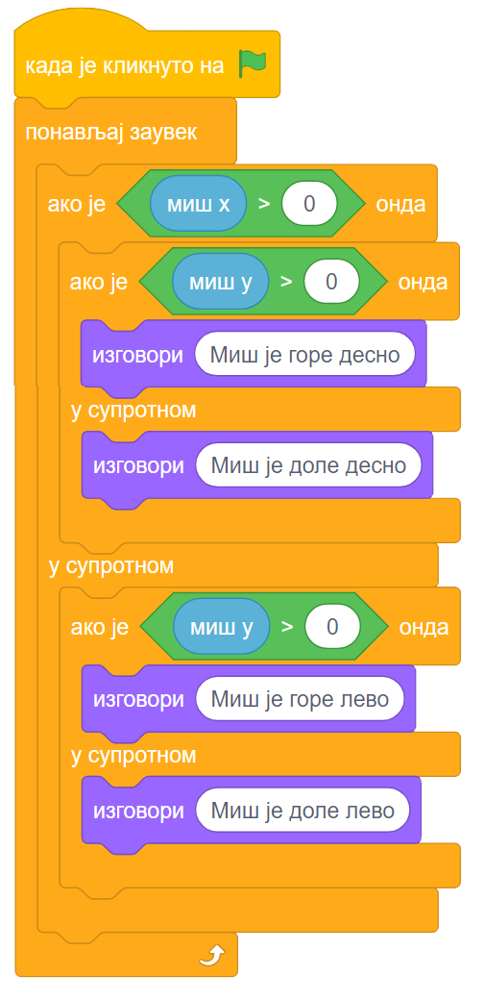
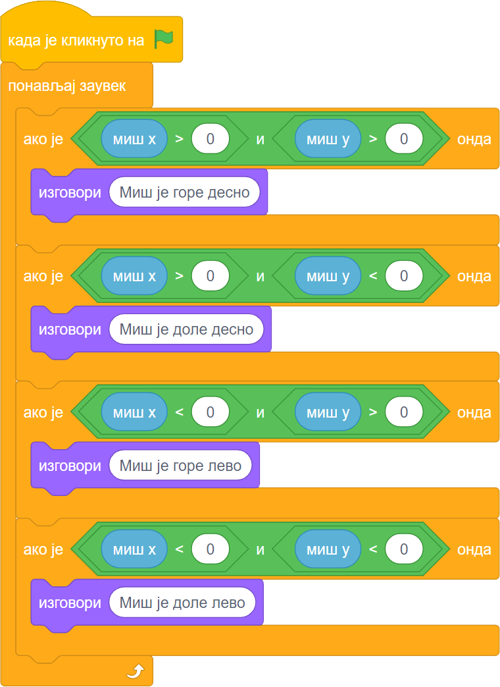

~~~~~~~~~~~~~~~~~~~~~~~~~~~~~~~~~
10.1. Осећаји
~~~~~~~~~~~~~~~~~~~~~~~~~~~~~~~~~

.. topic:: У оквиру овог часа: 
            
            - упознаћеш функције блокова из групе *Осећаји*
            - вежбаћеш употребу блокова групе *Осећаји*

Групу Осећаји чине блокови који омогућавају да пројекат прихвата улазне податке са различитих уређаја, слично као што човек чулима прикупља информације из свог окружења. Тако постоје блокови чувају податке који одговарају онима које човек прикупља чулом додира, чулом вида или чулом слуха. Неки блокови ове групе омогућавају да се покрену различите акције у зависности од положаја лика, времена, датума и слично.

За преношење информација између ликова до сада смо користили размену порука. Осећаји се такође могу посматрати као начин за преношење информација: један лик може да осети да додирује други лик, додирује боју која је део слике другог лика или позадине, а такође може да осети и колика је његова удаљеност од других ликова.

Блокови из групе *Осећаји* садрже разне вредности, које можемо да употребимо за формирање услова тако што те вредности поредимо са другим вредностима. На пример, ови блокови

садрже вредности координата тренутног положаја миша. Захваљујући овим блоковима, ликови у нашим програмима могу различито да реагују на различите положаје миша.

Примери
-------
У првом примеру корићењем репортера за кординате курсора мачак прати положај миша и непрекидно изговара да ли се миш налази горе-лево, горе-десно, доле-лево, или доле-десно.

У другом примеру лик балон непрестано клизи до положаја чије се координате задају на случајан начин. Ако при том додирне боју која одговара боји косе неког од ликова, балон нестаје па се појављује се у следећем костиму (боји) на некој другој случајно изабраној позицији.

Пример 1 - Где је миш
'''''''''''''''''''''

.. raw:: html

   

   <iframe src="https://scratch.mit.edu/projects/714840073/embed" allowtransparency="true" width="485" height="402" frameborder="0" scrolling="no"  allowfullscreen>
   </iframe>
   

Да бисмо могли да испитамо у којој четвртини позорнице се налази миш, користимо три наредбе гранања, од којих једна садржи друге две:

    
Задатак може да се реши и коришћењем 4 наредбе гранања (са једним устима), помоћу којих испитујемо једну по једну четвртину позорнице:

Пример 2 - Балони падају
''''''''''''''''''''''''

.. raw:: html

   

   <iframe src="https://scratch.mit.edu/projects/714924093/embed" allowtransparency="true" width="485" height="402" frameborder="0" scrolling="no"  allowfullscreen>
   </iframe>
   

Овај пример надограђен је од примера "Припрема журке" из лекције *3.3. Усмеравање лика*. 

Ана и Душан стоје на позорници, а око њих лети балон који изгледа исто као балони којима је окићена позорница. Балон полази 

.. image:: ../../_images/S3_10_osecaji/Baloni_padaju.png
    :width: 400px   
    :align: center

