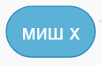

~~~~~~~~~~~~~~~~~~~~~~~~~~~~~~~~~
10.1. Осећаји
~~~~~~~~~~~~~~~~~~~~~~~~~~~~~~~~~

.. topic:: У оквиру овог часа: 
            
            - упознаћеш Функције блокова из групе *Осећаји*
			- вежбаћеш употребу блокова групе *Осећаји*

Групу Осећаји чине блокови који омогућавају да пројекат прихвата улазне податке са различитих уређаја, слично као што човек чулима прикупља информације из свог окружења. Тако постоје блокови чувају податке који одговарају онима које човек прикупља чулом додира, чулом вида или чулом слуха. Неки блокови ове групе омогућавају да се покрену различите акције у зависности од положаја лика, времена, датума и слично.

За преношење информација између ликова до сада смо користили размену порука. Осећаји се такође могу посматрати као начин за преношење информација: један лик може да осети да додирује други лик, додирује боју која је део слике другог лика или позадине, а такође може да осети и колика је његова удаљеност од других ликова.

Блокови из групе *Осећаји* садрже разне вредности, које можемо да употребимо за формирање услова тако што те вредности поредимо са другим вредностима. На пример, ови блокови

.. image:: ../../_images/S3_08_grananje/misy.png
    :width: 100px   

садрже вредности координата тренутног положаја миша. Захваљујући овим блоковима, ликови у нашим програмима могу различито да реагују на различите положаје миша.

Пример 1 - Где је миш
'''''''''''''''''''''

У овом примеру мачак прати положај миша и непрекидно изговара да ли се миш налази горе-лево, горе-десно, доле-лево, или доле-десно. 

Да бисмо могли да испитамо у којој четвртини позорнице се налази миш, користимо три наредбе гранања, од којих једна садржи друге две:

.. image:: ../../_images/S3_08_grananje/if_primer3a.png
    :width: 300px   
    :align: center
    
Задатак може да се реши и коришћењем 4 наредбе гранања (са једним устима), помоћу којих испитујемо једну по једну четвртину позорнице:

.. image:: ../../_images/S3_08_grananje/if_primer3b.png
    :width: 400px   
    :align: center

