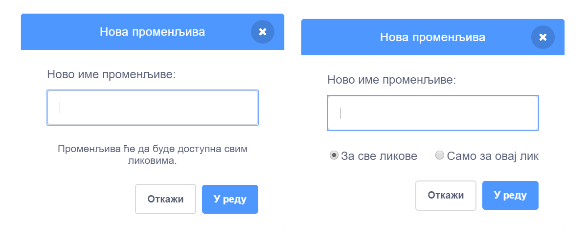
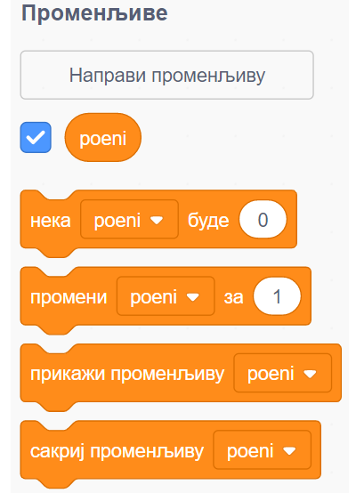
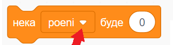
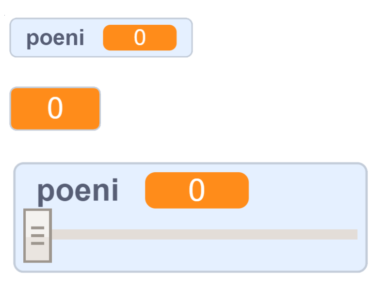
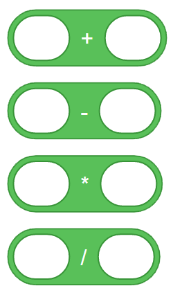
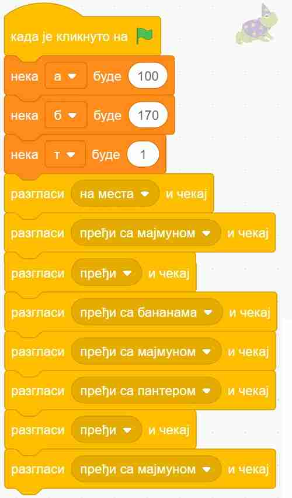
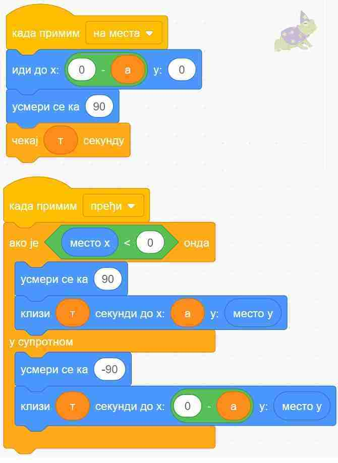
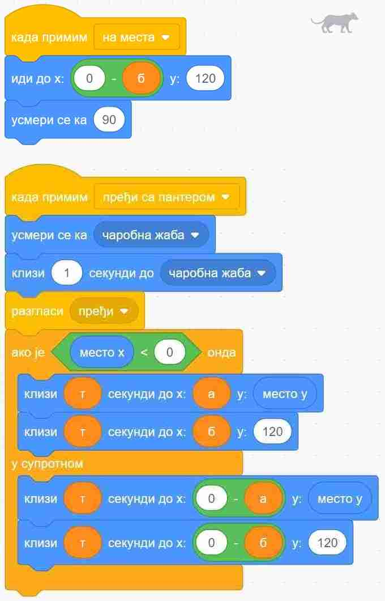

~~~~~~~~~~~~~~~~
11.1. Променљиве
~~~~~~~~~~~~~~~~

.. topic:: У оквиру овог часа научићеш: 
            
            - Који типови података постоје у Скречу.
            - Како да креираш и користиш променљиве.
            - Како да пратиш вредности променљивих током рада програма.
            - Како да користиш променљиве у рачунању.

Променљиве су један од најважнијих концепата у програмирању. У овом поглављу упознаћеш различите типове променљивих и видећеш како се на позорници могу пратити њихове промене вредности. Кроз примере пројеката чије скрипте имају сложену структуру показаћемо како се могу креирати такмичарске игре у којима се прати резултат играча, како се могу контролисати улазни подаци и како се формирају сложени изрази за рачунање вредности променљивих.

Кликом на слику можеш да одиграш игрицу "Ловац на духове 1". Духове ловиш тако што кликнеш на тастер размак, чиме постижеш да вештица полети навише. Ако при томе додирне духа, он нестаје – уловљен је.

.. raw:: html

   

   <iframe src="https://scratch.mit.edu/projects/715892731/embed" allowtransparency="true" width="485" height="402" frameborder="0" scrolling="no"  allowfullscreen>
   </iframe>
   

Кликом на следећу слику покрећеш игрицу "Ловац на духове 2", у којој се користи променљива "поени". Ова променљива броји колико духова је уловљено. Игра се завршава када се улови више од 10 духова.

.. raw:: html

   

   <iframe src="https://scratch.mit.edu/projects/715892226/embed" allowtransparency="true" width="485" height="402" frameborder="0" scrolling="no"  allowfullscreen>
   </iframe>
   

Игрица би се могла надоградити додавањем још једне променљиве која би прекидала игру по истеку задатог времена. Дакле, ако правиш игрицу, она постаје занимљивија када можеш да видиш тренутни резултат, или колико је неком лику остало енергије. Зато је важно да научиш да употребљаваш променљиве.

|

**Шта је променљива?**

Променљива (варијабла) је део меморије рачунара, коме смо дали неко име. Променљиву можемо да замислимо као кутију са именом, у којој програм памти неки податак који нам је потребан.

.. image:: ../../_images/S3_11_promenljive/promenljiva_kao_kutija.png
    :width: 390px   
    :align: center

Кутијом на слици смо представили променљиву која се зове *Х*, а у њој се налази број 15. 

|

**Чему служе променљиве?**

Помоћу променљивих можемо да урадимо разне ствари. 

Можемо, на пример, да бројимо колико пута се током рада програма нешто догодило (колико пута су се два лика додирнула, колико пута је лик дотакао ивице позорнице или неку одређену боју итд.). Исто тако, можемо да израчунамо координате неког важног места на позорници и запамтимо их у променљивама, да бисмо могли да доведемо нашег лика до тог места када буде потребно.

У променљиве можемо да стављамо и другачије врсте података, а не само бројеве. На пример, можемо да запамтимо текстуалне одговоре корисника на нека питања, па да касније поступамо у складу са тим одговорима. 

|

**Какве све врсте података (типови података) постоје?**

Ми смо и у досадашњим пројектима користили различите врсте података, само их нисмо смештали у променљиве. Подсетимо се:

- Текст "Здраво свете" и сви остали које смо уносили у блокове "изговори" и "замисли" су једна врста података. Овакве текстуалне податке називамо стрингови.
- Бројеви које смо уносили као аргументе у наредбе кретања (иди, клизи, усмери се ка, промени за) су такође подаци, овај пут бројчани (нумерички).
- Услов понављања или услов гранања може да има две вредности – тачно и нетачно. Резултат израчунавања услова (вредност услова) је још једна врста податка – логички податак.

Све ове врсте података (текстуални, бројчани, логички) могу и да се сместе у променљиве.

|

**Како се праве променљиве?**

На врху групе блокова променљиве се налази дугме на коме пише "Направи променљиву". 

.. image:: ../../_images/S3_11_promenljive/PravljenjePromenljiveMeni.png
    :width: 480px   
    :align: center

|

Када кликнемо на дугме "Направи променљиву" појавиће се прозор – дијалог сличан овим:

|

Изглед прозора зависи од тога да ли смо пре клика на дугме "Направи променљиву" уређивали скрипте позорнице или неког од ликова. Уколико смо уређивали скрипте позорнице, треба још само да упишемо како ће променљива да се зове. У случају да смо уређивали скрипте неког од ликова, осим имена променљиве можемо да изаберемо и да ли желимо да променљиву користимо само у скриптама тренутно активног лика, или ће та променљива бити доступна скриптама свих ликова.

Видимо да се променљиве у сваком случају праве веома једноставно. Када направимо променљиву, од тог тренутка на даље можемо да је користимо у скриптама актуелног лика или скриптама свих ликова (зависно од начина на који смо је направили).

|

**Како се користе променљиве**

Нека смо направили променљиву "поени". Погледајмо сада групу блокова *Променљиве*.

Ове четири наредбе можемо да применимо на сваку променљиву коју направимо. У свакој од наредби поред имена променљиве се налази мала стрелица. 

Та стрелица сугерише да на име променљиве може да се кликне и да ће се кликом отворити нека листа. И заиста, отвара се листа која нам омогућава да изаберемо променљиву на коју желимо да применимо наредбу.

Ево шта све можемо да урадимо помоћу ових наредби:

- Наредба **нека ... буде** служи да поставимо вредност променљиве. Потребно је само да изаберемо променљиву, а затим да упишемо вредност коју јој додељујемо.
- Помоћу наредбе **промени ... за** повећавамо вредност изабране променљиве за вредност коју упишемо. На пример, ако упишемо :math:`3`, вредност променљиве ће се повећати за :math:`3`. Када желимо да смањимо вредност променљиве, треба да упишемо негативну вредност. На пример, ако упишемо :math:`-3`, вредност променљиве ће се смањити за :math:`3`.
- Помоћу наредби **прикажи променљиву** и **сакриј променљиву** постижемо да се вредност променљиве види или не види на позорници.

За променљиве које користимо у програму постоји једноставан и директан начин да задамо да ли да буду видљиве на позорници или не. Довољно је кликнути на знак ✓ (штрикла, квачица) поред имена променљиве. 

Поменуте наредбе "прикажи променљиву" и "сакриј променљиву" нам омогућавају да исту ствар урадимо из програма.

Када се променљива први пут појави на позорници, она се налази у горњем левом углу. Мишем је лако можемо преместити на било које друго место на позорници. 

Када изаберемо да се вредност променљиве приказује, можемо да задамо и начин на који ће она бити приказана. Начин приказа се мења двокликом на променљиву на позорници. Ево како све променљива може да изгледа.
    

Ово су биле основне ствари које треба да знаш о променљивама пре него што почнеш да их користиш. 

.. **Пројекат**

 Да би ти постало јасније шта све можеш да урадиш са променљивима, **проучи пројекат**
 `Лов <https://petlja.org/biblioteka/r/lekcije/scratch3-praktikum/scratch3-promenljive#id2>`_ у нашем практикуму. 

 Након што детаљно разумеш пројекат *Лов*, покушај да направиш неки сличан пројекат по својој идеји.

.. topic:: Погледај наредни видео.

   Он ће ти показати како смо употребили променљиве да бисмо увели систем бодовања у нашу игрицу.
   
    .. ytpopup:: hpDCMjjhC-E
        :width: 735
        :height: 415
        :align: center 

Рачунање
--------

Осим постављања, мењања и гледања вредности променљивих, променљиве можемо да користимо и у рачунању. У групи *Оператори*, на самом почетку се налазе аритметички оператори помоћу којих обављамо основне рачунске операције – сабирање, одузимање, множење и дељење.
    

У овалне отворе можемо да уписујемо бројеве, али и да убацујемо променљиве. То нам омогућава да решимо многе задатке као што је овај:

Примери
-------

У првом примеру показано је како се вредности променљивих уносе са улаза наредбом "питај ... чекај" и користе за израчунавање вредности израза. У изразу се користе аритметички оператори, а резултат његовог израчунавања се приказује на излазу.

У другом примеру показано је како се бројевни подаци уносе преко монитора са клизачем придруженим променљивој. У програму се такође користи променљива у оператору поређења који омогућава излазак и петље.

У трећем примеру, анимацији алгоритма за прелазак преко реке, променљиве се користе за задавање координата на које ликове треба премештати.

 
Пример 1 – Кликери
''''''''''''''''''
Јанко је са друговима изашао да играју кликере. Да би игра била равноправна, сви су од куће понели исти број кликера.

Следећи програм пита колико има Јанкових другова и колико сваки од њих има кликера, а исписује колико кликера имају сви заједно. 

.. raw:: html

   

   <iframe src="https://scratch.mit.edu/projects/714840254/embed" allowtransparency="true" width="485" height="402" frameborder="0" scrolling="no"  allowfullscreen>
   </iframe>
   

Покушај да правиш сличан програм. У томе ти може помоћи скрипта овог програма. 

.. reveal:: zadatak_sakrivanje_razgovor_klikeri
    :showtitle: Погледај скрипту
    :hidetitle: Сакриј скрипту

    .. image:: ../../_images/S3_11_promenljive/PrimerKlikeri.png
        :width: 750px
        :align: center

Размисли зашто се при рачунању укупног броја кликера број другова прво повећава за један, па тек онда множи бројем кликера.

|

Пример 2 – Таблица множења
''''''''''''''''''''''''''

У следећем примеру девојчица множи број који корисник уноси преко клизача бројевима од 1 до 10.

.. raw:: html

   

   <iframe src="https://scratch.mit.edu/projects/714923136/embed" allowtransparency="true" width="485" height="402" frameborder="0" scrolling="no"  allowfullscreen>
   </iframe>
   

Проучи скрипте придружене девојчици у овом програму. Посебно обрати пажњу на начин како се користи оператор "споји ... и ..." у наредби "изговори".

.. reveal:: zadatak_sakrivanje_razgovor_mnozenje
    :showtitle: Погледај скрипту
    :hidetitle: Сакриј скрипту

    .. image:: ../../_images/S3_11_promenljive/Mnozenje.png
        :width: 750px
        :align: center

Пример 3 – Пантер, мајмун и банане
''''''''''''''''''''''''''''''''''

Џиновска чаробна жаба налази се на обали реке, заједно са пантером, мајмуном и бананама. Жаба треба на својим леђима да пренесе преко реке пантера, мајмуна и банане. При томе може да их преноси само једно по једно и не сме да остави без надзора на истој обали пантера и мајмуна (јер би пантер појео мајмуна), ни мајмуна и банане (јер би мајмун појео банане). Којим редом жаба треба да преноси пантера, мајмуна и банане да би се сви нашли на другој обали?
	
Ова мозгалица је веома стара, а позната је као задатак о вуку, кози и купусу. Ако ти задатак није познат од раније, немој да пропустиш забаву – пробај прво да самостално смислиш редослед прелазака преко реке.

Наш стварни задатак овде је да, знајући редослед прелазака преко реке, направимо пројекат који те преласке приказује. Нека су на почетку сви на левој обали и треба да пређу на десну. Један од два могућа редоследа прелажења је овај (други се добија када пантер и банане замене улоге):

.. csv-table::
    :header: "Акција", "лево остају", "десно остају"
    :widths: 40, 30, 30
    :align: left

    "жаба преноси мајмуна", "пантер и банане", "жаба и мајмун"
    "жаба се враћа", "жаба, пантер и банане", "мајмун"
    "жаба преноси банане", "пантер", "жаба, мајмун и банане"
    "жаба се враћа са мајмуном", "жаба, пантер и мајмун", "банане"
    "жаба преноси пантера", "мајмун", "жаба, пантер и банане"
    "жаба се враћа", "жаба и мајмун", "пантер и банане"
    "жаба преноси мајмуна", "нико", "сви"
   
Да би се решио оригинални задатак требало је сетити се да жаба може и да врати мајмуна на леву обалу. Сада када знамо редослед потеза, хајде да видимо како да их прикажемо.

Жаба би могла да објављује потезе, а сви остали само реагују на објаве. То значи да у скриптама пантера, мајмуна и банана нема никаквог знања о томе како ће се сви они наћи на другој страни, они само умеју да иду са жабом кад их она позове. Све знање се налази у главној жабиној скрипти, која изгледа овако:

Променљиве **а**, **б** и **т** се не мењају током рада програма, па уместо њих свуда у програму могу да стоје бројеви 100, 170, 1. Променљиве смо користили да бисмо лакше подешавали положаје ликова и брзину анимације, јер током испробавања је лакше мењати, на пример, све брзине на само једном месту. Улоге ових променљивих ћеш још боље разумети када погледаш остале скрипте.

Поред главне, жаба има и две споредне скрипте, за постављање на почетни положај и за прелазак реке:

Жаба на основу *х* координате свог положаја зна на коју страну треба да иде. Ако је *х* негативно, значи да се жаба налази на левој страни па треба прећи са леве на десну обалу, а ако је *х*  позитивно, жаба треба да се врати на леву страну.

Скрипте осталих ликова су међусобно скоро истоветне, зато ћемо их показати само за пантера:

Када пантер прими објаву "пређи са пантером", он прво дође до жабе (попне јој се на леђа), затим пређе реку заједно са жабом, а на крају сиђе са жабе и стане на своје место на другој обали. Да ли се иде налево или надесно, пантер одређује на исти начин као и жаба. 

Остала два лика извршавају исте кораке, само што мајмун реагује на објаву "пређи са мајмуном", а банане на објаву "пређи са бананама". Још једна мала разлика између скрипти ових ликова је у томе што они користе различите *у* координате за свој положај на обали. За пантера је та *у* координата 120, за мајмуна 0, а за банане -120.

Кликни на слику да видиш анимацију решења.
	
	
.. raw:: html

    

    <iframe src="https://scratch.mit.edu/projects/416419029/embed" allowtransparency="true" width="485" height="402" frameborder="0" scrolling="no"  allowfullscreen>
    </iframe>
    

Покушај и ти да самостално направиш неки сличан пројекат.

Шта смо научили
---------------

У овој лекцији научили смо како се креирају и користе променљиве. У наредним лекцијама упознаћемо сложене променљиве и кроз примере разјаснити разлику између локалних и глобалних променљивих. Такође смо представили блокове из групе *Операције* и показали како се граде сложени функцијски блокови. Пример 3 у овој лекцији има сложену структуру – састављен је комбиновањем основних елемената програмске логике. Открити логичке грешке у пројектима сложене структуре није лако. Зато ћемо у наредној лекцији показати како се развој и тестирање пројеката може олакшати поделом великих скрипти у процедуре – логичке делове од којих сваки обавља једну функцију.

Додатак
-------

Ако желиш, погледај `поглавље "Променљиве" <https://petlja.org/biblioteka/r/lekcije/scratch3-praktikum/scratch3-promenljive>`_ у Петљином практикуму. Тамо можеш да нађеш још нека објашњења и занимљиве пројекте.

Петљин `студио Променљиве <https://scratch.mit.edu/studios/24292043>`_ на сајту Скреча садржи урађене пројекте за задатке сличне оним које смо овде решавали.

.. infonote::

    **Провери своје знање пролазећи кроз наредна питања и вежбе.**

