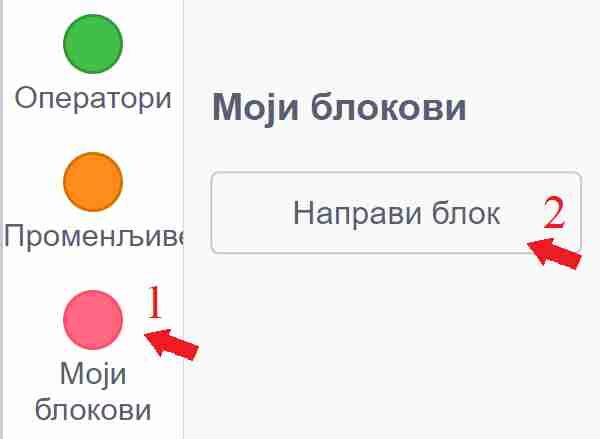

~~~~~~~~~~~~~~~
12.1. Процедуре
~~~~~~~~~~~~~~~

.. topic:: У оквиру овог часа научићеш:

    - шта су процедуре
    - како да направиш процедуру
    - како да задаш параметре процедуре
    - како да користиш процедуре

У нашим програмима често постоји део који се понавља у истом или сличном облику. Такве правилности можемо да искористимо и да програм учинимо краћим и прегледнијим. 

Узмимо као пример познату песмицу Душка Радовића::

    Деца Воле
    
    Деца воле чудне ствари
    као сто су оџачари,
    као што су кочничари,
    као што су, као што су...

    Деца воле слатке ствари
    као сто су сутлијаши,
    као што су грилијаши,
    као што су, као што су...

    Деца воле смешне ствари
    као сто су пападаћи,
    као што су сумарени,
    као што су, као што су...

Ако хоћемо да направимо програм у коме главни лик изговара стихове песме, то можемо да урадимо на различите начине. 

Један, не нарочито забаван (а ни поучан) начин је да за сваки стих додамо посебан блок у скрипту. Тако добијамо овај дугачак програм.

.. image:: ../../_images/S3_12_procedure/DecaVole1.png
    :width: 500px
    :align: center

|

Покушајмо сада да искористимо правилност која се појављује у песми, да бисмо скратили програм. Ради тога ћемо изговарање једне строфе да издвојимо у засебну целину и од те целине да направимо нови блок.

У групи "Моји блокови" кликни на дугме "Направи блок".

|

Појавиће се нови прозор - дијалог, у коме можеш да направиш свој блок. Сваки блок који на овај начин направиш зове се **процедура**.

Кликом у поље у коме на почетку пише "Име блока", можеш да задаш име будућег блока - процедуре. 

.. image:: ../../_images/S3_12_procedure/InterfejsBloka.jpg
    :width: 550px
    :align: center

|

Ми смо нашем блоку дали име "Кажи строфу".

Врати се за тренутак на текст песме и погледај га пажљивије. Примећујеш да се у свакој строфи мењају само три речи, а остале речи су исте:

- У првој строфи то су речи: 'чудне', 'оџачари' и 'кочничари';
- у другој су то речи: 'слатке', 'сутлијаши' и 'грилијаши';
- а у трећој строфи: 'смешне', 'пападаћи' и 'сумарени'.

Да би наш блок могао да изговара различите строфе, потребно је да му некако дотуримо три речи које треба убацити у текст строфе.

Кликом на дугме "Додај улаз" у блоку се ствара још једно поље. Овакво поље се зове улазно поље и у њега ћемо уписати име променљиве која ће да садржи прву од три речи које желимо да проследимо нашем блоку. Та променљива се у нашем примеру зове 'какве', јер говори какве ствари деца воле (чудне, слатке и смешне).

Када поново кликнемо да дугме "Додај улаз", појавиће се ново улазно поље, у којем дајемо име другој речи коју ћемо прослеђивати. Нека се та друга реч зове 'ствар1'. На крају, још једним кликом направићемо и улазно поље за трећу реч, коју називамо 'ствар2'. Кликом на дугме "У реду" завршавамо овај део посла.

Уписивањем имена блока и прављењем улазних поља смо задали како ће наш блок бити коришћен у програму. Кажемо и да смо задали **интерфејс** нашег блока.

.. image:: ../../_images/S3_12_procedure/ParametriBloka.jpg
    :width: 300px
    :align: center

|

У простору за скрипте појавио се почетни блок, који зовемо **заглавље процедуре**. Испод заглавља треба да задамо шта ће наш нови блок - процедура да ради.

.. image:: ../../_images/S3_12_procedure/DefinisanjeBloka.jpg
    :width: 450px
    :align: center

|

Додај блокове за спајање и изговарање текста, као на следећој слици. Ови блокови испод заглавља чине **тело процедуре** коју дефинишемо.

|

Формирајући тело процедуре, објаснили смо рачунару шта тачно треба да уради са речима 'какве', 'ствар1' и 'ствар2' када будемо користили наш блок - процедуру. Ове речи које наша процедура користи називају се **параметри** процедуре. Можемо да кажемо да се интерфејс процедуре састоји од њеног имена и параметара, који се виде у заглављу процедуре.

Пошто смо саставили тело процедуре "Кажи строфу", она је сада потпуно спремна за употребу. Остаје још само да у главној скрипти позовемо ову процедуру за сваку строфу по једном.

.. image:: ../../_images/S3_12_procedure/DecaVole2b.jpg
    :width: 400px
    :align: center

|

Речи које прослеђујемо процедури приликом позива, називају се **аргументи** процедуре (некад се каже и "стварни параметри"). У нашем примеру, аргументи у првом позиву си били 'чудне', 'оџачари' и 'кочничари', у другом позиву 'слатке', 'сутлијаши' и 'грилијаши', а у трећем 'смешне', 'пападаћи' и 'сумарени'.

.. infonote::

    Кроз овај пример смо научили да је процедура група наредби, која је издвојена у засебну програмску целину. Процедура може, а не мора да има параметре. Параметри нам омогућавају да се процедура не понаша потпуно исто при сваком позиву.

    Након што дефинишемо процедуру, можемо да је користимо више пута на разним местима у програму. На тај начин избегавамо понављање наредби које се налазе у телу процедуре.

.. reveal:: primer_panter_majmun_banane2
    :showtitle: Погледај пример
    :hidetitle: Сакриј пример

    **Пример 3 - Пантер, мајмун и банане**

    Џиновска чаробна жаба налази се на обали реке, заједно са пантером, мајмуном и бананама. Жаба треба на својим леђима да пренесе преко реке пантера, мајмуна и банане. При томе може да их преноси само једно по једно и не сме да остави без надзора на истој обали пантера и мајмуна (јер би пантер појео мајмуна), ни мајмуна и банане (јер би мајмун појео банане). Којим редом жаба треба да преноси пантера, мајмуна и банане, да би се сви нашли на другој обали?

    .. image:: ../../_images/S3_12_razglasavanje/PanterMajmunBanane.jpg
        :width: 470px
        :align: center

    Ова мозгалица је веома стара, а позната је као задатак о вуку, кози и купусу. Ако ти задатак није познат од раније, немој да пропустиш забаву - пробај прво да самостално смислиш редослед прелазака преко реке.

    Наш стварни задатак овде је да, знајући редослед прелазака преко реке, направимо пројекат који те преласке приказује. Нека су на почетку сви на левој обали и треба да пређу на десну. Један од два могућа редоследа прелажења је овај (други се добија када пантер и банане замене улоге):

    .. csv-table::
      :header: "Акција", "лево остају", "десно остају"
      :widths: 40, 30, 30
      :align: left

      "жаба преноси мајмуна", "пантер и банане", "жаба и мајмун"
      "жаба се враћа", "жаба, пантер и банане", "мајмун"
      "жаба преноси банане", "пантер", "жаба, мајмун и банане"
      "жаба се враћа са мајмуном", "жаба, пантер и мајмун", "банане"
      "жаба преноси пантера", "мајмун", "жаба, пантер и банане"
      "жаба се враћа", "жаба и мајмун", "пантер и банане"
      "жаба преноси мајмуна", "нико", "сви"
   
    Ради решавања оригиналног задатка је требало сетити се да жаба може и да врати мајмуна на леву обалу. Сада када знамо редослед потеза, хајде да видимо како да их прикажемо.

    Жаба би могла да објављује потезе, а сви остали само реагују на објаве. То значи да у скриптама пантера, мајмуна и банана нема никаквог знања о томе како ће се сви они наћи на другој страни, они само умеју да иду са жабом кад их она позове. Сво знање се налази у главној жабиној скрипти, која изгледа овако:

    .. image:: ../../_images/S3_12_razglasavanje/PanterMajmunBanane_Zaba1.jpg
        :width: 400px
        :align: center

    Променљиве **а**, **б** и **т** се не мењају током рада програма, па уместо њих свуда у програму могу да стоје бројеви 100, 170, 1. Променљиве смо користили да бисмо лакше подешавали положаје ликова и брзину анимације, јер током испробавања је лакше мењати на пример све брзине на само једном месту. Улоге ових променљивих ћеш још боље разумети када погледаш остале скрипте.

    Поред главне, жаба има и две споредне скрипте, за постављање на почетни положај и за прелазак реке:

    .. image:: ../../_images/S3_12_razglasavanje/PanterMajmunBanane_Zaba2.jpg
        :width: 400px
        :align: center

    Жаба на основу *X* координате свог положаја зна на коју страну треба да иде. Ако је *X* негативно, значи да се жаба налази на левој страни па треба прећи са леве на десну обалу, а ако је *X*  позитивно, жаба треба да се врати на леву страну.

    Скрипте осталих ликова су међусобно скоро истоветне, зато ћемо их показати само за пантера:

    .. image:: ../../_images/S3_12_razglasavanje/PanterMajmunBanane_Panter.jpg
        :width: 400px
        :align: center

    Када пантер прими објаву "пређи са пантером", он прво дође до жабе (попне јој се на леђа), затим пређе реку заједно са жабом, а на крају сиђе са жабе и стане на своје место на другој обали. Да ли се иде на лево или на десно, пантер одређује на исти начин као и жаба. 

    Остала два лика извршавају исте кораке, само што мајмун реагује на објаву "пређи са мајмуном", а банане на објаву "пређи са бананама". Још једна мала разлика између скрипти ових ликова је у томе што они користе различите *Y* координате за свој положај на обали. За пантера је та *Y* координата 120, за мајмуна 0, а за банане -120.

Процедуре могу да буду врло корисне и приликом цртања. Да би ти било јасније на који начин ти процедуре могу помоћи при цртању, проучи 
`примере употребе процедура  <https://petlja.org/biblioteka/r/lekcije/scratch3-praktikum/scratch3-procedure>`_
у нашем практикуму. Након тога, покушај да направиш и неки сопствени пројекат у коме ћеш употребити процедуре.

Петљин `студио Процедуре <https://scratch.mit.edu/studios/25117374>`_ на сајту Скреча садржи урађене пројекте за задатке сличне оним којима смо се овде бавили.

.. topic:: Погледај видео:

   На крају, погледај и видео у коме смо употребили процедуре да бисмо унапредили кретање наших ликова. 

    .. ytpopup:: s7T5ecjEDQA
        :width: 735
        :height: 415
        :align: center 

