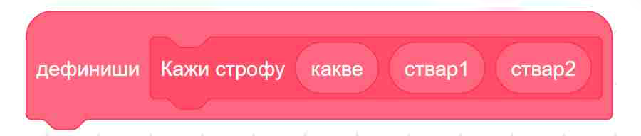

~~~~~~~~~~~~~~~
12.1. Процедуре
~~~~~~~~~~~~~~~

.. topic:: У оквиру овог часа научићеш:

   
    - Шта су процедуре.
    - Како да направиш процедуру.
    - Како да задаш параметре процедуре.
    - Како да користиш процедуре.

Пројекти које ћемо проучавати у овој лекцији имају сложену структуру. Да бисмо брже и лакше направили пројекте сложене структуре разделићемо велике скрипте у логичке делове од којих сваки обавља једну функцију. Такве делове називамо **процедуре**. Свака од процедура извршава одређену функцију, а једна скрипта, главни програм, позива их и повезује у јединствену целину.

Дакле, ако у нашим програмима постоји део који се понавља у истом или сличном облику, такве правилности можемо да искористимо и да програм учинимо краћим и прегледнијим. 

Узмимо као пример познату песмицу Душка Радовића::

    Деца Воле
    
    Деца воле чудне ствари
    као сто су оџачари,
    као што су кочничари,
    као што су, као што су...

    Деца воле слатке ствари
    као сто су сутлијаши,
    као што су грилијаши,
    као што су, као што су...

    Деца воле смешне ствари
    као сто су пападаћи,
    као што су сумарени,
    као што су, као што су...

Ако хоћемо да направимо програм у коме главни лик изговара стихове песме, то можемо да урадимо на различите начине. 

Један, не нарочито забаван (а ни поучан) начин је да за сваки стих додамо посебан блок у скрипту. Тако добијамо овај дугачак програм.

.. reveal:: primer_dugacka_skripta
    :showtitle: Погледај скрипту
    :hidetitle: Сакриј скрипту

    .. image:: ../../_images/S3_12_procedure/DecaVole1.png
        :width: 500px
        :align: center

|

Покушајмо сада да искористимо правилност која се појављује у песми, да бисмо скратили програм. Ради тога ћемо изговарање једне строфе да издвојимо у засебну целину и од те целине да направимо нови блок.

У групи *Моји блокови* кликни на дугме "Направи блок".

.. image:: ../../_images/S3_12_procedure/MojiBlokovi.png
    :width: 500px
    :align: center

|

Појавиће се нови прозор – дијалог, у коме можеш да направиш свој блок. Сваки блок који на овај начин направиш зове се **процедура**.

Кликом у поље у коме на почетку пише "Име блока", можеш да задаш име будућег блока – процедуре. 

.. image:: ../../_images/S3_12_procedure/InterfejsBloka.png
    :width: 780px
    :align: center

|

Ми смо нашем блоку дали име "Кажи строфу".

Врати се за тренутак на текст песме и погледај га пажљивије. Примећујеш да се у свакој строфи мењају само три речи, а остале речи су исте:

- У првој строфи то су речи: "чудне", "оџачари" и "кочничари";
- у другој су то речи: "слатке", "сутлијаши" и "грилијаши";
- а у трећој строфи: "смешне", "пападаћи" и "сумарени".

Да би наш блок могао да изговара различите строфе, потребно је да му некако дотуримо три речи које треба убацити у текст строфе.

Кликом на дугме "Додај улаз" у блоку се ствара још једно поље. Овакво поље се зове улазно поље и у њега ћемо уписати име променљиве која ће да садржи прву од три речи које желимо да проследимо нашем блоку. Та променљива се у нашем примеру зове "какве", јер говори какве ствари деца воле (чудне, слатке и смешне).

Када поново кликнемо да дугме "Додај улаз", појавиће се ново улазно поље, у којем дајемо име другој речи коју ћемо прослеђивати. Нека се та друга реч зове "ствар1". На крају, још једним кликом направићемо и улазно поље за трећу реч, коју називамо "ствар2". Кликом на дугме "У реду" завршавамо овај део посла.

Уписивањем имена блока и прављењем улазних поља задали смо како ће наш блок бити коришћен у програму. Кажемо и да смо задали **интерфејс** нашег блока.

.. image:: ../../_images/S3_12_procedure/ParametriBloka.png
    :width: 500px
    :align: center

|

У простору за скрипте појавио се почетни блок, који зовемо **заглавље процедуре**. Испод заглавља треба да задамо шта ће наш нови блок – процедура да ради.

|

Додај блокове за спајање и изговарање текста, као на следећој слици. Ови блокови испод заглавља чине **тело процедуре** коју дефинишемо.

.. image:: ../../_images/S3_12_procedure/DecaVole2a.png
    :width: 780px
    :align: center

|

Формирајући тело процедуре, објаснили смо рачунару шта тачно треба да уради са речима "какве", "ствар1" и "ствар2" када будемо користили наш блок – процедуру. Ове речи које наша процедура користи називају се **параметри** процедуре. Можемо да кажемо да се интерфејс процедуре састоји од њеног имена и параметара, који се виде у заглављу процедуре.

Пошто смо саставили тело процедуре "Кажи строфу", она је сада потпуно спремна за употребу. Остаје још само да у главној скрипти позовемо ову процедуру за сваку строфу по једном.

.. image:: ../../_images/S3_12_procedure/DecaVole2b.png
    :width: 500px
    :align: center

|

Речи које прослеђујемо процедури приликом позива називају се **аргументи** процедуре (некад се каже и "стварни параметри"). У нашем примеру, аргументи у првом позиву си били "чудне", "оџачари" и "кочничари", у другом позиву "слатке", "сутлијаши" и "грилијаши", а у трећем "смешне", "пападаћи" и "сумарени".

.. infonote::

    Кроз овај пример смо научили да је процедура група наредби издвојена у засебну програмску целину. Процедура може, а не мора, да има параметре. Параметри нам омогућавају да се процедура не понаша потпуно исто при сваком позиву.

    Након што дефинишемо процедуру, можемо да је користимо више пута на разним местима у програму. На тај начин избегавамо понављање наредби које се налазе у телу процедуре.

Шта смо научили
---------------

У овој лекцији показали смо како се у Скречу могу реализовати процедуре. Показали смо како се могу направити нови блокови са и без улазних поља. Нови блокови са улазним пољима омогућавају да се аргументи који се у њих упишу проследе дефиницији блока и тамо поставе уместо одговарајућих параметра. На тај начин један исти блок може да реализује више различитих акција у зависности вредности аргумената. 

Додатак
-------

Процедуре могу да буду врло корисне и приликом цртања. Да би ти било јасније на који начин ти процедуре могу помоћи при цртању, проучи 
`примере употребе процедура  <https://petlja.org/biblioteka/r/lekcije/scratch3-praktikum/scratch3-procedure>`_
у нашем практикуму. Након тога, покушај да направиш и неки сопствени пројекат у коме ћеш употребити процедуре.

Петљин `студио Процедуре <https://scratch.mit.edu/studios/25117374>`_ на сајту Скреча садржи урађене пројекте за задатке сличне оним које смо овде решавали.

.. topic:: Погледај наредни видео.

   Видећеш како смо овде употребили процедуре да бисмо унапредили кретање наших ликова. 

    .. ytpopup:: s7T5ecjEDQA
        :width: 735
        :height: 415
        :align: center 

.. infonote::

    **Провери своје знање пролазећи кроз наредна питања и вежбе.**

