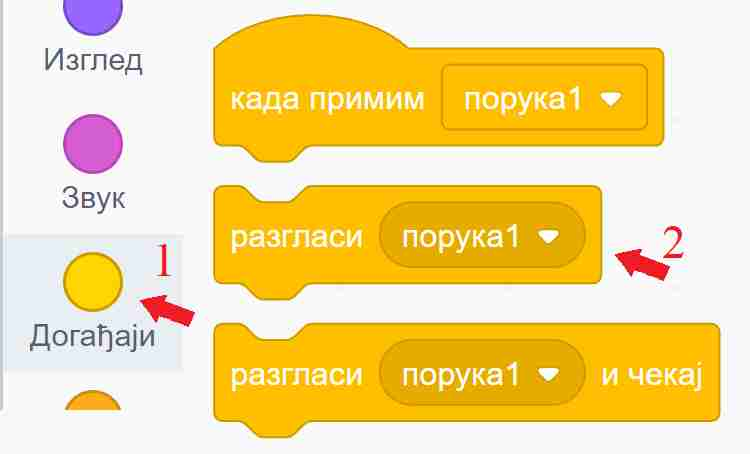
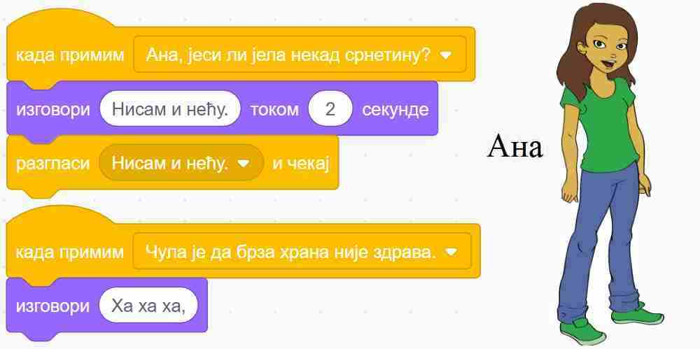
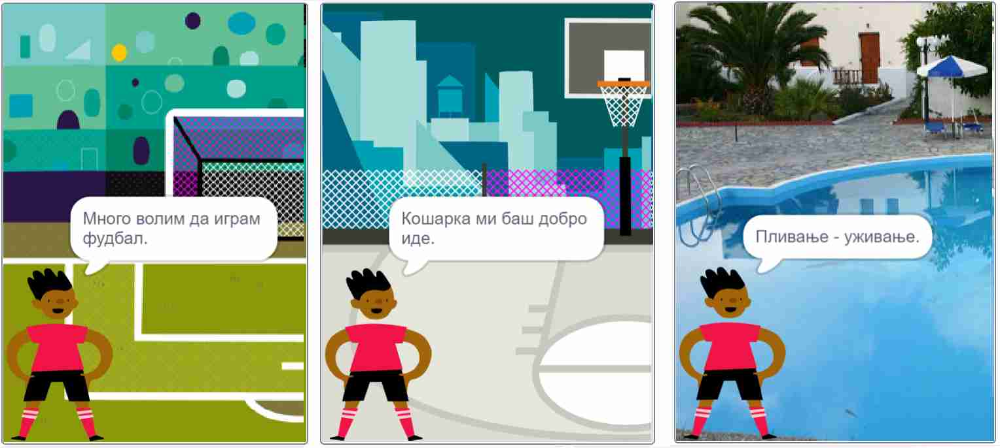
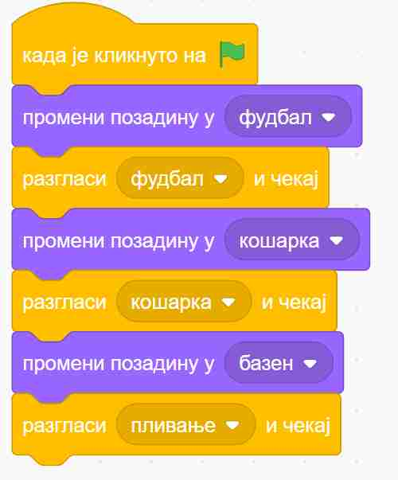
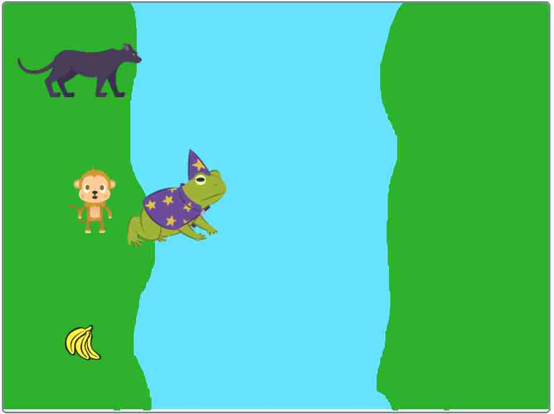

~~~~~~~~~~~~
Разглашавање
~~~~~~~~~~~~

.. topic:: У оквиру овог часа научићеш:

    - шта су објаве (разглашавања) и како оне функционишу
    - како да користиш објаве у својим програмима

.. |razglasi|        image:: ../../_images/S3_opste/razglasi.png
.. |razglasi_cekaj|  image:: ../../_images/S3_opste/razglasi_cekaj.png

Објаве су врло моћан начин да ускладиш, односно синхронизујеш понашање ликова и позадине у програму. Овај пут ћемо све што је потребно да се зна објашњавати успут, кроз примере.

Примери
-------

До сада већ сигурно умеш да синхронизујеш ликове помоћу наредби "чекај ... секунду" из групе блокова за управљање. Ево још једне прилике да то провериш.

Пример 1 - срнетина
'''''''''''''''''''

Нека три девојчице, Дана, Ана и Тамара, воде следећи разговор:

- Дана: Ана, јеси ли јела некад срнетину?
- Ана: Нисам и нећу.
- Дана: А зашто не?
- Тамара: Чула је да брза храна није здрава.
- Све три: Ха ха ха

Исти тај разговор можемо да прикажемо и у табели, додељујући успут трајање свакој реченици:

.. csv-table::
   :header: "Трајање", "Дана", "Ана", "Тамара"
   :widths: 15, 35, 15, 35
   :align: left

   "2 секунде", "**Ана, јеси ли јела некад срнетину?**", *чека*, *чека*
   "2 секунде", *чека*, **Нисам и нећу.**, *чека*
   "2 секунде", **А зашто не?**, *чека*, *чека*
   "3 секунде", *чека*, *чека*, **Чула је да брза храна није здрава.**
   "заувек", **Ха ха ха**, **Ха ха ха**, **Ха ха ха**
   
Сада се скрипта за сваку девојчицу лако саставља на основу њене колоне у табели. Да би скрипте биле једноставније, трајања узастопних чекања смо сабрали и представили једном наредбом чекања.

.. image:: ../../_images/S3_12_razglasavanje/SrnetinaCekanje_Dana.jpg
    :width: 500px
    :align: center

.. image:: ../../_images/S3_12_razglasavanje/SrnetinaCekanje_Ana.jpg
    :width: 500px
    :align: center

.. image:: ../../_images/S3_12_razglasavanje/SrnetinaCekanje_Tamara.jpg
    :width: 500px
    :align: center

|

Проблем са оваквим начином синхронизовања ликова је у томе што он није нарочито флексибилан. Претпоставимо да хоћемо да продужимо трајање једне од реченица. Програм се, наравно, може преправити, али када продужимо трајање говора говорника у наредби "изговори", треба још у скриптама осталих ликова пронаћи и продужити одговарајуће чекање. Слично је и када хоћемо да убацимо нову реченицу. Све ово постаје још компликованије када има више ликова и када је њихов разговор дужи. Уместо да уживамо у дорађивању програма и прављењу богатије и садржајније анимације, ми се све теже одлучјујемо да још понешто додамо, да не бисмо покварили и раздесили програм.

|

Хајде да видимо како би овај исти разговор могао да се направи помоћу разглашавања. Основна идеја разглашавања је врло једноставна - један од ликова (или позорница) направи објаву и разгласи је, као када телевизијска станица емитује програм. Сви ликови (укључујући и објављивача) могу а не морају да приме објаву, као што преко телевизора можемо а не морамо да пратимо програм. 

Ево како се праве објаве: у групи блокова "догађаји" изаберемо блок |razglasi| и поставимо га у скрипту. У поље блока уместо "порука1" упишемо текст који желимо. То ће бити име наше објаве.

|

Блок |kad_primim| можемо да користимо и да бисмо синхронизовали скрипте једног лика између себе, али обично га користимо да бисмо ускладили понашање више ликова. У блоку |kad_primim| треба да изаберемо неку од до сада дефинисаних објава, а затим испод тог блока додамо наредбе које треба извршити када изабрана објава буде разглашена.

За овај пример то је све што нам треба. Погледајмо скрипте за сваку од девојчица и у верзији када се користе објаве.

.. image:: ../../_images/S3_12_razglasavanje/SrnetinaObjave_Dana.jpg
    :width: 500px
    :align: center

|

|

.. image:: ../../_images/S3_12_razglasavanje/SrnetinaObjave_Tamara.jpg
    :width: 500px
    :align: center

|

У овом случају, преправљање трајања појединих стања би било знатно једноставније - довољно је изменити програм на само једном месту.

План комуникације
-----------------

Када се ликови у програму синхронизују помоћу објава, важно је да план комуникације буде једноставан. У противном, програм може да постане тежак за праћење. Један једноставан план комуникације је да само један лик "зна" када шта треба да се догоди, а остали не морају да знају "целу причу" него само примају објаве и реагују на њих. На тај начин везе између ликова остају једноставне, па нам је лако да пратимо комуникацију. Зато се овакав начин размене врло често користи.

Пример 2 - спортови
'''''''''''''''''''

У следећем, једноставном примеру, позорница мења позадине и сваку промену објављује, а лик прима поруке и реагује на њих коментаром. 

|

Скрипта позорнице изгледа овако:

|

Видимо да није неопходно да у скрипти позорнице кажемо колико треба да се чека да би се завршила реакција дечака. Довољно је да уместо блока |razglasi| употребимо блок |razglasi_cekaj|. Ово је последњи од три блока који су у вези са разглашавањем (два смо користили и у претходном примеру). Када користимо овај блок, рачунар неће наставити са извршавањем скрипте позорнице док се све реакције на објаву не заврше. Овде постоји само једна реакција, али и да их је више, све би биле сачекане. У случају да скрипте реакције такође нешто разглашавају и чекају, полазна скрипта би, наравно, сачекала заједно са њима. Захваљујући овако организованом сачекивању, све тече по реду и следећа позадина се појављује тек када се заврши скрипта реакције дечака.

Погледајмо и скрипту дечака:

.. image:: ../../_images/S3_12_razglasavanje/Sportovi_Lik.jpg
    :width: 420px
    :align: center

Примећујемо да ни "дечак не мора да зна" када ће се која позадина појавити. Што се њега тиче, позорница је могла да поставља позадине било којим редом, па и да их понавља, а скрипте којима дечак реагује на објаве не би морале због тога уопште да се мењају.

У овом примеру скрипте позорнице и дечака нису независне, оне сарађују путем објава. Међутим, ове скрипте нису ни превише повезане: позорница не зна ништа о томе како дечак реагује на објаве (могао је и да се шета по слици или ради нешто друго), ни колико те реакције трају; са друге стране дечак не зна када ће која објава да се догоди, а то му није ни потребно да би реаговао. Овом лабавом повезаношћу позорнице и дечака добијамо програм који је лакше преправљати, уколико пожелимо да га мењамо.

|

Пример 3 - пантер, мајмун и банане
''''''''''''''''''''''''''''''''''

Џиновска чаробна жаба налази се на обали реке, заједно са пантером, мајмуном и бананама. Жаба треба на својим леђима да пренесе преко реке пантера, мајмуна и банане. При томе може да их преноси само једно по једно и не сме да остави без надзора на истој обали пантера и мајмуна (јер би пантер појео мајмуна), ни мајмуна и банане (јер би мајмун појео банане). Којим редом жаба треба да преноси пантера, мајмуна и банане, да би се сви нашли на другој обали?

Ова мозгалица је веома стара, а позната је као задатак о вуку, кози и купусу. Ако ти задатак није познат од раније, немој да пропустиш забаву - пробај прво да самостално смислиш редослед прелазака преко реке.

Наш стварни задатак овде је да, знајући редослед прелазака преко реке, направимо пројекат који те преласке приказује. Нека су на почетку сви на левој обали и треба да пређу на десну. Један од два могућа редоследа прелажења је овај (други се добија када пантер и банане замене улоге):

.. csv-table::
   :header: "Акција", "лево остају", "десно остају"
   :widths: 40, 30, 30
   :align: left

   "жаба преноси мајмуна", "пантер и банане", "жаба и мајмун"
   "жаба се враћа", "жаба, пантер и банане", "мајмун"
   "жаба преноси банане", "пантер", "жаба, мајмун и банане"
   "жаба се враћа са мајмуном", "жаба, пантер и мајмун", "банане"
   "жаба преноси пантера", "мајмун", "жаба, пантер и банане"
   "жаба се враћа", "жаба и мајмун", "пантер и банане"
   "жаба преноси мајмуна", "нико", "сви"
   
Ради решавања оригиналног задатка је требало сетити се да жаба може и да врати мајмуна на леву обалу. Сада када знамо редослед потеза, хајде да видимо како да их прикажемо.

Жаба би могла да објављује потезе, а сви остали само реагују на објаве. То значи да у скриптама пантера, мајмуна и банана нема никаквог знања о томе како ће се сви они наћи на другој страни, они само умеју да иду са жабом кад их она позове. Сво знање се налази у главној жабиној скрипти, која изгледа овако:

.. image:: ../../_images/S3_12_razglasavanje/PanterMajmunBanane_Zaba1.jpg
    :width: 400px
    :align: center

Променљиве **а**, **б** и **т** се не мењају током рада програма, па уместо њих свуда у програму могу да стоје бројеви 100, 170, 1. Променљиве смо користили да бисмо лакше подешавали положаје ликова и брзину анимације, јер током испробавања је лакше мењати на пример све брзине на само једном месту. Улоге ових променљивих ћеш још боље разумети када погледаш остале скрипте.

Поред главне, жаба има и две споредне скрипте, за постављање на почетни положај и за прелазак реке:

.. image:: ../../_images/S3_12_razglasavanje/PanterMajmunBanane_Zaba2.jpg
    :width: 400px
    :align: center

Жаба на основу *X* координате свог положаја зна на коју страну треба да иде. Ако је *X* негативно, значи да се жаба налази на левој страни па треба прећи са леве на десну обалу, а ако је *X*  позитивно, жаба треба да се врати на леву страну.

Скрипте осталих ликова су међусобно скоро истоветне, зато ћемо их показати само за пантера:

.. image:: ../../_images/S3_12_razglasavanje/PanterMajmunBanane_Panter.jpg
    :width: 400px
    :align: center

Када пантер прими објаву "пређи са пантером", он прво дође до жабе (попне јој се на леђа), затим пређе реку заједно са жабом, а на крају сиђе са жабе и стане на своје место на другој обали. Да ли се иде на лево или на десно, пантер одређује на исти начин као и жаба. 

Остала два лика извршавају исте кораке, само што мајмун реагује на објаву "пређи са мајмуном", а банане на објаву "пређи са бананама". Још једна мала разлика између скрипти ових ликова је у томе што они користе различите *Y* координате за свој положај на обали. За пантера је та *Y* координата 120, за мајмуна 0, а за банане -120.

Додатак
-------

Погледај и примере 
`Породица <https://petlja.org/biblioteka/r/lekcije/scratch3-praktikum/scratch3-kornjaca-grafika#id6>`_
и `Дан и ноћ <https://petlja.org/biblioteka/r/lekcije/scratch3-praktikum/scratch3-grananje#id4>`_
из нашег практикума, где ћеш видети још неке начине да се реагује на објаве. На пример, видимо да се ликовима може покренути и више скрипти као реакција на једну објаву, да реакција може да садржи и наредбу понављања итд. У наредним лекцијама ће бити још примера у којима се понашање ликова усклађује разглашавањем.

Петљин `студио Разглашавање <https://scratch.mit.edu/studios/27294857>`_ на сајту Скреча садржи урађене пројекте за задатке сличне оним којима смо се овде бавили.
