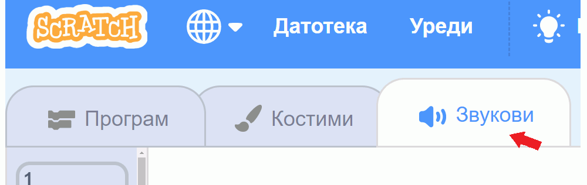
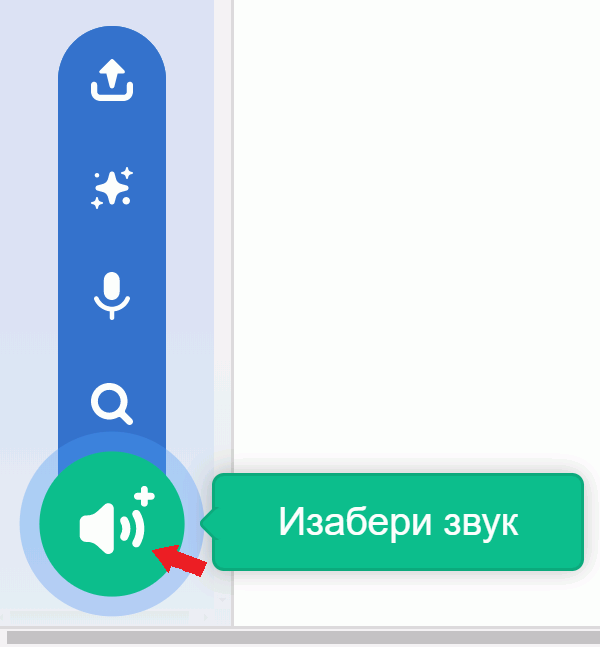
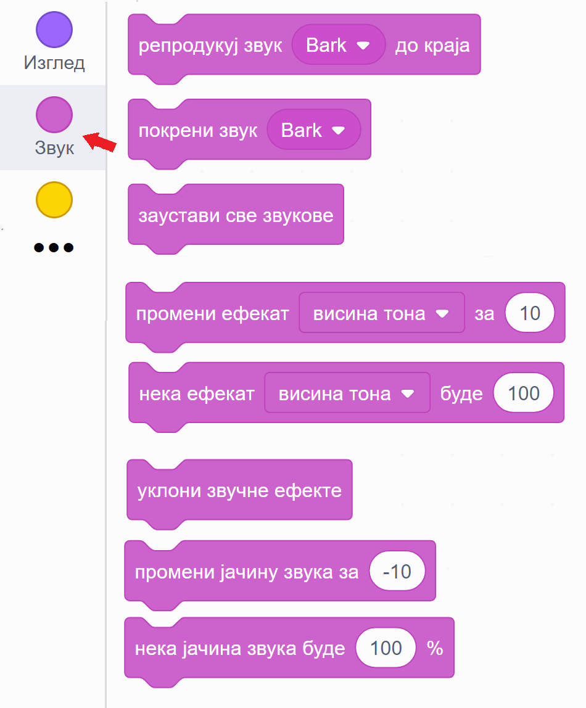
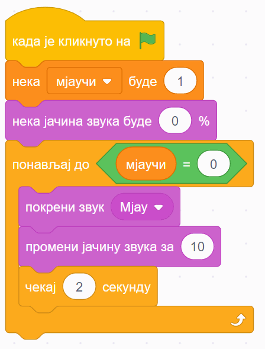
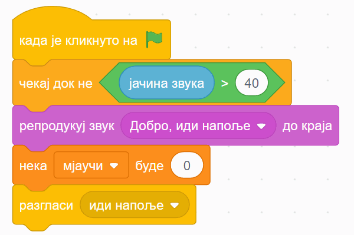
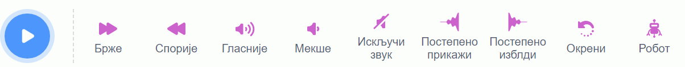

~~~~~~~~~~~~~~~~~~~
14.1. Звук
~~~~~~~~~~~~~~~~~~~

.. topic:: У оквиру овог часа:

    - како да користиш готове звукове у свом програму
    - како да направиш нове звукове
    - како да измениш неки звук

.. infonote::

    **Упозорење:** пре него што почнемо да користимо звуке и музику у Скречу, скрећемо ти пажњу да гласни звуци могу да оштете слух, нарочито ако користиш слушалице. Да предупредиш случајно пуштање врло гласних звукова, било би добро да пре слушања било ког звука утишаш своје звучнике или слушалице, а затим их постепено појачаваш до нивоа који ти одговара.

Звук
~~~~

Скреч нуди велики број готових звукова које можеш да употребиш у својим програмима. Звукове можеш да придружиш својим ликовима у пар једноставних потеза. Прво кликни на картицу "Звукови" у горњем менију

|

а затим постави миша на сличицу звучника у доњем левом углу.

|

Појављује се мени од 4 сличице. Клик на лупу (или на сам звучник) води те у библиотеку Скречових звукова. Клик на микрофон омогућава ти да снимиш звук који желиш. Клик на звездице додаје твом лику звук насумично изабран из библиотеке. Последња, четврта сличица са стрелицом на горе омогућава ти да додаш звук са свог рачунара, што може на пример, да буде фајл у формату *mp3* (чита се "ем пе три").

Кликни на звучник или лупу. Појавиће се избор од преко 300 различитих звукова.

.. image:: ../../_images/S3_15_zvuk/zvukovi_izbor.png
    :width: 700
    :align: center

|

Сваки од ових звукова можеш да чујеш када зауставиш миша на знаку за "свирање" звука (бели троугао у љубичастом кругу). На тај начин можеш да провериш да ли ти звук одговара и пре него што га изабереш. Ми ћемо репродукцију сваког звука често звати **свирање**, без обзира на то што звук можда није запис музике, већ може бити говор, оглашавање неке животиње, звук машине итд.

Када пронађеш звук који желиш да додаш свом лику, кликни на њега. Сада лик коме је звук придружен може да изговара или одсвира тај звук у програму. Програм је свакако занимљивији када се наши ликови и чују. 

Ако се понуђени звукови не уклапају у оно што намераваш да направиш, можеш једноставно да снимиш неки нови звук и додаш га неком од ликова. Само кликни на микрофон и прати упутства. Ако, на пример, снимиш себе и своје другове и другарице како изговарате неке реченице, ликови у твом програму ће убрзо моћи да говоре твојим гласом и гласовима твојих другова и другарица.

У групи блокова "Звук" зе налазе наредбе помоћу којих можеш у програму да користиш изабрани звук.

|

- Наредбе "репродукуј звук ... до краја" и "покрени звук ..." служе да се задати звук одсвира. Разлика између ове две наредбе је у томе што прва чека да се свирање звука заврши, па тек онда може да се настави са извршавањем скрипте, док друга само започиње свирање и допушта да скрипта настави да се извршава упоредо са свирањем звука.
- Наредба "заустави све звукове" прекида свирање свих звукова који су започети пре ове наредбе. Наредба не утиче на звуке чије свирање је покренуто након ње.
- Наредба "промени ефекат ... за ..." подржава промену два ефекта, а то су висина тона и баланс. Када помоћу ове наредбе променимо висину тона, свако следеће свирање било којег звука биће изведено вишим тоном (ако је вредност промене негативна, тон ће бити нижи). Други ефекат који се може мењати зове се "померање лево/десно", а односи се на померање звука са левог на десни звучник или обрнуто. Негативне вредности померају звук на леви звучник, а позитивне на десни. Вредност ефекта -100 значи да се звук чује само на левом звучнику, а +100 да се чује само на десном.
- Наредба "нека ефекат ... буде ..." је слична претходној, само што ова наредба не повећава и не смањује тренутну вредност ефекта, него поставља нову вредност.
- Наредба "уклони звучне ефекте" поништава све ефекте и поставља стање какво је било на почетку рада програма.
- Наредба "промени јачину звука за ..." појачава звук датог лика за задату вредност (звук се утишава ако се зада негативна вредност).
- Наредба "нека јачина звука буде ..." поставља жељену јачину звука за дати лик (0 за нечујно, 100 за најевћу могућу јачину).

У групи блокова "осећаји" се налази репортер "јачина звука" који нам говори укупну јачину свих звукова који допиру до микрофона нашег рачунара. Овај репортер може лепо да се комбинује са подешавањем јачине звука појединих ликова. На пример, ако мачку придружимо ову скрипту:

|

он ће мјаукати све гласније и гласније, док год се не промени вредност променљиве "мјаучи". Други лик може да извршава овакву скрипту:

|

при чему је звук "добро, иди напоље" нека претходно снимљена реченица. Овај лик ће реаговати када мјаукање постане прегласно, тако што изговори снимљену реченицу, постави вредност променљиве "мјаучи" на 0 да прекине мјаукање и на крају разгласи "иди напоље" да би мачак могао да реагује (ако желиш, можеш да додаш неку скрипту којом мачак реагује на ову објаву).

~~~~

Поменимо на крају овог дела и то да, осим наредби које привремено мењају звук постављањем вредности ефеката (звук и баланс), можемо и трајно да изменимо звук. Када у горњем менију кликнемо на картицу "Звукови", испод визуелног приказа звука налазе се ови симболи (преводи на српски још увек нису сасвим добри):

|

Кликом на ове симболе звук можемо да убрзамо, успоримо, појачамо, утишамо, постепено појачавамо, постепено утишавамо, да га окренемо уназад, или да га "роботизујемо". Ова преправљања звукова дају мноштво могућности за забаву и испољавање креативности у програмима.

.. topic:: Погледај видео:

   Пре него што погледаш како се у пројекат додаје звук, погледај како употребљавамо разглашавање да бисмо игрицу са јежом и диносаурусом учинили занимљивијом.

    .. ytpopup:: awpmJjZqZJ8
        :width: 735
        :height: 415
        :align: center 

.. topic:: Погледај видео:

   А сада погледај како смо у нашу игрицу додали звукове.  

    .. ytpopup:: uystTq3ubOo
        :width: 735
        :height: 415
        :align: center 

