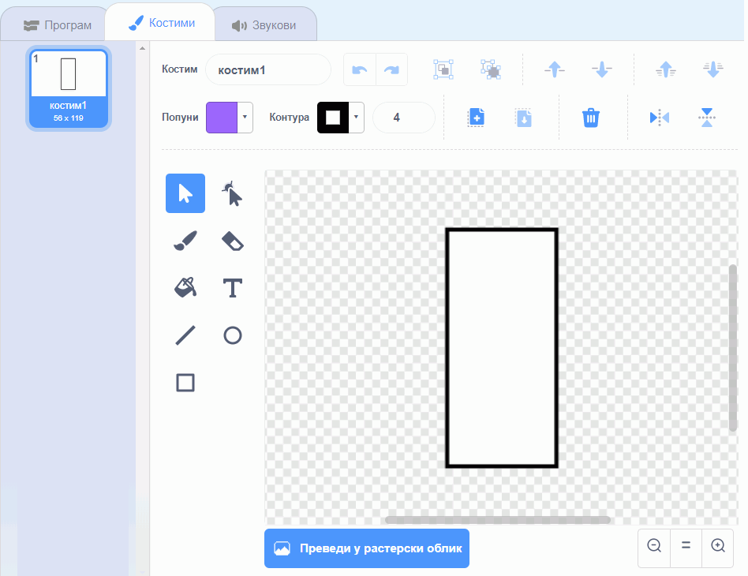
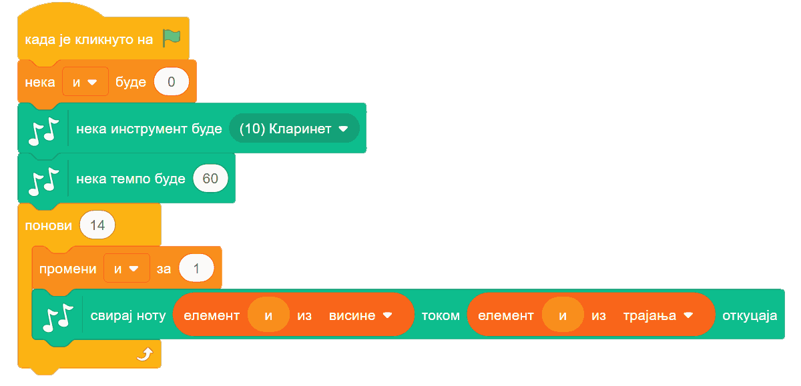

~~~~~~~~~~~~~~~~~~~
15.1. Музика
~~~~~~~~~~~~~~~~~~~

.. topic:: У оквиру овог часа:

    - како да одсвираш мелодију и компонујеш у Скречу

Подршка за музику се не налази међу основним групама блокова, него у једном од неколико стандардних проширења Скреча. Проширења се једноставно укључују у радно окружење. Док је активна картица "Програм", у доњем левом углу се налази дугме за додавање проширења:

|

Када кликнемо на то дугме, отвара се листа доступних проширења. Кликом на проширење "музика", додајемо га у радно окружење.

.. image:: ../../_images/S3_15_muzika/muzika_prosirenja2.png
    :width: 500
    :align: center

|

Сада имамо нову групу блокова, која се зове "музика". Када кликемо на ту групу, видимо следеће наредбе:

.. image:: ../../_images/S3_15_muzika/muzika_komande.png
    :width: 636
    :align: center

|

- Наредбом "удараљка ... током ... откуцаја" постижемо да се чује удараљка коју изаберемо и да звук траје изабрани број откуцаја. Сама удараљка се можда неће чути током целог тог периода због природе њеног звука, али се неће прећи на следећу наредбу док не протекне задати број откуцаја.
- Наредба "пауза ... откуцаја" производи паузу (тишину) која траје задати број откуцаја.
- Помоћу наредбе "свирај ноту ... током ... откуцаја" тражимо да се одсвира задата нота током задатог броја откуцаја. 
- Наредбом "нека инструмент буде ..." задајемо који инструмент ће да се чује при свирању нота.
- Наредбом "нека темпо буде ..." задајемо темпо (ритам) музицирања, изражен бројем откуцаја у једном минуту. Подразумевани темпо је 60 (откуцаја у минуту), често се користи и 120, а можеш да задаш и разне друге бројеве.
- Наредбом "промени темпо за ..." мењамо тренутни темпо музицирања за задату вредност (позитивном вредношћу ћемо убрзати темпо, а негативном успорити).

Ове наредбе пружају разноврсне могућности. Ево неких примера.

Пример 1 - Клавијатура
''''''''''''''''''''''

Направићемо пројекат у коме може да се свира на клавијатури, било кликовима на нацртане дирке, било притисцима на тастере тастатуре. Кликни на слику да видиш како програм ради.

.. raw:: html

   

   <iframe src="https://scratch.mit.edu/projects/416457135/embed" allowtransparency="true" width="485" height="402" frameborder="0" scrolling="no"  allowfullscreen>
   </iframe>
   

Сваку дирку основне октаве представљаће по један лик. Укупно ће бити 8 белих и 5 црних дирки (нота *до* се понавља на крају октаве), дакле 13 ликова у програму. Пошто ће ови ликови имати врло сличне скрипте (и углавном исте костиме), лакше је да прво потпуно довршимо креирање једног лика, а затим остале ликове направимо копирањем креираног лика и преправљањем скрипти. 

Почнимо од дирке за ноту **до**, односно ноту **C4** (нота *C* четврте октаве). Најпре ћемо нацртати костим лика, који се састоји од једног белог правоугаоника.

|

Лик дирке ћемо испрограмирати помоћу три кратке скрипте: једна за постављање на праву позицију при стартовању програма, друга која се извршава када се притисне тастер *А* и трећа, која се извршава када се кликне на овај лик.

.. image:: ../../_images/S3_15_muzika/muzika_klavir_skripte_bela.png
    :width: 300
    :align: center

Напоменимо да није потребно знати бројчане вредности нота, јер кликом на поље у које се уписује вредност, отвара се мала клавијатура у којој можемо да задамо вредност ноте кликом на одговарајућу дирку.

.. image:: ../../_images/S3_15_muzika/muzika_zadavanje_note.png
    :width: 414
    :align: center

|

Сада овај лик треба копирати и променити име лика, слово на које реагује лик, вредност ноте и вредност *X* координате положаја ноте на екрану. У нашем случају свака следећа нота је 60 пиксела десно од претходне. Слова смо изабрали тако да белим диркама редом одговарају *A*, *S*, *D*, *F*, *G*, *H*, *J*, *K*, а црним диркама *W*, *E*, *T*, *Y*, *U*. Ове тастере смо изабрали зато што је њихов распоред сличан распореду дирки на правој клавијатури.

Ликови који представљају црне дирке разликују се још и по томе што они као костим имају црни правоугаоник уместо белог, немају наредбу за постављање у позадину (црне дирке су нацртане преко белих), а *Y* координата им је већа за 50. На пример, скрипте за последњу црну дирку изгледају овако:

.. image:: ../../_images/S3_15_muzika/muzika_klavir_skripte_crna.png
    :width: 300
    :align: center

|

Твој "клавир" је спреман! Покушај да на њему одсвираш неку мелодију.

Пример 2 - Мелодија
'''''''''''''''''''

.. raw:: html

   

   <iframe src="https://scratch.mit.edu/projects/416454914/embed" allowtransparency="true" width="485" height="402" frameborder="0" scrolling="no"  allowfullscreen>
   </iframe>
   

Програм који свира одређену мелодију се прави веома лако. Довољно је да наређамо низ блокова "свирај ноту ... током ... откуцаја" и мелодија је спремна за свирање.

Нешто другачији начин, који смо ми овде употребили је да прво висине и трајања нота сместимо у листе:

|

Пошто се на слици не виде целе листе, поменимо да је четрнаеста нота иста као и тринаеста. Након дефинисања овакве две листе, следећа скрипта ће одсвирати мелодију записану у тим листама.

|

Ово је већ програм који има смисла и сам за себе. Ми ћемо се ипак још мало поиграти и покушати да извучемо нешто више од музицирања у Скречу. Наша мелодија садржи прва четири такта песме, па ћемо да направимо и ритам за прва четири такта. За то се користи наредба "удараљка". Ми смо се одлучили да по четири ударца која чине један такт сместимо у засебне процедуре. Имена процедура сугеришу како отприлике звуче ударци у одговарајућем такту.

.. image:: ../../_images/S3_15_muzika/muzika_dunje_ranke_ritam.png
    :width: 600
    :align: center

|

То нам даје могућност да лако испробавамо различите редоследе тактова. Један редослед који се уклапа у нашу основну мелодију је на пример овај:

|

Сигурни смо да уз мало експериментисања можеш да направиш једнако добру или још бољу ритмичку пратњу за ову мелодију.

Ако покренемо истовремено основну мелодију и процедуру "четири такта", то већ звучи мало боље него сама основна мелодија. Ово је још једно место на коме можемо да се зауставимо и прогласимо наш музички пројекат заокруженим. Међутим, сада када смо направили ритмичке тактове и листе нота, уз врло мало додатног труда можемо се забавити и варијацијама инструмената, висине и слично. 

|

На пример, наредбе које свирају основну мелодију можемо да покрећемо на пријем објаве уместо на започињање програма. Тако можемо да у истом програму одсвирамо исту мелодију више пута, а сваки пут на мало друкчији начин. Једна од могућности је и ова:

.. image:: ../../_images/S3_15_muzika/muzika_dunje_ranke_konacna1.png
    :width: 400
    :align: center

Ова скрипта четири пута свира наша четири такта:

- у прва четири такта чују се само удараљке 
- у друга четири такта чује се мелодија на клавиру уз пратњу удараљки
- у следећа четири такта чује се хор уз пратњу удараљки
- у последња четири такта чују се два хора (други хор пева вишим гласом), поново уз пратњу удараљки

Да би основна мелодија могла да се чује на све ове начине, преправили смо почетну скрипту у следеће две:

.. image:: ../../_images/S3_15_muzika/muzika_dunje_ranke_konacna2.png
    :width: 800
    :align: center

Процедуре које дају ритам нисмо мењали. 

Ако су ти ови примери били занимљиви, покушај да их још мало измениш и да сложиш још неку комбинацију која ти се допада. Успут ћеш сигурно развијати своје знање програмирања у Скречу, као и знање о музици. 

Шта смо научили
---------------

У овој лекцији научили смо како се користе могућности стандардног проширења "Музика". Показали смо како да одсвираш мелодију и компонујеш у Скречу.

Шта даље
---------

Стигли смо до краја последње лекције. Саветујемо ти да проучиш упутство `Употреба уграђеног графичког едитора <https://petlja.org/biblioteka/r/lekcije/scratch3-praktikum/scratch3-dodaci#id14>`_, које ће ти помоћи да креираш сопствене ликове и додајеш нове костиме постојећим. 

Ако ти се програмирање у Скречу допало, проучи и могућности језика које нису обрађене у овом курсу. На пример, како се врши умножавање ликова (клонирање), што је објашњено у пројекту `Чаробњак Збуњенко <https://petlja.org/biblioteka/r/lekcije/scratch3-praktikum/scratch3-liste#id5>`_ и како се ради са текстуалним подацима, што је обрађено у лекцији `Стрингови <https://petlja.org/biblioteka/r/lekcije/scratch3-praktikum/scratch3-stringovi>`_ нашег практикума. 

Користећи ове могућности, умећеш да направиш још атрактивније програме. 

Желимо ти пријатну забаву!

.. infonote::

    **Провери своје знање пролазећи кроз наредна питања и вежбе.**

