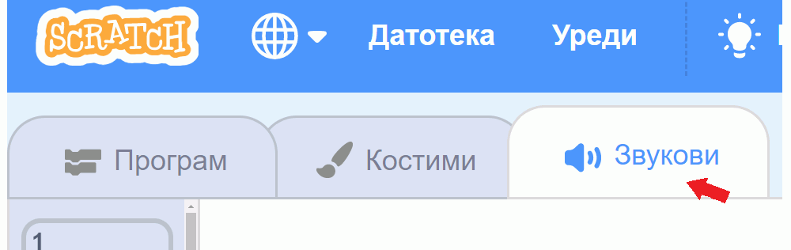
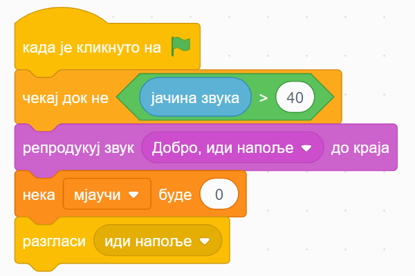
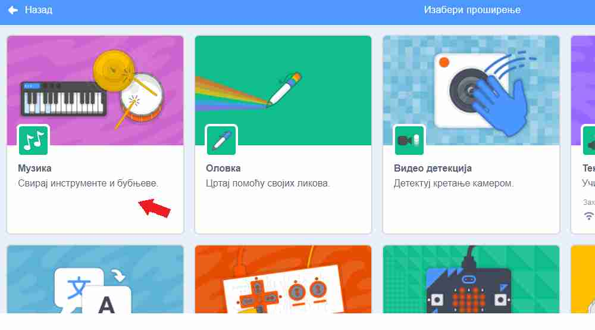
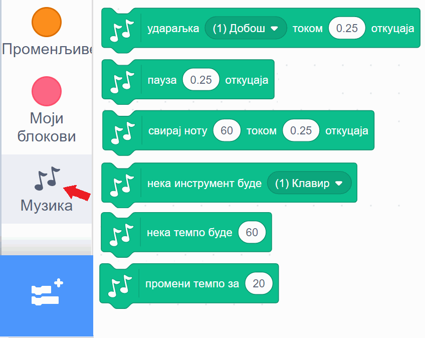
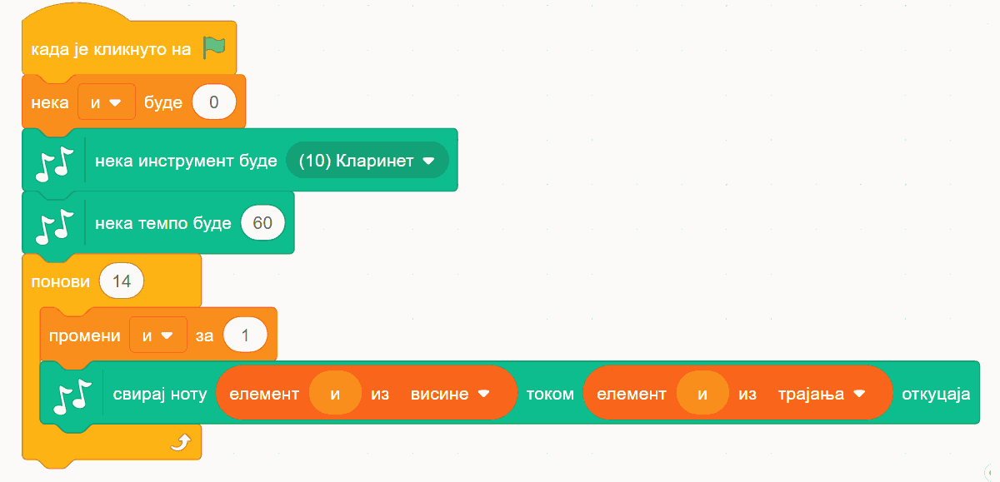

~~~~~~~~~~~~~~~~~~~
15.1. Звук и музика
~~~~~~~~~~~~~~~~~~~

.. topic:: У оквиру овог часа:

    - како да користиш готове звукове у свом програму
    - како да направиш нове звукове
    - како да измениш неки звук
    - како да одсвираш мелодију и компонујеш у Скречу

.. infonote::

    **Упозорење:** пре него што почнемо да користимо звуке и музику у Скречу, скрећемо ти пажњу да гласни звуци могу да оштете слух, нарочито ако користиш слушалице. Да предупредиш случајно пуштање врло гласних звукова, било би добро да пре слушања било ког звука утишаш своје звучнике или слушалице, а затим их постепено појачаваш до нивоа који ти одговара.

Звук
~~~~

Скреч нуди велики број готових звукова које можеш да употребиш у својим програмима. Звукове можеш да придружиш својим ликовима у пар једноставних потеза. Прво кликни на картицу "Звукови" у горњем менију

|

а затим постави миша на сличицу звучника у доњем левом углу.

.. image:: ../../_images/S3_15_zvuk/zvukovi_dodavanje.png
    :width: 300
    :align: center

|

Појављује се мени од 4 сличице. Клик на лупу (или на сам звучник) води те у библиотеку Скречових звукова. Клик на микрофон омогућава ти да снимиш звук који желиш. Клик на звездице додаје твом лику звук насумично изабран из библиотеке. Последња, четврта сличица са стрелицом на горе омогућава ти да додаш звук са свог рачунара, што може на пример, да буде фајл у формату *mp3* (чита се "ем пе три").

Кликни на звучник или лупу. Појавиће се избор од преко 300 различитих звукова.

.. image:: ../../_images/S3_15_zvuk/zvukovi_izbor.png
    :width: 700
    :align: center

|

Сваки од ових звукова можеш да чујеш када зауставиш миша на знаку за "свирање" звука (бели троугао у љубичастом кругу). На тај начин можеш да провериш да ли ти звук одговара и пре него што га изабереш. Ми ћемо репродукцију сваког звука често звати **свирање**, без обзира на то што звук можда није запис музике, већ може бити говор, оглашавање неке животиње, звук машине итд.

Када пронађеш звук који желиш да додаш свом лику, кликни на њега. Сада лик коме је звук придружен може да изговара или одсвира тај звук у програму. Програм је свакако занимљивији када се наши ликови и чују. 

Ако се понуђени звукови не уклапају у оно што намераваш да направиш, можеш једноставно да снимиш неки нови звук и додаш га неком од ликова. Само кликни на микрофон и прати упутства. Ако, на пример, снимиш себе и своје другове и другарице како изговарате неке реченице, ликови у твом програму ће убрзо моћи да говоре твојим гласом и гласовима твојих другова и другарица.

У групи блокова "Звук" зе налазе наредбе помоћу којих можеш у програму да користиш изабрани звук.

.. image:: ../../_images/S3_15_zvuk/zvukovi_upotreba.png
    :width: 475
    :align: center

|

- Наредбе "репродукуј звук ... до краја" и "покрени звук ..." служе да се задати звук одсвира. Разлика између ове две наредбе је у томе што прва чека да се свирање звука заврши, па тек онда може да се настави са извршавањем скрипте, док друга само започиње свирање и допушта да скрипта настави да се извршава упоредо са свирањем звука.
- Наредба "заустави све звукове" прекида свирање свих звукова који су започети пре ове наредбе. Наредба не утиче на звуке чије свирање је покренуто након ње.
- Наредба "промени ефекат ... за ..." подржава промену два ефекта, а то су висина тона и баланс. Када помоћу ове наредбе променимо висину тона, свако следеће свирање било којег звука биће изведено вишим тоном (ако је вредност промене негативна, тон ће бити нижи). Други ефекат који се може мењати зове се "померање лево/десно", а односи се на померање звука са левог на десни звучник или обрнуто. Негативне вредности померају звук на леви звучник, а позитивне на десни. Вредност ефекта -100 значи да се звук чује само на левом звучнику, а +100 да се чује само на десном.
- Наредба "нека ефекат ... буде ..." је слична претходној, само што ова наредба не повећава и не смањује тренутну вредност ефекта, него поставља нову вредност.
- Наредба "уклони звучне ефекте" поништава све ефекте и поставља стање какво је било на почетку рада програма.
- Наредба "промени јачину звука за ..." појачава звук датог лика за задату вредност (звук се утишава ако се зада негативна вредност).
- Наредба "нека јачина звука буде ..." поставља жељену јачину звука за дати лик (0 за нечујно, 100 за најевћу могућу јачину).

У групи блокова "осећаји" се налази репортер "јачина звука" који нам говори укупну јачину свих звукова који допиру до микрофона нашег рачунара. Овај репортер може лепо да се комбинује са подешавањем јачине звука појединих ликова. На пример, ако мачку придружимо ову скрипту:

.. image:: ../../_images/S3_15_zvuk/zvukovi_maca_hoce_napolje.png
    :width: 336
    :align: center

|

он ће мјаукати све гласније и гласније, док год се не промени вредност променљиве "мјаучи". Други лик може да извршава овакву скрипту:

|

при чему је звук "добро, иди напоље" нека претходно снимљена реченица. Овај лик ће реаговати када мјаукање постане прегласно, тако што изговори снимљену реченицу, постави вредност променљиве "мјаучи" на 0 да прекине мјаукање и на крају разгласи "иди напоље" да би мачак могао да реагује (ако желиш, можеш да додаш неку скрипту којом мачак реагује на ову објаву).

~~~~

Поменимо на крају овог дела и то да, осим наредби које привремено мењају звук постављањем вредности ефеката (звук и баланс), можемо и трајно да изменимо звук. Када у горњем менију кликнемо на картицу "Звукови", испод визуелног приказа звука налазе се ови симболи (преводи на српски још увек нису сасвим добри):

.. image:: ../../_images/S3_15_zvuk/zvukovi_edit.png
    :width: 600
    :align: center

|

Кликом на ове симболе звук можемо да убрзамо, успоримо, појачамо, утишамо, постепено појачавамо, постепено утишавамо, да га окренемо уназад, или да га "роботизујемо". Ова преправљања звукова дају мноштво могућности за забаву и испољавање креативности у програмима.

.. topic:: Погледај видео:

   Пре него што пређеш на музику, погледај како смо у нашу игрицу додали звукове.  

    .. ytpopup:: uystTq3ubOo
        :width: 735
        :height: 415
        :align: center 

Музика
~~~~~~

Подршка за музику се не налази међу основним групама блокова, него у једном од неколико стандардних проширења Скреча. Проширења се једноставно укључују у радно окружење. Док је активна картица "Програм", у доњем левом углу се налази дугме за додавање проширења:

.. image:: ../../_images/S3_15_zvuk/muzika_prosirenja1.png
    :width: 100
    :align: center

|

Када кликнемо на то дугме, отвара се листа доступних проширења. Кликом на проширење "музика", додајемо га у радно окружење.

|

Сада имамо нову групу блокова, која се зове "музика". Када кликемо на ту групу, видимо следеће наредбе:

|

- Наредбом "удараљка ... током ... откуцаја" постижемо да се чује удараљка коју изаберемо и да звук траје изабрани број откуцаја. Сама удараљка се можда неће чути током целог тог периода због природе њеног звука, али се неће прећи на следећу наредбу док не протекне задати број откуцаја.
- Наредба "пауза ... откуцаја" производи паузу (тишину) која траје задати број откуцаја.
- Помоћу наредбе "свирај ноту ... током ... откуцаја" тражимо да се одсвира задата нота током задатог броја откуцаја. 
- Наредбом "нека инструмент буде ..." задајемо који инструмент ће да се чује при свирању нота.
- Наредбом "нека темпо буде ..." задајемо темпо (ритам) музицирања, изражен бројем откуцаја у једном минуту. Подразумевани темпо је 60 (откуцаја у минуту), често се користи и 120, а можеш да задаш и разне друге бројеве.
- Наредбом "промени темпо за ..." мењамо тренутни темпо музицирања за задату вредност (позитивном вредношћу ћемо убрзати темпо, а негативном успорити).

Ове наредбе пружају разноврсне могућности. Ево неких примера.

Пример 1 - Клавијатура
''''''''''''''''''''''

Направићемо пројекат у коме може да се свира на клавијатури, било кликовима на нацртане дирке, било притисцима на тастере тастатуре. 

Сваку дирку основне октаве представљаће по један лик. Укупно ће бити 8 белих и 5 црних дирки (нота *до* се понавља на крају октаве), дакле 13 ликова у програму. 

Пошто ће ови ликови имати врло сличне скрипте (и углавном исте костиме), лакше је да прво потпуно довршимо креирање једног лика, а затим остале ликове направимо копирањем креираног лика и преправљањем скрипти. 

Почнимо од дирке за ноту **до**, односно ноту **C4** (нота *C* четврте октаве). Најпре ћемо нацртати костим лика, који се састоји од једног белог правоугаоника.

.. image:: ../../_images/S3_15_zvuk/muzika_kostim_dirke.png
    :width: 474
    :align: center

|

Лик дирке ћемо испрограмирати помоћу три кратке скрипте: једна за постављање на праву позицију при стартовању програма, друга која се извршава када се притисне тастер *А* и трећа, која се извршава када се кликне на овај лик.

Напоменимо да није потребно знати бројчане вредности нота, јер кликом на поље у које се уписује вредност, отвара се мала клавијатура у којој можемо да задамо вредност ноте кликом на одговарајућу дирку.

|

Сада овај лик треба копирати и променити име лика, слово на које реагује лик, вредност ноте и вредност *X* координате положаја ноте на екрану. У нашем случају свака следећа нота је 60 пиксела десно од претходне. Слова смо изабрали тако да белим диркама редом одговарају *A*, *S*, *D*, *F*, *G*, *H*, *J*, *K*, а црним диркама *W*, *E*, *T*, *Y*, *U*. Ове тастере смо изабрали зато што је њихов распоред сличан распореду дирки на правој клавијатури.

Ликови који представљају црне дирке разликују се још и по томе што они као костим имају црни правоугаоник уместо белог, немају наредбу за постављање у позадину (црне дирке су нацртане преко белих), а *Y* координата им је већа за 50. На пример, скрипте за последњу црну дирку изгледају овако:

|

Твој "клавир" је спреман! Покушај да на њему одсвираш неку мелодију.

Пример 2 - Мелодија
'''''''''''''''''''

Програм који свира одређену мелодију се прави веома лако. Довољно је да наређамо низ блокова "свирај ноту ... током ... откуцаја" и мелодија је спремна за свирање.

Нешто другачији начин, који смо ми овде употребили је да прво висине и трајања нота сместимо у листе:

.. image:: ../../_images/S3_15_zvuk/muzika_dunje_ranke_liste.png
    :width: 300
    :align: center

|

Пошто се на слици не виде целе листе, поменимо да је четрнаеста нота иста као и тринаеста. Након дефинисања овакве две листе, следећа скрипта ће одсвирати мелодију записану у тим листама.

|

Ово је већ програм који има смисла и сам за себе. Ми ћемо се ипак још мало поиграти и покушати да извучемо нешто више од музицирања у Скречу. Наша мелодија садржи прва четири такта песме, па ћемо да направимо и ритам за прва четири такта. За то се користи наредба "удараљка". Ми смо се одлучили да по четири ударца која чине један такт сместимо у засебне процедуре. Имена процедура сугеришу како отприлике звуче ударци у одговарајућем такту.

|

То нам даје могућност да лако испробавамо различите редоследе тактова. Један редослед који се уклапа у нашу основну мелодију је на пример овај:

|

Сигурни смо да уз мало експериментисања можеш да направиш једнако добру или још бољу ритмичку пратњу за ову мелодију.

Ако покренемо истовремено основну мелодију и процедуру "четири такта", то већ звучи мало боље него сама основна мелодија. Ово је још једно место на коме можемо да се зауставимо и прогласимо наш музички пројекат заокруженим. Међутим, сада када смо направили ритмичке тактове и листе нота, уз врло мало додатног труда можемо се забавити и варијацијама инструмената, висине и слично. 

|

На пример, наредбе које свирају основну мелодију можемо да покрећемо на пријем објаве уместо на започињање програма. Тако можемо да у истом програму одсвирамо исту мелодију више пута, а сваки пут на мало друкчији начин. Једна од могућности је и ова:

Ова скрипта четири пута свира наша четири такта:

- у прва четири такта чују се само удараљке 
- у друга четири такта чује се мелодија на клавиру уз пратњу удараљки
- у следећа четири такта чује се хор уз пратњу удараљки
- у последња четири такта чују се два хора (други хор пева вишим гласом), поново уз пратњу удараљки

Да би основна мелодија могла да се чује на све ове начине, преправили смо почетну скрипту у следеће две:

Процедуре које дају ритам нисмо мењали. 

~~~~

Ако су ти ови примери били занимљиви, покушај да их још мало измениш и да сложиш још неку комбинацију која ти се допада. Успут ћеш сигурно развијати своје знање програмирања у Скречу, као и знање о музици. Желимо ти пријатну забаву!
