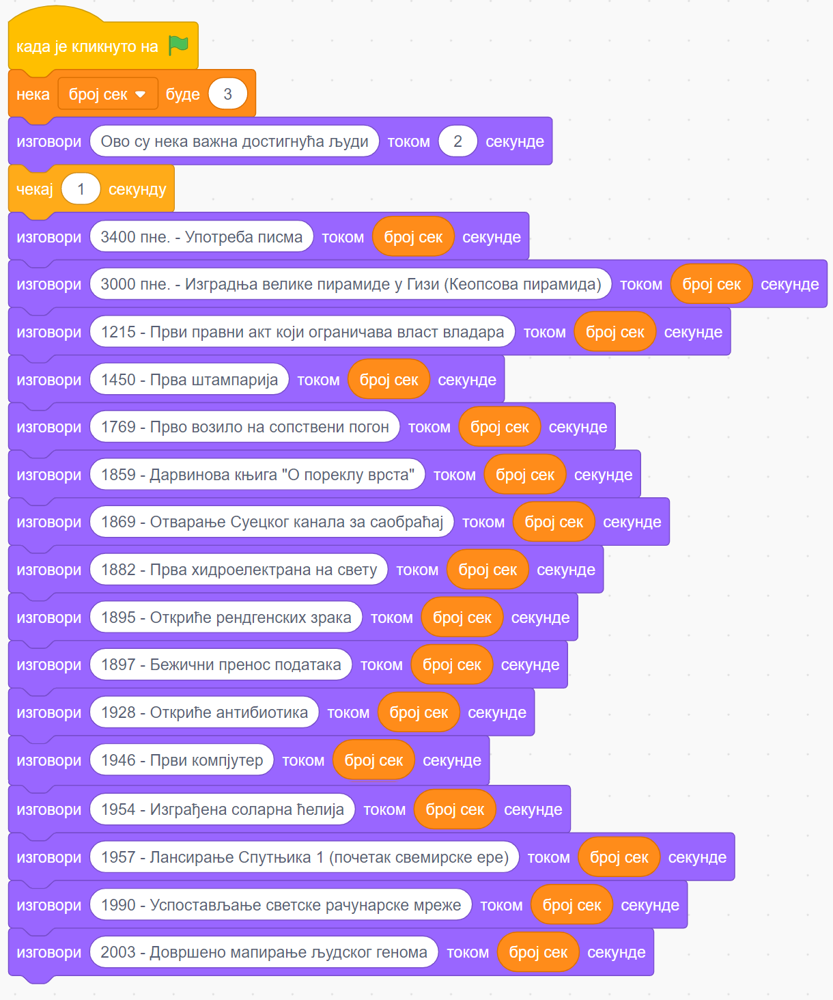
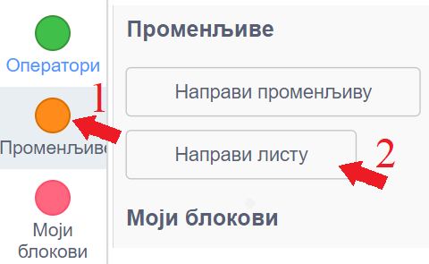
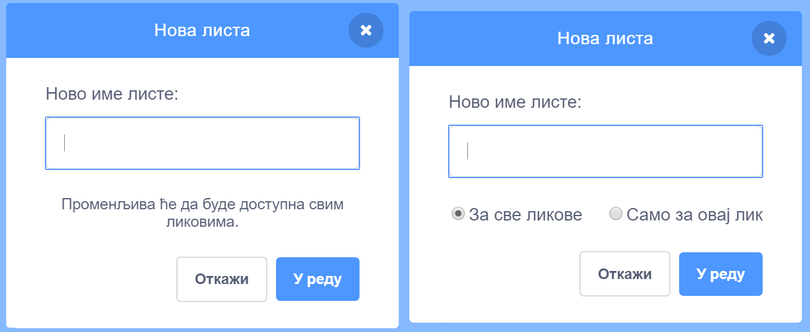
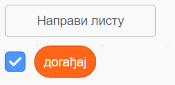
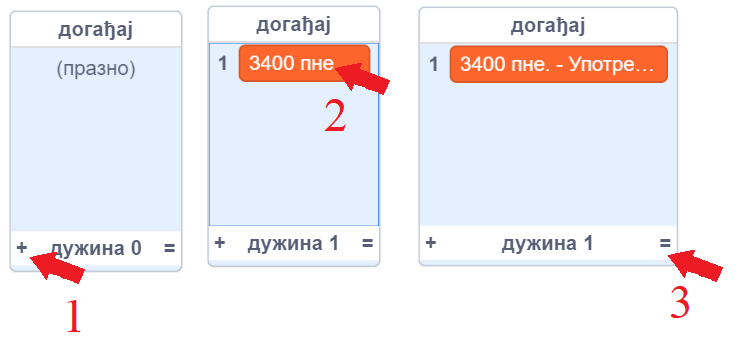
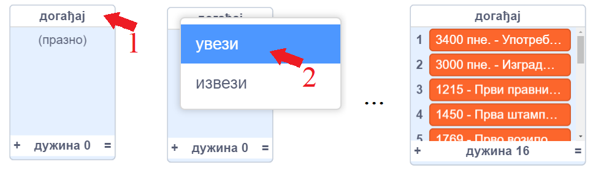
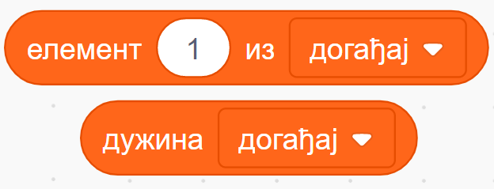
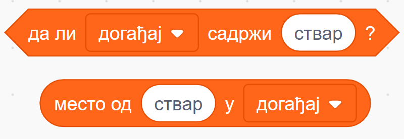
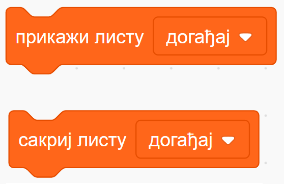
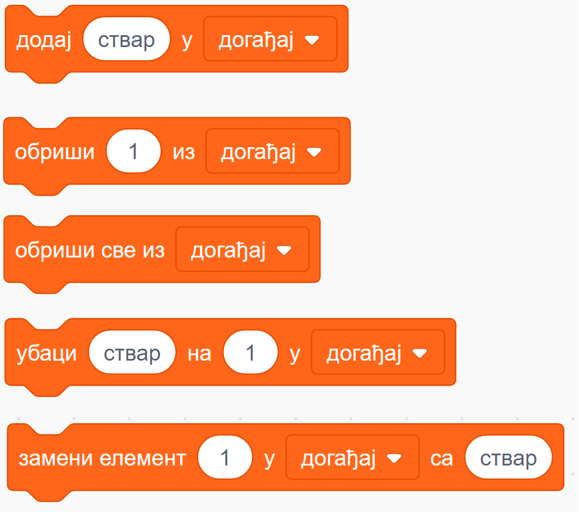

~~~~~
Листе
~~~~~

.. topic:: У оквиру овог часа научићеш:

    - шта су листе
    - како да направиш и користиш листе
    

У програмирању, реч листа има скоро исто значење као и у животу: то је у суштини скуп података уређен по неком редоследу. На пример, телефонски именик је листа имена и бројева, рачун из самопослуге је листа купљених ствари и њихових цена итд. 

Можда се питаш зашто нам требају листе у програмирању? Већ следећи, једноставан пример ће ти дати неку идеју о томе.
Претпоставимо да желимо да направимо пројекат у коме ће главни лик да наброји нека велика достигнућа човечанства. Скрипта главног лика би могла да изгледа овако:

Променљиву "број сек" користимо само да бисмо лакше подешавали трајање изговорених реченица.

|

Употребом листе у пројекту, скрипта ће сигурно постати краћа. Још важније, тако направљен пројекат је погоднији за дорађивање, па га лакше можемо преправити и додати неку нову функционалност. Зато погледајмо како можемо да искористимо листу у овом задатку. 

|

Прво треба да направимо листу. У групи блокова "Променљиве" постоји и дугме "Направи листу" (ако већ имаш неке променљиве у пројекту, ово дугме је испод блокова који управљају променљивама).

|

Кликом на дугме "Направи листу" добијаш прозор - дијалог у коме треба да задаш име листе. Слично као при прављењу променљиве, ако до овог прозора дођеш уређујући неки од ликова (десни дијалог), онда још треба да изабереш да ли ће листа бити доступна само том лику, или свим ликовима (ако правиш листу док уређујеш позорницу, отвориће се леви дијалог и та листа ће бити доступна свим ликовима).

|

Назови листу "догађај" и кликни "У реду". Испод дугмета "Направи листу" појавиће се блок који представља листу.

Знак ✓ (квачица) у пољу за потврду значи да је листа тренутно видљива на позорници. 

|

Сада треба да попунимо листу. Мале листе је најлакше попуњавати директним уношењем елемената листе. То можеш да урадиш тако што кликнеш на знак плус у доњем левом углу прозора листе, а када се појави поље за елемент листе - упишеш текст у то поље. Величину прозора који приказује листу можеш да подесиш тако што повучеш знак = у доњем десном углу тог прозора. Понављањем овог поступка у листу се уноси један по један елемент.

|

Други начин да попуниш листу је погоднији када имамо велику листу. Можеш да направиш текстуални фајл "dogadjaji.txt" са следећим садржајем:

.. code::

    3400 пне. - Употреба писма
    3000 пне. - Изградња велике пирамиде у Гизи (Кеопсова пирамида)
    1215 - Први правни акт који ограничава власт владара
    1450 - Прва штампарија
    1769 - Прво возило на сопствени погон
    1859 - Дарвинова књига "О пореклу врста"
    1869 - Отварање Суецког канала за саобраћај
    1882 - Прва хидроелектрана на свету
    1895 - Откриће рендгенских зрака
    1897 - Бежични пренос података
    1928 - Откриће антибиотика
    1946 - Први компјутер
    1954 - Изграђена соларна ћелија
    1957 - Лансирање Спутњика 1 (почетак свемирске ере)
    1990 - Успостављање светске рачунарске мреже
    2003 - Довршено мапирање људског генома

Када сачуваш фајл, десним кликом на назив листе отвара се мени од само две ставке: "увези" и "извези". Изабери "увези" и затим кликни на раније припремљени фајл. Листа ће бити попуњена редовима из фајла.

|

Јасно, кликом на ставку "извези" садржај листе се пребацује у фајл на твом рачунару (највероватније у фолдеру *Downloads*).

|

Пошто је формирање листе завршено, кликни на квачицу у пољу за потврду поред блока "догађај" да би листа постала невидљива. 

Овако направљену листу можемо да употребимо у следећој скрипти, помоћу које лик изговара исте реченице као и у првом решењу.

.. image:: ../_images/L11/IzgovoriDogadjajeLista.png
    :width: 600
    :align: center

|

Да бисмо направили скрипту, потребно је да прво формирамо променљиву "и". Ову променљиву користимо као редни број елемента у листи. За листу од 16 елемената променљива "и" ће редом добијати вредности од 1 до 16. Уместо "и" смо могли да употребимо и неко јасније име (нпр. "редни број"), али у програмирању је уобичајено да се за овакве, бројачке променљиве користе имена "и", "ј", "к". Зато и убудуће, када у неком програму видиш променљиву "и", очекуј да она има намену сличну овој.

У скрипти смо употребили и два најважнија блока из групе блокова који контролишу листе, а то су:

- блок "елемент ... из", који нам омогућава да из дохватимо и употребимо елемент који нам треба
- блок "дужина", који нам говори дужину листе 

Осим ова два постоји још неколико блокова за баратање листама. На пример, наредна два блока нам омогућавају да из нашег програма сазнамо да ли се неки податак налази у листи (блок "да ли ... садржи") и на којој позицији је тај податак (блок "место од ... у"). Ако податак није у листи, вредност другог блока је 0.

|

Следећа два блока служе да из нашег програма прикажемо или сакријемо листу када је то потребно

|

Остали блокови из ове групе нам омогућавају да мењамо листу, додајући, бришући или преправљајући њене елементе у току рада програма. 

.. comment

    Измена садржаја листе док се програм извршава је већ нешто напреднија употреба листи и неће нам бити потребна у почетним примерима. Ипак, поменућемо и ове блокове јер их није тешко разумети, а биће нам потребни у нешто напреднијим пројектима.

- блок "додај .. у" додаје задати податак (ствар) на крај листе
- блок "обриши ... из" избацује из листе елемент са наведене позиције (елементи испод избаченог се померају за једно место навише)
- блок "обриши све из" избацује из листе све елементе (листа остаје празна)
- блок "убаци ... на ... у" убацује задати податак (ствар) на задато место (1) у листи, а елемент који је био на том месту и сви наредни елементни се померају за једно место наниже
- блок "замени елемент ... у ... са ..." на место задатог елемента (1) у листи уписује задати податак (ствар). Остали елементи се не померају

~~~~

Погледај и 
`пројекте, питања и вежбе о листама <https://petlja.org/biblioteka/r/lekcije/scratch3-praktikum/scratch3-liste>`_
у нашем практикуму. Тако ћеш добити јаснију идеју о новим могућностима које се отварају пред тобом када користиш листе.