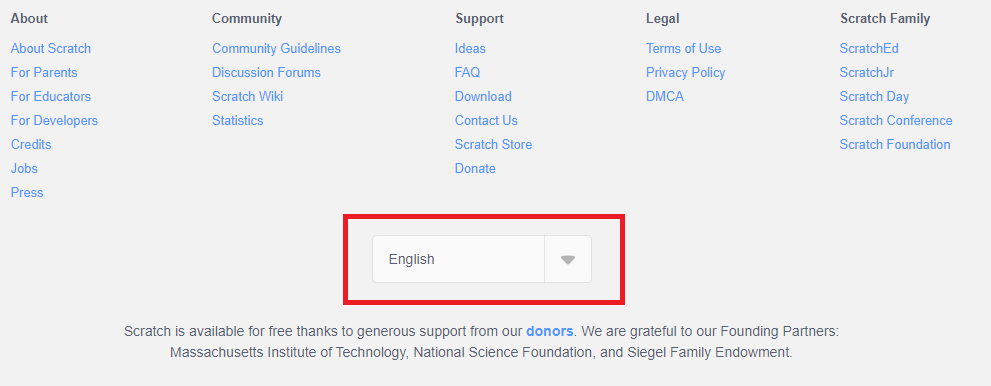
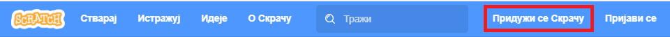
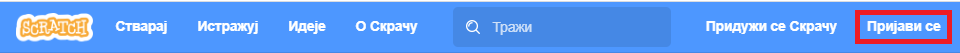
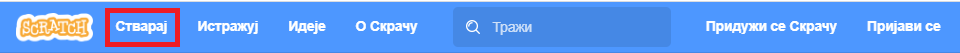

~~~~~~~~~~~~~~~~~~~~~~~~~~~~~~~~~~~~~~~~~~~~~~~~~~~~~
Положај лика на позорници, прогами линијске структуре
~~~~~~~~~~~~~~~~~~~~~~~~~~~~~~~~~~~~~~~~~~~~~~~~~~~~~

.. topic:: У оквиру ове лекције упознаћеш се са следећим појмовима: 
            
            - радно окружење програмског језика Скреч
            - управљање положајем лика на позорници
            - низање корака

Најједноставнији начин да користиш Скреч јесте директно на веб сајту `scratch.mit.edu <https://scratch.mit.edu>`_.

Користи два одвојена прозора или два таба свог веб браузера да у једном имаш отворен овај курс, а 
у другом сајт `scratch.mit.edu <https://scratch.mit.edu>`_. 

Када одеш на сајт `scratch.mit.edu <https://scratch.mit.edu>`_, прво што треба да урадиш је да подесиш језик на српски. 
Скролуј до краја старне и уочи дугме за избор језика. На следећој слици је уоквирено црвеним:

Ако на том месту није изабран српски језик, изабери га. Затим треба да креираш свој кориснички налог (уколико ниси раније)
избором опције *Придружи се Скречу* која се налази у горњем десном углу веб стране:

Као име за пријаву немој да користиш своје право име, најбоље је да измислиш неко име само за ову прилику.
Уколико већ имаш креиран кориснички налог или си га управо креирао/креирала, треба да се пријавиш тако што у врху стране идеш на опцију  *Пријави се*

Након тога у врху са леве стране нађи опцију *Стварај*:

Када кликнеш на опцију *Стварај* отвориће ти се радно окружење програмског језика Скреч.

Сада треба да прочиташ следећа два одељка нашег приручника:

   - `Визуелни програмски језик Скреч - радно окружење <https://petlja.org/biblioteka/r/lekcije/scratch3-prirucnik/scratch>`_
   - `Низање корака <https://petlja.org/biblioteka/r/lekcije/scratch3-prirucnik/polozaj_lika_na_pozornici>`_

