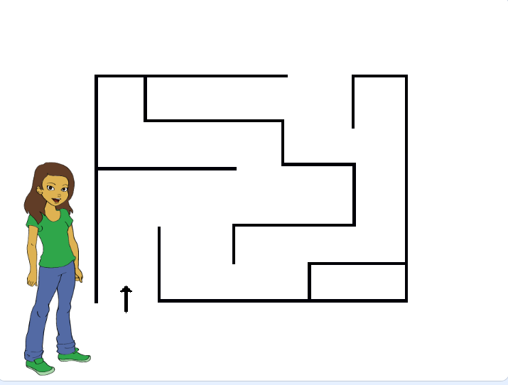
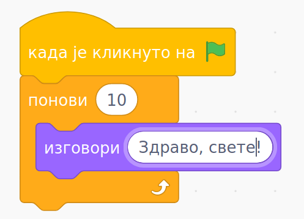
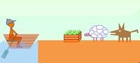

Квиз - Алгоритамски начин размишљања
####################################

.. mchoice:: peti_1p
   :answer_a: Да
   :answer_b: Не
   :correct: a
   :feedback_a: Нетачно!
   :feedback_b: Тачно!
   
   Да ли је рачунар је паметна машина? 

.. fillintheblank:: peti_2p
		    
      Када програмер ралунару даје упутства (наредбе) шта рачунат треба да ради, програмер напише: 
      
      (*Одговор написати малим словима, ћирилицом*) |blank|

      -     :програм: Тачно!
            :x: Нетачно.

   
.. mchoice:: peti_3p
   :answer_a: Алгоритам
   :answer_b: Програмски језик
   :answer_c: Scratch
   :answer_d: Блоковско програмирање
   :correct: a
   :feedback_a: Тачно!
   :feedback_b: Нетачно!
   :feedback_c: Нетачно!
   :feedback_d: Нетачно!

   
   Реченица: **Коначан низ корака који воде до решења неког проблема.** описује:

.. fillintheblank:: peti_4p
		    
      Чему је једнако b након извршавања следећих израза? 
      
      a = 2

      b = 5 * a
      
      
      Одговор написати бројем.

      -     :10: Тачно!
            :x: Нетачно.

.. mchoice:: peti_5p
   :answer_a: Рачунар
   :answer_b: Човек
   :answer_c: Човек и рачунар
   :correct: b
   :feedback_a: Нетачно!
   :feedback_b: Тачно!
   :feedback_c: Нетачно!
   
   Дато је упутство:

      1. Изађи из куће.

      2. Скрени лево.

      3. Иди право 200 метара.

      4. Пређи пешачки прелаз и скрени лево.

      5. После беле зграде, скрени лево.

      6. Уђи у књижару.

      Ко може да изврши ово упутство?

.. mchoice:: peti_6p
   :answer_a: напред, напред, десно, десно, доле, напред, лево, десно, напред, лево, горе, лево, десно, напред
   :answer_b: напред, напред, десно, десно, доле, лево, напред, лево, десно, напред, лево, горе, горе, лево, десно, напред
   :answer_c: напред, напред, десно, десно, доле, лево, напред, лево, десно, напред, лево, горе, горе, лево, десно, напред, напред
   :correct: b
   :feedback_a: Нетачно!
   :feedback_b: Тачно!
   :feedback_c: Нетачно!
   
   Који од наредних низа инструкција доводи девојчицу са слике до краја лавиринта? 

.. mchoice:: peti_7p
   :answer_a: Исписаће се "Здраво, свете!"
   :answer_b: Исписаће се "Здраво, свете!" десет пута.
   :answer_c: Исписаће се "Здраво, свете!" на сваких десет секунди.
   :correct: b
   :feedback_a: Нетачно!
   :feedback_b: Тачно!
   :feedback_c: Нетачно!
   
   Шта је резултат извршавања предходног блока наредби?

.. mchoice:: peti_8p
   :answer_a: Милица првози путнике следећим редом: превезе овцу, враћа се, превезе вука и врати овцу, остави овцу и узме купус, превезе купус, врати се по овцу.
   :answer_b: Милица првози путнике следећим редом: превезе купус, враћа се, превезе вука и врати купус, остави купус и узме вука, превезе вука, врати се по купус.
   :answer_c: Милица првози путнике следећим редом: превезе овцу, враћа се, превезе вука и врати овцу назад, узме купус, превезе купус.
   :correct: a
   :feedback_a: Тачно!
   :feedback_b: Нетачно!
   :feedback_c: Нетачно!
   
   Милица треба преко реке у чамцу да превезе вука, овцу и купус. У чамац поред Милице може да стане само још један путник. Вука и овца 
   не смеју да остану сами на обали јер ће вук појести овцу. Такође, овца и купус не смеју да остану сами на обали јер ће овца појести купус.
   Који од следећих алгоритама је тачан за превожење купуса, овце и вука?

