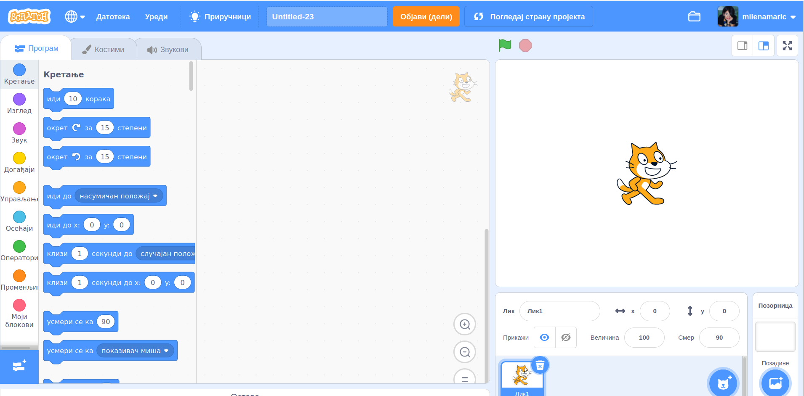

**Увод**
=========================
Добродошао/Добродошла!

Налазиш се у Петљиној онлајн учионици где смо за тебе припремили часове програмирања за 
пети разред у програму Scratch, који је намањен за визуелно програмирање.

Пред тобом су лекције које прате све оно што је предвиђено да се ради и на редовним часовима Информатике и рачунарства
у школи. Лекције су прилагођене твом узрасту. Организовали смо их да имају теоријски део који чине текст, видеи, питалице и након тога
долази мини квиз који ће ти помоћи да процениш колико си градива усвојио/усвојила из лекције коју си прошао/прошла.

Након већих целина, припремили смо за тебе тестове којима пратимо твој напредак.

Пре него што пређемо на први час, хајде да се укратко упознамо са окружењем програмског језика Scratch.

Ово окружење се састоји од дела са блоковима, који имају различиту намену, дела за слагање блокова, тј. писања скриптова, 
различитих дугмади за покретање и заустављање анимације и много тога још. Детаљније ћеш се са окружењем упознати 
у наредним лекцијама.

Користећи ово окружење моћи ћеш да направиш своју прву анимирану причу, мини игрицу, занимљиву презентацију. Scratch је визуелан језик,
то значи да ћеш све ово правити превлачењем одговарајућих блокова, а не писањем наредби. Погледај наредни видео.

.. ytpopup:: eLDdGsRvX7Y
    :width: 735
    :height: 415
    :align: center 

Ово су лекције које ће ти помоћи да направиш своје прве програмерске кораке у визуелном окружењу. Текстуално програмирање те чека 
већ у 6. разреду. Желимо ти успешан рад!

